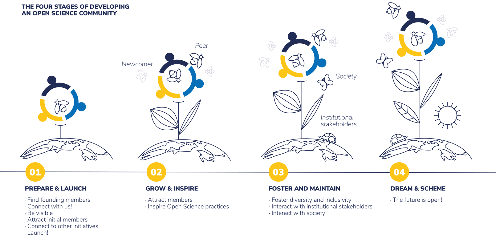

Open Science improves the **quality**, **accessibility**, and **efficiency** of science, but is **not yet the norm** in research. While pioneering scholars are developing and embracing Open Science practices, the majority sticks to the status quo. To **move from pioneers to common practice**, we need to engage a critical proportion of the research community. This is where Open Science Communities come into play!

Open Science Communities provide a place where **newcomers and experienced peers** interact, **inspire each other to adopt** Open Science practices and values, identify **opportunities** and **pitfalls**, and **provide feedback on policies, infrastructure, and support services**. By the same token, Open Science Communities are places where researchers and societal stakeholders can meet, inspire and co-create. 

Both the size and number of Open Science Communities continues to grow. By creating momentum and critical mass, Open Science Communities usher in a cultural change towards Open Science. 

You can be part of this! 

This Starter Kit provides you the rationale, design, and guidelines to start your own local Open Science Community. So jump right in and connect with us. 

Together, we make science open!

***

***