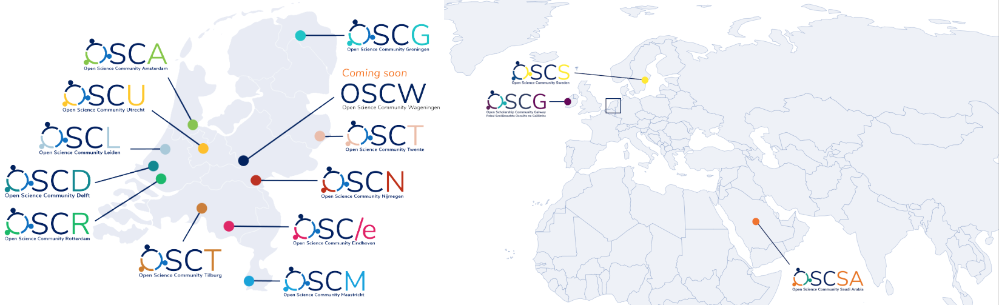

---
# Title, summary, and page position.
linktitle: 'Section I: An introduction to Open Science Communities'
summary: ''
weight: 1
icon: book
icon_pack: fas

# Page metadata.
title: 'Section I'
date: "2020-10-18"
type: book  # Do not modify.
---

## I.I The role of communities in the transition to Open Science

Open Science[^1] (OS) encompasses a large and ever growing [set of practices](https://doi.org/10.54677/XOIR1696) that make scholarly output (publications, data, code, protocols, etc.) more accessible, transparent, reliable, and inclusive. The rationale behind any of these practices is that [openness increases the quality, efficiency, and impact of science](https://doi.org/10.3390/publications7030046). While some of these practices are starting to become more widespread (e.g., Open Access publishing), others are far from being mainstream (e.g., open data and preprints). If you are reading this Starter Kit, you are probably aware of many of such practices and are convinced that OS is beneficial to science and society. So are we!

At first glance, the transition to OS may seem rather easy to accomplish. Why would people not embrace this great new set of practices? In reality, it requires nothing less than a profound cultural shift in academia. As articulated by Brian Nosek in [this blog post](https://www.cos.io/blog/strategy-for-culture-change), a culture change needs a set of key ingredients that can be represented as a pyramid (*Figure 1*).

***

***Figure 1**. The pyramid of culture change. Image by Brian Nosek (licensed under [CC BY-ND 4.0](https://creativecommons.org/licenses/by-nd/4.0/)), reproduced from the blog post [Strategy for Culture Change](https://www.cos.io/blog/strategy-for-culture-change).*

***

At the top of this pyramid sits **Policy**. For a cultural shift towards OS in academia, policies are needed to promote OS and to assure that institutional incentives are aligned accordingly. At the bottom of this pyramid, we find the required **infrastructure**. Having a reliable, flexible, and user-friendly infrastructure is essential for putting open science to practice. Online platforms allow for collaborative workflows (e.g., [Open Science Framework](https://cos.io/)), to store and share materials, data, code, and other output (see also the [European Open Science Cloud](https://open-science-cloud.ec.europa.eu/) and support services, e.g., those provided by University Libraries. Despite recent policies and available infrastructure, however, we are still awaiting a true cultural shift. What is holding us back? This challenge lies within the middle layer of the pyramid, the **communities** that make OS normative. Currently, the scholarly community engaged in OS is relatively small and mainly consists of people who are often already quite experienced with OS practices. These OS pioneers often play an advisory role in policy and infrastructure. While their input is extremely valuable, they may overlook obstacles experienced by newcomers to OS. These newcomers span the scholarly field in its broadest sense: they will not only be students or early-career researchers, but likely senior scholars who have practiced a scientific workflow for decades and now became interested in applying more open workflows. Without engaging this larger community and appealing to shared scientific goals and values, OS runs the risk of becoming time-consuming or ‘just another box to tick’ instead of an enrichment of everyone's workflow. Wide-scale adoption of OS, therefore, hinges on moving from pioneers to the early and late majority (*Figure 2*).

***

***Figure 2**. The Innovation Adoption Lifecycle, or [Roger’s Bell Curve](https://en.wikipedia.org/wiki/Technology_adoption_life_cycle#/media/File:DiffusionOfInnovation.png), indicating stages any innovation typically goes through: Innovators, Early Adopters, Early Majority, Late Majority, Laggards.*

***

Any cultural change needs a critical mass to challenge and change the *status quo*, and the input of newcomers is essential to refine the necessary policy and infrastructure to reach a wide adoption of OS. The main challenge in the transition to open science is therefore a **social challenge**: how to engage the necessary critical mass of the scholarly community? While many experience the transition to openness as liberating and more in line with intrinsic motivations, others are more hesitant to change for several reasons. They might be comfortable in their current practices, do not see the added benefits, do not consider it worth the investment, or become overwhelmed and frustrated by the sheer overload of new information and the lack of standardized practices and institutional recognition. Some might even feel that OS is just a phase, and will want to wait until it blows over. The reality is, it won’t. The transition is real and all scholars will have to deal with it. Now is the time that we build and shape this transition and, for this, we need the input from the scholarly community by and large.

This is where Open Science Communities (OSCs) come into play. They are bottom-up learning communities designed to appeal to a large proportion of researchers. We do this by making OS more **visible**, more **accessible**, and to explore the **obstacles and requirements** for newcomers to make their workflows more open. For a more elaborate introduction of the role of OSC in the transition to Open Science, please read our [OSC Whitepaper](https://doi.org/10.31222/osf.io/7gct9).

To instantiate a global change towards OS, we need many local OSCs, all around the globe. It is with these objectives in mind that we created this Starter Kit, to inspire and enable you to create a local OSC. The key to accelerate the transition towards OS may, literally, be in your hands.

## I.II Our format for Open Science Communities

The format of OSCs that we introduce in this Starter Kit is a **bottom-up** learning community comprising members of various scientific disciplines and career stages. The main target audience of OSCs are academics, but others, e.g. from industry, ministries or citizens, are also welcome to join.

Our vision and mission are:

> **Vision and Mission**
> 
> Open Science improves the quality, accessibility, and efficiency of science, but is **not yet the norm** in research. While pioneering scholars are developing and embracing Open Science practices, the majority sticks to the *status quo*. To *move from pioneers to common practice*, we need to engage a critical proportion of the research community.
> 
> This is where Open Science Communities come into play. 
> 
> Open Science Communities provide a place where **newcomers and experienced peers** interact, **inspire each other** to embed Open Science practices and values in their workflows, and provide feedback on policies, infrastructure, and support services.
> 
> Together, we make Open Science the norm!  

The above mission can be broken down into practical aims (*Figure 3*):

> **Aims**
> - Invite newcomers to Open Science
> - Increase engagement in Open Science practices 
> - Serve as a breeding ground for Open Science initiatives 
> - Interact with policy, infrastructure and support services
> - Foster interactions between academia and society

***

***Figure 3**. Infographic highlighting the main purposes of an Open Science Community (see legend).*

***

*Aim #1 - Invite newcomers to Open Science*   
The core aim of an OSC is to welcome newcomers to OS and to provide a platform where they can learn from their peers and identify ways to overcome bottlenecks when transitioning to (more) open workflows. An OSC is a learning community: you do not need to have any experience with OS to join the community, or commit to such practices upon joining. What unites community members is their interest in OS, publicly displayed on the website of their OSC.   
To interact with newcomers, it is crucial for them to know of the existence of your community. You need to be visible. Also, newcomers need to be attracted to the community. They need to feel at home. It is key here to strike the right tone. We provide practical guidelines in these regards in [*Section II*]().

*Aim #2 -  Increase engagement with Open Science practices*   
Increasing engagement with OS practices is central to our mission. This includes inspiring newcomers to take their first steps, but also consolidating current OS practices amongst colleagues that already opened (parts of) their workflow. Our main strategy is to facilitate knowledge exchange amongst peers. In [*Section II*](), we provide several practical examples of formats that promote knowledge exchange amongst peers.

*Aim #3: Serve as a breeding ground for Open Science initiatives*   
The success of a community depends on the contributions of its members. It is therefore important to **enable members to start their own initiatives** within the community. These member initiatives can be facilitated by providing guidelines, announcing them on the website, newsletter, and social media, and, if possible, allocating budget. Instead of developing new initiatives, members can also adopt existing formats that were proven successful in other institutions (e.g., other OSCs). Practical guidelines and examples of existing successful formats are detailed in [*Section II*]().

*Aim #4: Interact with policy, infrastructure and support services*   
One of the key features of an OSC is that it operates **independently** from institutional policy. That means that the community is a self-steering organisation that does not receive instructions, targets, or tasks from other parties. However, OSCs should not operate in isolation. As discussed in [*Section I.I*](#I.I-The-role-of-communities-in-the-transition-to-Open-Science), OSCs are well placed between policy and infrastructure. Policy describes what is required, desired, and incentivised; infrastructure determines what is possible; but the community determines how things are done in practice. To facilitate a smooth transition to OS, all stakeholders need to collaborate. Therefore, community coordinator(s) strive to increase connections with colleagues at leadership positions, in particular those involved in **institutional policies, infrastructure, and support**. Practical examples of collaborations with such stakeholders are discussed in [*Section II*]().

*Aim #5: Foster interactions between academia and society*   
OS means not only open to colleagues in academia, but also open to society. We therefore foster interactions between academics and societal stakeholders, such as civil societies, civilians, patients, politicians, and industry. A first step is to make our work accessible to these stakeholders. Where applicable, we also encourage engaging with these stakeholders in all stages of the research cycle.

***

| Aims       | Target audience     | Strategies & formats    |
| :------------- | :----------: | -----------: |
| Reach out and include newcomers to Open Science | Newcomers | Website, newsletter, flyers,   merchandise, social media, tone |
| Increase engagement with Open Science practices | Newcomers & experienced colleagues | Lightning talks, workshops,   symposia, mentorship programs, forum |
| Serve as a breeding ground for Open Science initiatives | Newcomers & experienced colleagues | Member initiatives, collection of established formats |
| Provide input to policy, infrastructure, and support | Rector, board, deans, librarians, IT specialists | Regular consultancy meetings with stakeholders |
| Foster interactions between scholars and society | Academics, societal stakeholders, and citizens | Symposia, information meetings, science festivals, online communication |

***Table 1**. Aims and audiences. Strategies and formats are further detailed in [Section II]().*

***

## I.III History and Achievements of our Open Science Communities

To get a taste of how an OSC can evolve, let’s have a look at how the OSCs in the Netherlands have advanced. The first OSC was the one in Utrecht ([OSCU](https://openscience-utrecht.com/)), started in 2018 at Utrecht University by two researchers with a passion for OS. They started out by making the prevalence of OS practices at their university more visible, by asking colleagues that were engaged in OS to join the community and listing their OS expertise on the community website. In addition, they recruited members that were interested in OS, but did not have prior experience with it. These members could then contact their more experienced peers to learn more about certain OS practices. Moreover, OSCU members received a monthly newsletter and the founders started to showcase the community around campus and on social media. Over time, the number of members increased and OSCU started organizing a series of workshops whose topics were based on a survey amongst its members. In addition, the founders created a step-by-step tutorial describing how they started OSCU, which further developed into this starters kit, to help colleagues at other universities start a similar initiative at their university. Within a year, colleagues from several Dutch universities (*Figure 3*) started parallel OSCs, operating under a similar acronym and logo and sharing a set of Guiding Principles and a Code of Conduct.[^2]   
After a year, OSCU secured a budget from Utrecht University to further develop and sustain its activities, which led to the appointment of Faculty Ambassadors to promote the community in their respective faculties via OSC-NL (OSC Netherlands) meetings. After the first OSC-NL meeting, a plethora of OS workshops and events were organized far beyond Utrecht. For example, in the first year after attending the first OSC-NL, the Open Science Community Groningen (OSCG) held a petition in which 244 staff members of the University of Groningen indicated they would be willing to actively support the OSCG. After their official kick-off, the OSCG organized six lectures and workshops (e.g., on data visualization, registered reports, and preregistration for qualitative studies), launched a [website](https://openscience-groningen.nl/), a [Twitter account](https://twitter.com/OSCGroningen) (420 followers and counting), and a [YouTube channel](https://www.youtube.com/channel/UCNqQuXVcwnnof_7QEIaabdQ), and started to send out a bi-monthly OSCG newsletter (227 subscribers).    
In less than two years, eleven OSCs sprouted in the Netherlands and two outside of the Netherlands (*Figure 4*), who all organized different OS activities and sought where they could contribute the most within that specific university (see *Box 1* for an overview of achievements). While this organic approach was fast, fun, and effective in the short run, it lacked a clear overarching goal or strategy. Decisions were typically made *ad-hoc* (should we organise another workshop? Or start a blog? Or... Or... ) and it was difficult to assess how successful our communities were in practice. Therefore, we decided to take a step back and reflect on our goals, strategies, and tools, which we now articulate in this Starter Kit.[^3]

> ***Box 1.** Achievements of OSCs since 2018.*
> - OSCs at twelve[^4] Dutch Universities, totalling more than 700 members (and growing!)
> - Three OSCs outside of the Netherlands: Sweden, Ireland, and Saudi Arabia
> - Many OS workshops and events, with up to 75 attendees
> - Several OS blogs written on various Open Science related topics (e.g., [Why Open Science is the Road to the Future](https://openscience-utrecht.com/why-open-science-is-the-road-to-the-future/ )
> - OSCG launched annual [Open Research Award](https://www.rug.nl/research/openscience/open-research-award/)
> - Frequent requests to provide OS lectures and workshops at national and international events
> - Contributed to large EU and USA funding proposals
> - Frequent requests to advise local policy makers
> - Frequent request to promote materials (e.g., for University Libraries, or the national ORCID project)
> - Received recognition locally from [Rectors](https://www.uu.nl/sites/default/files/uu-oaj-2019-2020-henk-kummeling.pdf) and Deans and internationally from the [Center for Open Science](https://www.cos.io/blog/how-build-open-science-network-your-community) and the [Society for the Improvement of Psychological Science](https://improvingpsych.org/mission/awards/)

***

***Figure 4**. Overview of the current Open Science Communities. As of January 2022, the International Network of Open Science Communities (INOSC) comprises Open Science Communities at 12 locations in the Netherlands, 1 in Ireland, 1 in Sweden, and 1 in Saudi Arabia. Image by [Anita Eerland](http://www.anitaeerland.com/about/), licensed under [CC BY-ND 3.0](https://creativecommons.org/licenses/by-nd/3.0/nl/deed.en).*

***

## I.IV Call to action

As local community coordinators, we are very happy and proud of what we have achieved so far, but we want more[^5]! That is why we encourage colleagues around the globe to start local OSCs at their universities or research centres, to create momentum for a global culture change in academia towards OS (*Figure 5*). So, we call upon you to start a local OSC. Please connect with us so that you can start from a worked-out example and make use of our active network of Community Coordinators to exchange experiences and ideas. In addition, as the network expands, we would be in a better position to collectively apply for (inter)national funding and provide input to (inter)national policies. Becoming part of the growing network of OSCs means that you adhere to our collective Guiding Principles and Code of Conduct, but design and manage your community as you see fit, in full consideration of your local context. Together, we make OS the norm, for the benefit of science and society!

***

***Figure 5**. The aim and purpose of the International Network of Open Science Communities (INOSC).*

***

[^1]: The term "science" is used here in its broadest sense and includes fields such as the humanities, social sciences and engineering; that is, it more suitably refers to any form of scholarship. 
[^2]: It is interesting to note that, while OSCs are open to members of all disciplines, the founders of these communities are often researchers in the field of Social Sciences. This is likely because the discourse around OS is very lively in this discipline, but also because most OSC coordinators attend the same events. One of the most influential in this respect is the annual meeting of the Society for the Improvement of Psychological Sciences ([SIPS](http://improvingpsych.org/)), where the format of the OSC was actively promoted by the OSCU founders.
[^3]: In the case of Loek Brinkman and Antonio Schettino, this process of reflection was inspired by the [eLife Innovation Leaders](https://elifesciences.org/labs/ea8e2f51/introducing-innovation-leaders-2020) program, which itself was inspired by [Mozilla Open Leaders](https://foundation.mozilla.org/en/initiatives/mozilla-open-leaders/).
[^4]: OSCA is a collaboration between two universities: the University of Amsterdam (UvA) and the Vrije Universiteit Amsterdam (VU).
[^5]: [We have only just begun!](https://www.youtube.com/watch?v=__VQX2Xn7tI)
