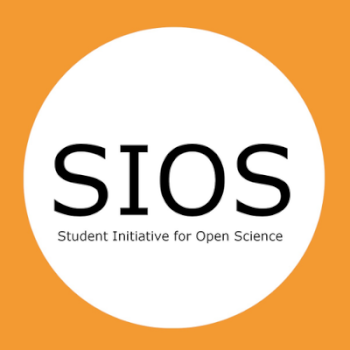

---
# Title, summary, and page position.
linktitle: 'Section II: Start and Foster your Open Science Community'
summary: ''
weight: 1
icon: book
icon_pack: fas

# Page metadata.
title: 'Section II'
date: "2020-10-18"
type: book  # Do not modify.
---

We describe **four stages** in setting up an OSC (*Figure 6*). These stages are presented in chronological order, but it may very well be that, in your situation, the order of these steps are reversed. That is fine! Also, you may experience that certain aspects of these stages are not ’finished’ when moving to the next stage, but require continuous work. Nevertheless, these stages provide a scaffold to get your community off the ground. So here we go!

***

***Figure 6**. The four stages of starting and fostering an Open Science Community*

***

## **Stage 1: Prepare and Launch**

### 1a. Founding members: Community Coordinators and Faculty Ambassadors

The first thing you need in order to get a local OSC off the ground is (at least) one **Community Coordinator**, who takes the initiative to start an OSC. This could be you! Looking at the people that have started local OSCs so far, we can identify the following profile:

- Passionate about Open Science
- Early to mid-career researcher (PhD student / Associate professor)
- Enthusiastic
- Outgoing
- Optimistic
- Enable to inspire others
- Inclusive
- Innovative
- Team player
- Well connected within the university and/or able to establish new connections (e.g., with deans, librarians, research support offices, various councils, etc.)  
- Willing to try and fail (and try again!)

Obviously, this does not mean that *only* individuals with the aforementioned characteristics are suitable to become Community Coordinators; we only highlight that these traits, common among the people who have stepped up for the challenge so far, have been beneficial in setting up our communities. In our experience, it is more sustainable (and much more fun!) to start with more than one Community Coordinator. Look for like-minded colleagues who want to co-create and co-lead an OSC with you.   
People in leadership positions involved in Open Science Programmes within your institution might also be interested in having a local OSC. However, rather than coordinating the community themselves, they may be in the position to *facilitate and support* the initiation of an OSC. For instance, they can actively search for people within their university that fit the Community Coordinator profile described above or, even better, they could propose a vacancy for a (paid) position. Judging from our experiences so far, we recommend two Community Coordinators (0.2 - 0.4 fte each).   
It is also possible for people who are not active researchers (e.g., research support staff or librarians) to initiate and facilitate an OSC. This has been the case, for example, in Rotterdam ([OSCR](https://www.openscience-rotterdam.com/home/)) and Galway ([OSCGalway](https://osc-international.com/category/osc-galway/))[^1]. In those cases, active researchers are included in strategic decisions related to the selection of topics and prioritization of activities. One of the main aspects that make OSCs attractive for (new) members is that the community is *bottom-up*: for scholars, *by* scholars. OSCs operate in parallel of – but independently from – local policies or initiatives. It is important to stress this bottom-up nature when representing the OSC, in particular if Community Coordinators are not active researchers themselves.   
Until now, Community Coordinators have been self-appointed and, where applicable, Faculty Ambassadors were chosen by Community Coordinators (e.g., in Utrecht and Leiden, vacancies were announced via community newsletters and social media). However, it is also possible for Community Coordinators and Faculty Ambassadors to be selected based on an election process amongst community members or, alternatively, be hired by the local institution as part of a broader strategy.   
While setting up an OSC requires substantial commitment and time investment, our experiences have been very rewarding. As Community Coordinators, we have greatly extended our professional networks across all layers of the university, including rectors, deans, support offices, and librarians, thus increasing our influence on policy and infrastructure. On a personal level, we have acquired useful transferable skills, such as project management, community management, and leadership. Most importantly, it is extremely rewarding to co-create large-scale solutions with inspiring and like-minded colleagues, being part of something bigger than yourself, for the betterment of science and society.

### 1b. Connect with INOSC: Guiding Principles and Code of Conduct

The next step for the newly appointed Community Coordinators will be to **connect with our network: the International Network of Open Science/Scholarship Communities (INOSC)**. There is a lot of variety and flexibility in how different OSC within INOSC run their communities. What we share is a common set of Guiding Principles (*Box 2*) and a [Code of Conduct](https://osf.io/6gsye/). And we learn from each other! In [this Slack workspace](https://osc-netherlands.slack.com/#/) you can chat with the coordinators of all OSCs, who will help you get started.

***

> **Guiding Principles**
> - Open Science/Scholarship Communities (OSCs) are bottom-up platforms by and for researchers to exchange knowledge and knowhow on open science practices
> - OSCs are inclusive
>   - Researchers are the target audience of OSCs, but students, researcher supporters, and others that are interested in (conducting) research are also welcome to join the community
>   - No prior knowledge is required to be part of the community, nor are members in any way required to commit to certain open science/scholarship practices
> - OSCs organize, promote, and facilitate open science/scholarship events to (1) learn about and discuss open science/scholarship practices, (2) share open science/scholarship knowledge, and (3) build professional networks.
>   - Events are open to both members and non-members, and are free-of-charge, if possible
>   - Attendees and organizers of events organized by OSCs should adhere to the [Code of Conduct](https://osf.io/6gsye/)
> - OSCs promote critical discussions of pro’s and con’s of open science/scholarship practices. We refrain from being normative or condescending, and do not tell others what to do. Respect for each others’ workflows and decisions in this regard is critical.

***Box 2.** Open Science Communities Guiding Principles. Full version plus CoC can be found [here](https://osf.io/6gsye/).*

***

The **Guiding Principles (GP)** and **Code of Conduct (CoC)** represent the common ground of all OSCs and should not be modified. If you feel that certain aspects of these documents do not suit your community, please share your thoughts in the Slack channel of the Community Coordinators. You are free to complement these documents with principles that are tailored to your particular community, as long as they do not contradict the GP and/or CoC. You can find the full version of the GP and the CoC [here](https://osf.io/6gsye/), as well as the procedure to add a local addendum. 
When you agree to the GP and CoC, you are allowed to create your own **customized logo**, based on our template. Note that, while you are allowed to modify certain aspects of the logo, there are some restrictions[^2]. See our [Style Guide](https://docs.google.com/document/d/1MrAsChwb81gFXQX1_WUfdgo95HqH4t_rQU3DvGZHDfE/edit) for a detailed description on what you can and cannot change in the logo. If in doubt, contact the OSCU coordinators ([email](mailto:openscience.utrecht@gmail.com)).

### 1c. Online visibility: website and social media

The next thing you need is a **website**, an indispensable tool to increase online visibility of an OSC. On the website, OSC activities are constantly advertised and names and skills of community members are highlighted via personal profile pages and interviews. OSC websites have so far been created via Wordpress (e.g., [Utrecht](https://openscience-utrecht.com/)), embedded in internal university websites (e.g., [Leiden](https://www.universiteitleiden.nl/open-science-community-leiden)), or [R](https://cran.r-project.org/) in combination with [GitHub Pages](https://pages.github.com/) (e.g., [Nijmegen](https://openscience-nijmegen.nl/index), [Rotterdam](https://www.openscience-rotterdam.com/home/)). For consistency and to be found more easily, OSCs domain names often follow the form *www.openscience-[CITY].com* (e.g., [Groningen](https://groningen.osc-international.com/)), with some exceptions (e.g., [Eindhoven](https://osceindhoven.github.io/)).   
While you are free to create the website for your OSC in any way your like, the following elements are required:
- A homepage with the Vision and Mission statements of the OSCs (see [Section I]()) as well as our Guiding Principles (see *Box 2*)
- A section with the OSC [Code of Conduct](https://osf.io/6gsye/)
- A section with names and/or profiles of community members
Other features you may consider for your community website are: (*i*) a news section for OS developments; (*ii*) an agenda section for OS events; (*iii*) general information about OS; or (*iv*) a page to feature members initiatives.

Regarding social media, [Twitter](http://twitter.com) is a powerful tool to connect with other OS enthusiasts, share knowledge, and start fruitful collaborations on various projects. On Twitter, OSCs advertise their internal activities, retweet external events (e.g., conferences), promote thoughtful documents (e.g., blog posts, preprints) and funding opportunities. Each OSC has its own Twitter account (e.g., [OSCU](https://twitter.com/OpenSciUtrecht), [OSCG](https://twitter.com/OSCGroningen)). For consistency and to be found more easily, the Twitter handle is typically *@OSC* followed by the city (e.g., [@OSCLeiden](https://twitter.com/OSCLeiden)).

Daily internal communications can be facilitated by means of instant messaging tools. The OSCs are productively using [Slack](https://slack.com/) and [Element](https://element.io/). Slack is very popular, has an intuitive user interface, and interacts seamlessly with other services (e.g., Google Drive, Microsoft Office 365). However, it is proprietary software and the free version has [some limitations](https://slack.com/intl/en-nl/help/articles/115002422943-Message-file-and-app-limits-on-the-free-version-of-Slack?eu_nc=1) (e.g., chat history is hidden after 10,000 messages). Element, while slightly less user-friendly, is free and open source, based on the secure [Matrix](https://matrix.org/) decentralized communication system, and integrations with other products are actively developed and maintained by open source enthusiasts.

### 1d. Attract initial members

In the initial stages of an OSC, attracting members is most effective by word of mouth: talk to colleagues who are interested in OS and/or already have experience with OS practices, and ask them if they are willing to join the community. Note that *it matters a lot who your initial members are*. If all your initial members are from one faculty, it will be more difficult to attract members from other faculties at a later stage, because they will think that this community is not for them. The same goes for OS expertise. If you only have OS experts as members, newcomers will be more reluctant to join. Thus, make sure that your initial members are a heterogeneous group.

### 1e. Connect to Open Science initiatives at your institute

It is also highly recommended in this stage to connect locally with related projects (for example in University Libraries), even when you are still in the phase of setting up your community. It is important to be aware of what is already going on in your institute regarding OS and, moreover, these people are often very willing to help you, for example to organise workshops together or connect you to other relevant stakeholders.

### 1f. Launch!

When you have an initial set of members and perhaps some plans for workshops or events, it is time to make your community official! A great way of doing this is by organising a kick-off event including, for example a couple of short talks by your founding members on why they are enthusiastic about OS and the community. Ask your initial members to help out by inviting their colleagues to the kick-off event and promoting the community. Current members, preferably at a leadership position, can send out an email to their research group, department, or faculty, to promote the event.   
Make sure that the event is festive and celebratory, e.g., by decorating the room and offering drinks and snacks. It is also worthwhile to invite someone to take pictures of the event, which can later be showcased in newsletters, social media, and on the community website.

## **Stage 2: Grow & Inspire**

In the next stage, the two main objectives are: (1) to attract more members; and (2) to inspire members to make their workflows more open.

### 2a. Attracting members

First off, you need to invest a lot in the visibility of your community. Start spreading the word at meetings and in newsletters of faculties or departments. You can also print flyers or stickers (see the [Style Guide](https://docs.google.com/document/d/1MrAsChwb81gFXQX1_WUfdgo95HqH4t_rQU3DvGZHDfE/edit) for examples). It can be very useful to ask your initial members to help out with the promotion. Newcomers are more inclined to join the community if they hear about it from colleagues within their own discipline or department, so make use of the network of your members. In our experience, an effective way to attract new people is when current members, preferably at a leadership position, talk about the community or send out an email to their colleagues, research group, department, or faculty, stating that they joined the community and suggesting their colleagues to join as well. It is also worthwhile to be visible at local events with many newcomers to OS, even when such events are not about OS. Try and get a slot to talk about OS and your community, even if it is just a one-minute pitch. Another option, often easier to accomplish, is to have an information stand at an event, where you can interact with potential new members. It also helps to have a *‘SIGN UP HERE’* desk present at events where newcomers can sign up on the spot. Merchandising and gadgets such as stickers, keycords, and water bottles with the community logo can also help attract new members and increase the community feel (if your budget allows).   
When attracting new members, it is crucial to have a clear communication strategy. For this, it is key to understand your target audience. They are not you! While OS may be high on your agenda, for newcomers it often has less priority. It is crucial not to be condescending about this. People who are particularly passionate about OS might consider their workflows superior to those of others and express such feelings. Being exposed to such perspectives can alienate newcomers and lead to unnecessary resistance by creating a counterproductive “us versus them” distinction. Newcomers are more likely to join a community where they can explore and formulate their opinions and doubts, as opposed to an ‘expert club’ that is judgemental on the workflows of others. It is therefore critical to strike the right tone. Make sure that in all your communication you are inclusive, humble, and respectful. Stress that the OSC is a learning community and that communication is bidirectional: newcomers and experienced peers learn from each other and identify bottlenecks and opportunities to make the transition to OS more fun and fluent, together.   
The fact that OS is not top-priority for your target audience also means that you need to make the threshold for events as low as possible. For example, make sure people don’t have to travel a lot to attend events, e.g., by organising events online, or multiple times at different locations across campus. Having to leave the building can literally make a difference for people to attend or not. Make sure that newcomers can identify and relate to events that you are organising. Try to do everything within your limits to bring your events to the people, both in terms of logistics and topics. As mentioned above, free drinks, snacks, and swag are often appreciated (if your budget allows).

### 2b. Inspire members to make their workflows more open

OSCs have various tools and formats at their disposal to promote engagement with OS. Here we list those that have proved to be particularly effective.

#### OSC website
On the OSC websites, members indicate their expertise on OS practices: for example, the website of the Open Science Community Rotterdam ([OSCR](https://www.openscience-rotterdam.com/home/)) present the Open Science skills of each member via [tags](https://www.openscience-rotterdam.com/tags/). This provides an easy and low-threshold route to find and contact a colleague when having a question regarding a particular OS topic. This can also facilitate some kind of ‘match-making’ between members who want to share their OS knowledge and members who want to learn about specific aspects of OS. A built-in function that makes these matches automatically would be very useful, otherwise Community Coordinators could email ‘matches’ with the suggestion to meet. This procedure might resemble the format of a dating site, without the romance (but who knows!).   
Information on the website can also inspire engagement with OS practices by *setting norms*. By demonstrating the prevalence of experience and interest in Open Science practices, we communicate that Open Science is the way forward. 

#### Newsletters
A newsletter is an efficient way to reach a large number of people and inform them on OS news and events. Our newsletters are typically well read, with about 50% of the subscribers opening the newsletter and 10% clicking on items in the newsletters[^3]. Make sure to keep them short and appealing and try not to overload your subscribers with emails (once a month is sufficient).

#### Talks, Workshops, and Study Groups
When choosing the topics of your events (e.g., talks, workshops), we recommend reaching out to your members for input. What topics would they like to be covered? Make sure to have a diverse set of events, in terms of topics and format. Your members will have different levels of experience in opening up their workflows, and it is crucial to cater to the needs of all. Here we present formats for subsequent levels of engagement with OS practices, from lightweight introductions to in-depth and hands-on workshops and study groups (*Table 2*).

*Talks* are a useful format for introductions: meetings aimed at sharing information to a broad audience. Typical examples are overviews on open science or introductions to Registered Reports. A particular format of talks frequently adopted in OSCs are *lightning talks*, short talks (5 - 10 minutes) where colleagues share their practical experience with OS practices. Speakers do not need to be experts, they can be just one step ahead of their colleagues on the use of a particular tool or technique. A set of lightning talks can be centered around one specific practice (e.g., preregistration) or targeted at a particular audience (e.g., PhD candidates) or discipline (e.g., behavioral economics). Many of the talks and workshops organized by OSCs are accessible online and open for reuse. We often complement practical experience from peers with in-depth knowledge from librarians.   
In order to attract newcomers, it is beneficial to narrow the scope of a workshop to a particular audience. For instance, newcomers may be more inclined to join a workshop “Open and FAIR data for Economists” than a workshop on Open and FAIR data in general. This, of course, comes with the drawback that many different workshops would need to be organized for different disciplines. If that is not feasible, you can also stick to workshops targeted at the whole university, with the added benefit that they may inspire interdisciplinary insights when people from different disciplines interact with one another.   
While (lightning) talks effectively inform and inspire newcomers to Open Science, in-depth workshops provide the next step towards behavioural change.

*Workshops* are interactive sessions aimed at learning tools that increase openness and transparency. These tools can be specific software or online collaborative platforms, for example how to use R for reproducible data analysis or a practical guide to the Open Science Framework. The session host gives a general introduction of the tool and what problem it tackles, followed by hands-on examples and live tutorials that participants can later adapt for their specific cases. Attendees are asked to prepare in advance, e.g., by bringing their own laptop and having relevant software already installed.

A next level of engagement can be achieved in *study groups* or *mentorship programs*, or *recurring consultation hours* where a group of peers work on how to implement a particular OS practice over a period of time, under the supervision of an experienced mentor. Such initiatives not only provide members with a good knowledge basis, but also allow them to connect with colleagues dealing with similar issues, thereby facilitating the quick development of shared solutions and a stronger sense of community.

For any of the initiatives described above to work, the community needs both an audience (e.g., newcomers) and colleagues who already have experience with one or more OS practices that are willing to share their knowledge. The advantages for newcomers to OS are pretty clear. But what’s in it for the latter group? Pioneers and early adopters, generally proud of their open workflow, often work in environments where their efforts might not be appreciated because it is not common practice. OSCs welcome, validate, and reward their expertise by showing that more people care about improving scholarly practices, thus creating a sense of belonging which can be a strong motivator to stay committed to OS. Moreover, OSCs provide opportunities for leadership roles in setting up local member initiatives, thereby increasing impact and visibility within the local academic environment. This also provides opportunities for members who already actively promote OS to get more traction for their initiatives.

***

|              | Lightning talk | Workshop   | Study Groups |
| :----------- | :------------: | ---------: | -----------: |
| **Goal**     | Inspire        | Engage     | Commit       |
| **Audience** | Open           | Interested | Invested     |
| **Speaker**  | Beginner       | Expert     | Expert       |

***Table 2**. Overview of event formats with matching level of OS engagement.*

***

#### Journal Clubs

Journal clubs are regular (e.g., bi-weekly or monthly) meetings in which attendees discuss articles and other documents related to OS. The document to be discussed is communicated in advance via email and Twitter, with frequent reminders in the days preceding the meeting. Typically, a discussant prepares a short summary with the main point of the document and discussion among attendees is encouraged. The discussant can be one of the organizers, an attendee, or one of the authors of the document examined during the session.   
Examples of OSC-led ReproducibiliTea (see *Box 3*) can be found in [Leiden](https://twitter.com/LeidenTea), [Groningen](https://osf.io/f6brg/), and [Rotterdam](https://www.openscience-rotterdam.com/2019/10/21/oscr-reproducibilitea/). In case of *in-person* journal clubs, the organizers book a room and provide refreshments (or ask all attendees to contribute by bringing something to share). If the journal club is online, the organizers set up the meeting – using [Zoom](https://zoom.us/), [Jitsi Meet](https://meet.jit.si/), [Microsoft Teams](https://products.office.com/en-us/microsoft-teams/group-chat-software), or any other appropriate service – and moderate the discussion.

#### Online Webinars and Meet-Ups

Online events are aimed at sharing knowledge with as many people as possible, including non-members of OSCs. Speakers (typically OSC members) are invited to show the audience how to use practical tools to improve research openness and transparency. Two examples are *Using Gitbook for your course materials* (part of the [OSCU OSCoffee](https://osf.io/63fxd/) initiative) and [Introduction to Git(Hub)](https://www.openscience-rotterdam.com/2020/04/09/intro-github-apr2020/) (organized by OSCR).   
OSC coordinators typically set up the meeting – using [Zoom](https://zoom.us/), [Jitsi Meet](https://meet.jit.si/), [Microsoft Teams](https://products.office.com/en-us/microsoft-teams/group-chat-software), or any other appropriate service – and moderate the discussion.

#### Member Initiatives

The strength of a community depends on the contributions of its members. Members can increase the magnitude and diversity of the activities organised within the community while simultaneously easing the organisational burden on the shoulders of Community Coordinators. *Member Initiatives* are typically tailored for a smaller subsection of the community, and focus on specific open science areas. While members are free to develop their own initiatives, it can be even more effective to promote existing formats that have proven successful in other institutions, for instance ReproducibiliTea journal clubs, R.I.O.T. Science Clubs, and Data Champions (see *Box 3*). These initiatives can find a place under the umbrella of the local OSC. Community Coordinators can promote and support these initiatives by featuring them on the website, newsletter, and social media, making use of the community network. Colleagues from institutions that already have such initiatives in place can be invited to share their experience or be interviewed at events or in newsletters, to motivate local members to kickstart local instances. Regardless of whether members devise their own initiatives or start from existing examples, these are powerful opportunities to gain organizational and leadership experience, which is increasingly relevant for career development in academia.

***

> [**ReproducibiliTea**](https://reproducibilitea.org/)
> 
>
> ReproducibiliTea journal clubs help early-career researchers establish local Open Science journal clubs at their universities. Topics of discussions range from ways to improve science (e.g., by means of statistical reforms) to social implications of the Open Science movement.

 

> [**R.I.O.T. Science Club**](http://www.riotscience.co.uk/)
> 
>
> The R.I.O.T. Science Club organizes seminars where researchers can learn about Open Science reforms and practices. Speakers give talks, discuss papers, provide insights into software and tools, and recommend (new) statistical techniques, with the main goal to encourage Reproducible, Interpretable, Open, and Transparent Science.

 

> [**Data Champions**](https://doi.org/10.5281/zenodo.3383814)
>
> Data Champions are volunteers who promote good research data management (RDM) and support Findable, Accessible, Interoperable, and Re-usable (FAIR) research principles.

 

> [**The Carpentries**](https://carpentries.org/)
> 
>
> The Carpentries teach basic computational and data science skills to researchers. The project comprises the [Software Carpentry](https://software-carpentry.org/), [Data Carpentry](https://datacarpentry.org/), and [Library Carpentry](https://librarycarpentry.org/) communities.

 
 

> [**SIOS**](https://studentinitiativeopenscience.wordpress.com/)
> 
>
> The Student Initiative for Open Science (SIOS) spreads the message and practices of Open Science within the student community by organizing lectures, debates, and workshops. In addition, SIOS promotes the implementation of open practices in university programs, e.g., open access to all articles and preregistration of thesis projects.

***Box 3.** Examples of successful initiatives and formats to promote Open Science that can be rolled out locally in an Open Science Community.*

***

## **Stage 3: Foster and Sustain**

In this stage, you increase the diversity of your membership, increase interactions with stakeholders and make your community sustainable. This is also a good time to critically evaluate the effectiveness of your community and to identify opportunities for further development.

### 3a. Diversity and inclusivity

Take time to analyze the **diversity of your membership**. Are you happy with the proportion of newcomers and experienced members? Do you have members in all faculties? The key question here is: Who are you missing? To optimize the diversity of your membership, consider reaching out to new target audiences, such as students, colleagues at Universities of Applied Sciences, or members without a university affiliation, such as citizens, private companies, or members of civil societies.

### 3b. Institutional stakeholders: policy, infrastructure, and support

In our experience, institutional stakeholders – such as people in leadership positions responsible for policy, infrastructure, and support – are often eager to collaborate with OSCs (see *Table 3*). Identify those people in your institution and get your community to their attention. Make sure to articulate how we can mutually benefit from one another. We have a shared goal: smooth and effective implementation of OS practices. Communities can serve as platforms for stakeholders to get input from scholars. This input, e.g., on how scholars experience opportunities and obstacles regarding OS practices, is very valuable to them. By being open to this input, community members get the opportunity to influence policy, infrastructure, and support.   
There is no easy recipe to expand the influence of your community and the opportunities will depend heavily on your local environment. This is all about networking and lobbying. In our experience, it is more effective (and pleasant!) to focus on people in leadership positions that are already positively inclined towards OS. If you are met with resistance, do not fight it. Explore alternative routes instead. One format that has worked well for us is to organise meetings where the people responsible for policy and infrastructure can interact with community members. Use the newsletter to inform community members of new policies and services, and provide channels for feedback[^4].   
A partnership that has proved to be beneficial is with colleagues from the *university library*, who are pivotal for research support. Librarians are often very progressive when it comes to OS and many have been supporting it for years, in particular regarding Open Access and open data. However, our experience is that their knowledge and potential is not often adopted by scholars. One effective way to foster collaboration with librarians is to organise a back-to-back workshop with two speakers: one librarian and one scholar. In our experience, combining the expertise of a librarian with the practical experience of a researcher can be very insightful to both newcomers and expert OS practitioners.

***

| Stakeholder            | Give                                                         | Take                                         |
| :--------------------: | -----------------------------------------------------------: | -------------------------------------------: |
| Newcomers | Feedback on bottlenecks and boundary conditions | Learn Open Science skills, shape policy and infrastructure (influence) |
| Experienced colleagues | Share experience | Being able to inspire others (influence), platform to start initiatives (leadership), consolidate Open Science skills (sense of belonging) |
| Makers of policy and infrastructure | Being open to input (influence) | Well-tested ideas and experiences that help to re-shape or transform ways of working and institutional cultures |
| Librarians and support staff | Open Science training | Reach an audience interested in Open Science |

***Table 3**. The give and take of target audiences and stakeholders.*

***

### 3c. Interactions between academia and society

For science to be truly open, it is important to achieve a relationship of mutual respect and constructive criticism between science and the public. The public is arguably the stakeholder scientists are most accountable to, and their inclusion can benefit science by for instance providing a broader debate or valuable lay perspectives. Views of citizens and scientists [often differ](https://www.pewresearch.org/science/2015/01/29/public-and-scientists-views-on-science-and-society/), yet science relies on public funding and aims to be a relied upon source of knowledge generation. Open science thus also means engaging the public in a meaningful way, by for instance making science more accessible, providing press-abstracts and summaries for the layperson, involving the public in decisions of what to study (e.g., the [*‘Nationale Wetenschapsagenda’*](https://wetenschapsagenda.nl/) in the Netherlands), and achieving a [common goal through Citizen Science](https://erc.europa.eu/news-events/magazine-article/transformative-potential-citizen-science). As an OS community, including non-scientific public in the debate, for instance on how to make science available to all, can be a valuable form of feedback for researchers and teachers within the community.

### 3d. Funding

At this stage, you have a growing number of community members and a series of events in place. Now is the time to invest in the sustainability of the community, particularly maintaining and expanding capacity, which is closely connected to acquiring funding.   
Communities are often started by PhD students: their energy and enthusiasm can propel the success of the community, but their temporary contracts leave the community vulnerable. It is recommended to either include colleagues with a permanent contract in the core organizational group or include new PhD students that are likely to be around for a longer timespan than the founders. Also, consider *expanding your core team*. For example, promote *Faculty Ambassadors* who focus on activities and engagement in their respective Faculties (for example, OSCU has Faculty Ambassadors for all seven faculties, working for 0.1 fte each).  You may also want to involve support staff that could support you with organisational tasks, e.g., from the University Library or Research Support Offices.   
At this stage, it is also critical to *acquire funding*. Of course, it would make life much easier if you were able to acquire funding from the very beginning (and we wholeheartedly recommend you to investigate available options at your local institution). However, acquiring funding is often more effective if you already have a success story to show. It often requires extensive lobbying to convince colleagues who can allocate budget. In this regard, it helps if you can make a clear case for how your community makes institutional policy and projects more effective. The source of the message is also important, so make sure to include members at leadership positions in your requests. Your chances of acquiring funding will depend on the urgency of local and national OS policies and how well you are able to connect with them. Unfortunately, there is no one-size-fits-all solution or strategy, as these circumstances will differ from one University to another. In the [Slack workspace](https://osc-netherlands.slack.com/#/) of the Community Coordinators, we have a separate channel to discuss funding-related issues. See [here](https://docs.google.com/document/d/1RFxmQ0xbh8ZgQe0XiOGv2T7Xmj3TW5chRQq5X6hJq3w/edit) an example of a request for funding by Open Science Community Leiden. 

### 3e. Community Building

You’ve brought together a group of passionate people – you’re really hoping to sustain the energy, passion and dynamics of the community and connections. Perhaps you’re finding that as the community grows organically, more and more work is reliant on you, especially administrative, and it’s wearing you out. Perhaps you heard from some initial members that they’re finding their experience no longer rewarding, unless there’s room for them to grow or lead. Perhaps there are emerging disagreements and conflicts between some community members.

It’s important to always ask *why* – what is the goal of the community, and why do people join/stay? These factors *change* constantly. 

The goals of joining/being in a community can be:
- *Co-creation*: To work towards something meaningful together/to contribute to meaningful initiatives
- *Upskill*: to learn new skills/get more diverse experience
- *Network*: To meet new people/maintain existing contacts
- *Support*: Emotional support, soundboard ideas, troubleshooting

The goals for your community members can be different, and not listed above! It’s important to find out what they are, to help you design an effective community programme. *E.g. the most important goal for most of your community members is to co-create with others–you then design co-working sessions/working groups for your members to join and create something together.*

Mozilla Open Innovation and the Copenhagen Institute of Design distilled [6 major ways of building values together as a community](https://medium.com/mozilla-open-innovation/a-framework-of-open-practices-9a17fe1645a3). This is a helpful framework to start thinking about the different possibilities – but again, it goes back to figuring out which of these (or more) are most useful for *your community*.

To find out what these goals are, you can:
- Conduct 1:1 meetings with new/existing members – these will give you more in-depth insights that often don’t come through via other means, and will make members feel more valued/empowered to make decisions!
- Surveys – less time consuming than 1:1, quick insight into these key questions
- Co-design workshop – connect members in the processed, but requires more planning and effort into design to facilitate an effective workshop

The opportunity to continue to learn and grow with participating in a community is an important incentive to keep community members engaged and active. One needs to consider *pathways*, from the first instance of engagement (hearing about the community through a friend, or joining a community seminar) to sustained participation in community activities, and potentially leadership. 

The [mountain of engagement](https://docs.google.com/document/d/1mOxQYVIAnSFjwzx3sVXxZw2XdP18WxjP9nxcMXtNqIo/edit) is one of the best frameworks to begin mapping out these pathways, and ultimately, *an architecture for participation* – it helps you consider how members could move within the different levels of participation, and what would motivate them to move up and become more engaged. 

Ultimately, a community is *people*, which means as members come and go and circumstances and priorities change for members, the programming should change. There’s no perfect programming, and the best strategy is one of *build-measure-learn-repeat*: actively listen, seek feedback and constructive criticism, reflect, adjust and act accordingly. 

### 3f. Criteria for Success

Here we provide a set of proxies that can help you assess how successful your community is. These proxies, however, only offer a partial view of the work within a community and should not substitute a careful qualitative assessment, e.g., by talking regularly with community members to understand their needs and provide relevant offers with respects to events and communication strategy. Understanding how proxies relate to behavioural change requires additional qualitative investigation to highlight which interactions are most effective. Nevertheless, when used with care, the following proxies can help assess successful community outreach.

#### Proxy #1: number and characteristics of members

The most obvious proxy for success is the number of members and its increase over time. Make sure to dive into the characteristics of your membership to see whether they adhere to your intentions and strategies. For instance, what is the ratio of newcomers to experienced colleagues in your community? How are your members distributed amongst different faculties? What is the representation across work positions, e.g., PhD candidates, (full) professors, librarians, and so on? While there is no objective target to reach, ask yourself what you consider upper and lower bounds for your community to be self-sustained and achieve its general aims (being a link between OS experts and novices).

#### Proxy #2: number and type of community interactions

The chance of inspiring engagement to OS practices is likely correlated with the number and type of interactions within your community. For example, how many people attend OSC events? Does attendance vary as a function of the type of event, e.g., more people follow workshops rather than talks? Activity within member initiatives is also very relevant in this regard, therefore it is important to be in constant communication with all the organizers.   
It is also informative to consider analytics of website traffic and/or newsletter interactions, for example how many people have opened the newsletters and clicked on particular links.   
An additional proxy is social media presence. Many OSCs have substantial numbers of followers and traction on Twitter. Activity on social media facilitates interactions among OSCs and between OSCs and other stakeholders all around the world. However, it is important to consider how much of that information actually ends up at your local target audience. Check the profiles of your followers and those of the people that like and retweet your tweets, to make sure you are not only ‘preaching to the choir’.   
Finally, it would be informative to track how many people reached out to members via the website for questions regarding OS practices. We do not yet have procedures in place to systematically investigate the number of professional collaborations born within the community... if you have some ideas let us know!

#### Proxy #3: number and type of interactions with other stakeholders

Keep track of the formal and informal interactions that you have with local managers, policy makers, and providers of infrastructure and services. Wherever possible, make your role and input explicit and keep track of how much of your input actually gets implemented. This also holds for interactions with stakeholders outside your university, for example at the national and international level. In addition, you can track the number of collaborations you have with the university library and how beneficial they were in motivating scholars to implement OS practices in their workflow.

Besides these proxies, you may also conduct surveys and interviews at regular intervals, to monitor behaviors regarding the adoption of OS practices and evaluate to what extent OSC membership facilitates the transition to openness. Surveys allow you to have a general overview of the type and scope of OS practices within your organization and provide a better picture of the differences among disciplines. However, surveys can be time-consuming, require specialized knowledge, and causal inferences are difficult to draw (e.g., responses might be influenced by social desirability, or other organisational initiatives may have played a role), all caveats that should be taken into account in the planning stage.   
So, the take-home message here is: it is difficult to assess how successful your community is. Nevertheless, it is important to keep track of how you are doing, in particular to determine opportunities to steer and develop your communities. The proxies provided in this section, when used with care, can be useful in this regard.

## **Stage 4: Dream and Scheme**

Now that your community is up and running, what happens next? That’s up to you! What we provided in this Starter Kit is our experience with OSCs so far. We hope that, some day, OS will become such a common practice that OSCs will no longer need to focus on OS alone. Instead, OSCs can evolve and become platforms aimed at exploring means to innovate science, or as networks to initiate (interdisciplinary) collaborations. Until that day, we will continue to attract newcomers to OS, assist them in opening up their workflows, and interact with policy, infrastructure, and society to shape the transition to OS. This transition is an ongoing process, with local national and international stakeholders, each moving at their own pace. And it is bound to be a bumpy ride. We need to be agile, willing and able to adjust our ways to meet unforeseen challenges. At times it will be smooth sailing, other times we’ll be in for stormy weather. But together, our fleet of OSCs can navigate hell or high water. And one day, we will look back and see that science has become more open, more effective, and more fun, and that we have paved the way for generations to come.

[^1]: Note that OSCGalway chose to use ‘Open Scholarship’ instead of ‘Open Science’ in their name to appeal more to colleagues who do not identify with the term ‘Science’. In the Netherlands, Community Leaders have stuck to ‘Open Science’, as this term is more mainstream. As mentioned earlier, the term ‘science’ is used here in its broadest sense.
[^2]: The OSC logo bears similarity with the [Ubuntu logo](https://design.ubuntu.com/brand/ubuntu-logo/). We have agreed with Canonical Ltd. to set up guidelines to prevent any confusion regarding our respective logo, for example that the OSCs will not use the same color scheme as Ubuntu.
[^3]: These numbers are based on the newsletter of the Open Science Community Utrecht.
[^4]: There are, of course, many policies and infrastructures that are not determined locally, but rather at national or international level. It is worthwhile to invest time in interacting with relevant stakeholders at (inter)national levels as well.
