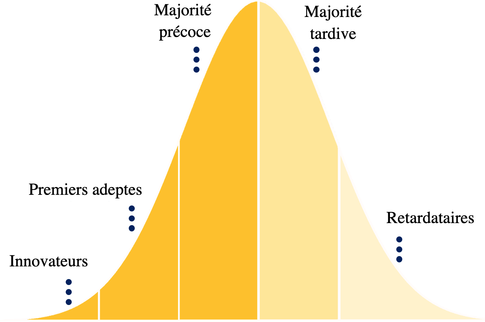
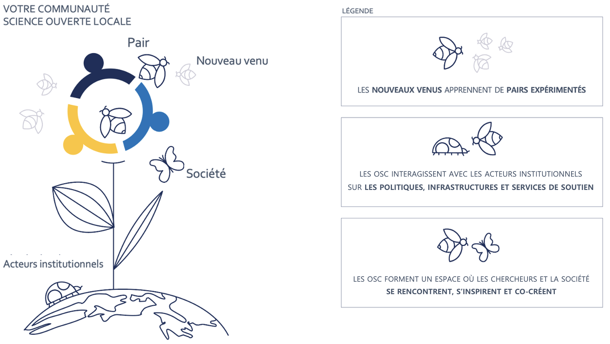
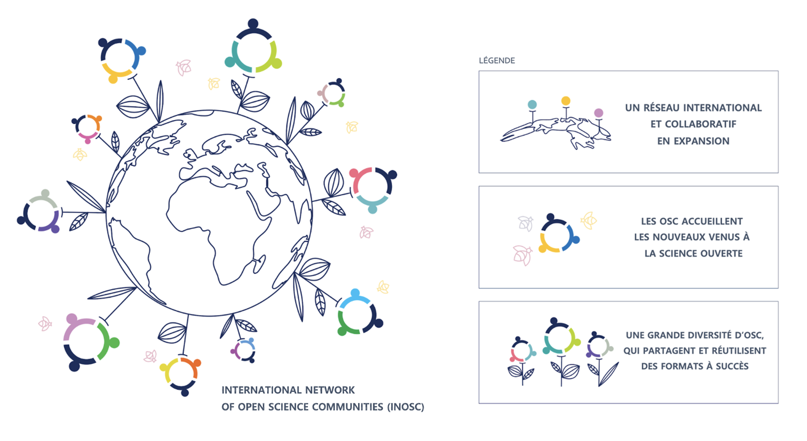

---
# Title, summary, and page position.
linktitle: 'Partie I : Introduction aux Communautés science ouverte'
summary: ''
weight: 1
icon: book
icon_pack: fas

# Page metadata.
title: 'Partie I'
date: "2021-10-11"
type: book  # Do not modify.
---

## I.1 Le rôle des Communautés dans la transition vers la science ouverte

La science ouverte[^1] (SO) recouvre un [vaste ensemble de pratiques](https://www.fosteropenscience.eu/themes/fosterstrap/images/taxonomies/os_taxonomy.png) qui ne cesse de croître et qui rend la production scientifique (publications, données, codes, protocoles, etc.) plus accessible, transparente, robuste et inclusive. La raison d'être de ces pratiques est que [l'ouverture améliore la qualité, l'efficacité et l'impact de la science](https://doi.org/10.3390/publications7030046). Si certaines de ces pratiques commencent à se généraliser (par exemple l'accès libre aux publications), d'autres sont loin d'être courantes (par exemple les données ouvertes et les preprints). Si vous lisez ce kit de démarrage, vous connaissez probablement un grand nombre de ces pratiques et vous êtes convaincus que la SO est bénéfique pour la science et la société. Nous le sommes aussi !

À première vue, la transition vers la SO peut sembler plutôt facile à réaliser. Pourquoi les gens n'adopteraient-ils pas ce formidable ensemble de nouvelles pratiques ? En réalité, cela ne demande rien de moins qu'un profond changement culturel dans le monde académique. Comme l'explique Brian Nosek dans [ce billet de blog](https://cos.io/blog/strategy-culture-change/), un changement culturel nécessite un ensemble d'ingrédients clés que l'on peut représenter sous forme de pyramide (*Figure 1*).

***

***Figure 1**. La pyramide du changement culturel. Illustration de Brian Nosek (sous [licence CC BY](https://twitter.com/BrianNosek/status/1446528277271748611)), tirée du billet de blog [Strategy for Culture Change](https://www.cos.io/blog/strategy-for-culture-change)*

***

Au sommet de cette pyramide se trouve la **politique**. Pour un changement culturel en faveur de la SO dans le monde académique, des politiques publiques sont nécessaires pour la promouvoir et s'assurer que les incitations institutionnelles sont alignées en conséquence. Au bas de cette pyramide, nous trouvons l'**infrastructure** nécessaire. Il est essentiel de disposer d'une infrastructure fiable, flexible et ergonomique pour mettre en pratique la science ouverte. Les plateformes en ligne permettent de mettre en place des flux de travail collaboratifs (par ex. [Open Science Framework](https://cos.io/)), de stocker et partager des données, codes et autres résultats (voir également [EOSC](https://www.eosc-portal.eu/)) et des services de soutien, par exemple, ceux fournis par les services de documentation. Cependant, malgré les politiques récentes et les infrastructures disponibles, nous attendons toujours un véritable changement culturel. Qu'est-ce qui nous retient ? Ce défi se situe au niveau de la couche intermédiaire de la pyramide, les **communautés** qui rendent la SO normale. À l'heure actuelle, la communauté scientifique engagée dans la SO est relativement restreinte et se compose principalement de personnes qui ont déjà une certaine pratique de la SO. Ces pionniers de la SO jouent souvent un rôle consultatif en matière de politique et d'infrastructure. Bien que leur contribution soit extrêmement précieuse, ils peuvent négliger les obstacles rencontrés par les nouveaux venus dans la SO. Ces nouveaux venus représentent le champ scientifique dans son sens le plus large : il ne s'agit pas seulement d'étudiants ou de chercheurs en début de carrière, mais aussi de chercheurs senior qui sont habitués à un mode de travail pendant des décennies et qui s'intéressent maintenant à des pratiques plus ouvertes. Si l'on n'implique pas cette communauté plus large et si l'on ne fait pas appel à des objectifs et des valeurs partagés, la SO risque de devenir une perte de temps ou "une case de plus à cocher" au lieu d'enrichir les méthodes de travail de chacun. L'adoption à grande échelle de la SO dépend donc de la transition des pionniers à la majorité précoce et tardive (*Figure 2*).

***

***Figure 2**. [Cycle de diffusion de l'innovation selon Everett Rogers](https://en.wikipedia.org/wiki/Technology_adoption_life_cycle#/media/File:DiffusionOfInnovation.png), indiquant les étapes par lesquelles passe généralement toute innovation : Innovateurs, Premiers adeptes, Majorité précoce, Majorité tardive, Retardataires.*

***

Tout changement culturel a besoin d'une masse critique pour remettre en question et modifier le *statu quo*, et l'apport des nouveaux venus est essentiel pour affiner la politique et l'infrastructure nécessaires pour parvenir à une adoption large de la SO. Le principal défi de la transition vers la science ouverte est donc un **défi social** : comment impliquer une masse critique de la communauté scientifique ? Si beaucoup vivent la transition vers l'ouverture comme libératrice et plus conforme à leurs motivations intrinsèques, d'autres sont plus réticents à changer pour plusieurs raisons. Il se peut qu'ils soient à l'aise dans leurs pratiques actuelles, qu'ils n'en voient pas les avantages, qu'ils considèrent que l'investissement n'en vaut pas la peine, ou qu'ils soient dépassés et frustrés par la surcharge d'information et l'absence de norme et de reconnaissance institutionnelle. Certains pourraient même penser que la SO n'est qu'une phase, et voudront attendre que cela se calme. Sauf que ça ne se calmera pas. La transition est bel et bien là et tous les chercheurs devront y faire face. Le moment est venu de construire et de façonner cette transition et, pour cela, nous avons besoin de la contribution de la communauté scientifique dans son ensemble.

C'est là que les Communautés science ouverte (en anglais *Open Science Communities* ou OSC) entrent en jeu. Il s'agit de communautés d'apprentissage par la base conçues pour une grande partie des chercheurs. Pour ce faire, nous rendons les OSC plus **visibles**, plus **accessibles**, et nous explorons les **obstacles et les exigences** qui se présentent aux nouveaux venus qui veulent ouvrir leurs pratiques. Pour une présentation plus détaillée du rôle des OSC dans la transition vers la science ouverte, veuillez lire notre [livre blanc](https://doi.org/10.31222/osf.io/7gct9/).

Pour mettre en place un changement mondial vers la SO, nous avons besoin de nombreuses OSC locales, à travers le monde. C'est avec ces objectifs en tête que nous avons créé ce kit de démarrage, pour vous inspirer et vous permettre de créer une OSC locale. La clé pour accélérer la transition vers la SO peut, littéralement, être entre vos mains.

## I.2 Notre format pour les Communautés science ouverte

Le format d'OSC que nous présentons dans ce kit de démarrage est une communauté d'apprentissage **ascendante** (*bottom-up*) composée de membres de différentes disciplines scientifiques à différents stades de leur carrière. Les OSC s'adressent principalement aux universitaires mais toute personne, qu'elle soit issue du secteur privé, des pouvoirs publics ou de la société, est également la bienvenue.

Notre vision et notre mission sont :

> **Vision et mission**
>
> La science ouverte améliore la qualité, l'accessibilité et l'efficacité de la science, mais n'est **pas encore la norme** dans la recherche. Alors que des chercheurs pionniers développent et adoptent les pratiques de science ouverte, la majorité s'en tient au *statu quo*. Pour *passer des pionniers à la pratique courante*, nous devons engager une part significative de la communauté académique.
>
> C'est ici que les Communautés science ouverte entrent en jeu.
>
> Les Communautés science ouverte offrent un lieu où **les nouveaux venus et les pairs expérimentés** interagissent, **s'inspirent mutuellement** pour intégrer les pratiques et les valeurs de la science ouverte dans leurs pratiques, et font un retour sur les feuilles de route, l'infrastructure et les services de soutien.
>
> Ensemble, nous faisons de la science ouverte une norme !  

La mission ci-dessus peut être décomposée en objectifs pratiques (*Figure 3*) :

> **Objectifs**
> - Accueillir les nouveaux venus à la science ouverte
> - Augmenter l'appropriation des pratiques de science ouverte
> - Servir de terreau aux initiatives de science ouverte
> - Interagir avec les politiques, les infrastructures et les services de soutien
> - Renforcer les interactions entre le monde académique et la société

***

***Figure 3**. Schéma présentant les principales raisons d'être d'une Communauté science ouverte (en légende).*

***

*Objectif n°&nbsp;1 - Accueillir les nouveaux venus à la science ouverte*  
L'objectif principal d'une OSC est d'accueillir les nouveaux venus dans le domaine de la SO et de proposer un espace où ils peuvent apprendre de leurs pairs et identifier les moyens de surmonter les difficultés lors de la transition vers des pratiques (plus) ouvertes. Une OSC est une communauté d'apprentissage : il n'est pas nécessaire d'avoir une quelconque expérience de la SO pour rejoindre la Communauté, ni de s'engager formellement à adopter de telles pratiques. Ce qui unit les membres de la Communauté, c'est leur intérêt pour la SO, affiché publiquement sur le site web de leur OSC.   
Pour interagir avec les nouveaux venus, il est crucial qu'ils connaissent l'existence de votre Communauté. Vous devez être visible. De même, les nouveaux venus doivent être attirés par la Communauté. Ils doivent se sentir chez eux. Il est essentiel de trouver le bon ton. Nous fournissons des consignes pratiques à cet égard dans la [*Partie II*]().

*Objectif n°&nbsp;2 - Augmenter l'appropriation des pratiques de science ouverte*   
Augmenter l'appropriation des pratiques de SO est la clé notre mission. Il s'agit  d'inciter les nouveaux venus à faire leurs premiers pas, mais aussi de consolider leurs pratiques actuelles de la SO parmi les collègues qui ont déjà changé (une partie de) leur méthode de travail. Notre principale stratégie consiste à faciliter l'échange de connaissances entre pairs. Dans la [*Partie II*](), nous fournissons plusieurs exemples concrets de formats qui favorisent l'échange de connaissances entre pairs.

*Objectif n°&nbsp;3 - Servir de terreau aux initiatives de science ouverte*
Le succès d'une Communauté dépend des contributions de ses membres. Il est donc important de **permettre aux membres de lancer leurs propres initiatives** au sein de la Communauté. Ces initiatives peuvent être facilitées en fournissant des lignes directrices, en les annonçant sur le site web, la *newsletter* et les réseaux sociaux et, si possible, en leur allouant un budget. Au lieu de proposer de nouvelles initiatives, les membres peuvent également transposer des formats qui ont fait leurs preuves dans d'autres OSC notamment. Des conseils pratiques et des exemples d'initiatives ayant fait leurs preuves sont détaillés dans la [*Partie II*]().

*Objectif n°&nbsp;4 - Interagir avec les politiques, les infrastructures et les services de soutien*   
L'une des principales caractéristiques d'une OSC est qu'elle fonctionne **indépendamment** de la politique institutionnelle. Cela signifie que la Communauté est une organisation autonome qui ne reçoit pas d'instructions, d'objectifs ou de tâches d'autres parties. Cependant, les OSC ne doivent pas fonctionner de manière isolée. Comme indiqué dans la [*Partie I.1*](#I.1-Le-rôle-des-Communautés-dans-la-transition-vers-la-science-ouverte), les OSC ont leur place entre la politique et l'infrastructure. La politique prescrit ce qui est requis, souhaité et encouragé ; l'infrastructure détermine ce qui est possible ; mais la Communauté décide comment les choses se font en pratique. Pour faciliter une transition en douceur vers la SO, toutes les parties prenantes doivent collaborer. C'est pourquoi le(s) coordinateur(s) de la Communauté s'efforce(nt) de renforcer les liens avec les collègues occupant des postes de direction, en particulier ceux impliqués dans les **politiques institutionnelles, les infrastructures et les services de soutien**. Des exemples pratiques de collaboration avec ces acteurs sont abordés dans la [*Partie II*]().

*Objectif n°&nbsp;5 - Renforcer les interactions entre le monde académique et la société*
La SO est non seulement ouverte aux collègues du monde académique, mais aussi ouverte à la société. Nous encourageons donc les interactions entre les chercheurs et les acteurs de la société : société civile organisée, citoyens, patients, hommes et femmes politiques, entreprises. Une première étape consiste à rendre notre travail accessible à ces acteurs. Quand c'est possible, nous encourageons également à les impliquer à toutes les étapes du cycle de la recherche.

***

| Objectifs       | Public cible     | Stratégies et formats   |
| :------------- | :----------: | -----------: |
| Accueillir les nouveaux venus à la science ouverte | Nouveaux venus | Site web, newsletter, dépliants,   *goodies*, réseaux sociaux, ton |
| Augmenter l'appropriation des pratiques de science ouverte | Nouveaux venus et collègues expérimentés | Présentations flash, ateliers,   colloques, programmes de mentorat, forum |
| Servir de terreau aux initiatives de science ouverte | Nouveaux venus et collègues expérimentés | Initiatives des membres, initiatives ayant fait leurs preuves |
| Interagir avec les politiques, les infrastructures et les services de soutien | Présidents d'université, organes de direction,   doyens, bibliothécaires, informaticiens | Réunions de concertation régulières avec les parties prenantes |
| Renforcer les interactions entre le monde académique et la société | Chercheurs, société civile | Colloques, réunions d'information, festivals de science, communication en ligne |

***Table 1**. Objectifs et publics. Les stratégies et formats sont détaillées dans la [Partie II]().*

***

## I.3 Histoire et réussites de nos Communautés science ouverte

Pour un aperçu de la façon dont une OSC peut grandir, regardons comment les OSC des Pays-Bas ont progressé. La première OSC a été celle d'Utrecht ([OSCU](https://openscience-utrecht.com/)), lancée en 2018 à l'Université d'Utrecht par deux chercheurs passionnés par la SO. Ils ont commencé par rendre plus visibles les pratiques de SO dans leur université, en demandant à des collègues impliqués dans la SO de rejoindre la Communauté et en listant leurs expertises SO sur le site web. En outre, ils ont recruté des membres qui étaient intéressés par la SO, mais qui n'avaient pas d'expérience dans ce domaine. Ces membres pouvaient alors contacter leurs pairs plus expérimentés pour en savoir plus sur certaines pratiques. En outre, les membres de l'OSCU ont reçu un bulletin d'information mensuel et les fondateurs ont commencé à mettre en valeur la Communauté sur le campus et sur les médias sociaux. Au fil du temps, le nombre de membres a augmenté et l'OSCU a commencé à organiser une série d'ateliers sur des thèmes choisis par une enquête auprès de ses membres. En outre, les fondateurs ont créé un [tutoriel étape par étape](https://openscience-utrecht.com/community-blueprint/) décrivant comment ils ont lancé l'OSCU, afin d'aider les collègues d'autres universités à lancer une initiative similaire dans leur université. En un an, des collègues de plusieurs universités néerlandaises (*Figure 3*) ont lancé des OSC parallèles, fonctionnant sous un acronyme et un logo similaires et partageant un ensemble de Principes directeurs et un Code de conduite[^2].

Au bout d'un an, l'OSCU a obtenu un financement de l'Université d'Utrecht pour développer et pérenniser ses activités, ce qui a conduit à la désignation d'ambassadeurs chargés de promouvoir la Communauté dans leurs facultés respectives via les réunions de l'OSC-NL (OSC Pays-Bas). Après la première réunion OSC-NL, une pléthore d'ateliers et d'événements sur la SO ont été organisés bien au-delà d'Utrecht. Par exemple, au cours de la première année qui a suivi la participation à la première OSC-NL, la Communauté science ouverte de Groningen (OSCG) a lancé une pétition dans laquelle 244 membres du personnel de l'Université de Groningen ont indiqué être prêts à soutenir activement l'OSCG. Après son lancement officiel, l'OSCG a organisé six exposés et ateliers (par exemple sur la visualisation des données, le pré-enregistrement (*registered reports*) etc.), a lancé un [site Web](https://openscience-groningen.nl/), un [compte Twitter](https://twitter.com/OSCGroningen) et une [chaîne YouTube](https://www.youtube.com/channel/UCNqQuXVcwnnof_7QEIaabdQ), et a commencé à envoyer une lettre d'information bimestrielle à l'OSCG (227 abonnés). Plus récemment, en collaboration avec le service de documentation, ils ont mis en place un [Prix de la science ouverte](https://openscience-groningen.nl/call-for-submissions-open-research-awards/) annuel pour le personnel et les étudiants de l'université.   

En moins de deux ans, 11 Communautés science ouverte ont vu le jour aux Pays-Bas et deux en dehors des Pays-Bas (*Figure 4*), qui ont toutes organisé différentes activités et cherché où ils pouvaient contribuer le plus à faire avancer la SO dans leur université (voir *Encadré 1* pour un aperçu des réalisations). Si cette approche organique était rapide, amusante et efficace à court terme, elle manquait d'un objectif ou d'une stratégie globale claire. Les décisions étaient généralement prises de manière *ad hoc* (devrions-nous organiser un autre atelier ? ou lancer un blog ? ou… ou…) et il était difficile d'évaluer le succès de nos Communautés sur le terrain. Nous avons donc décidé de prendre du recul et de réfléchir à nos objectifs, stratégies et outils, que nous présentons maintenant dans ce kit de démarrage[^3].

> ***Encadré 1.** Réussites des Communautés science ouverte depuis 2018.*
> - OSC dans douze[^4] universités néerlandaises, totalisant plus de 700 membres (et ce n'est pas fini !)
> - trois OSC en dehors des Pays-Bas : en Suède, en Irlande et en Arabie Saoudite
> - nombreux ateliers et événements de science ouverte, jusqu'à 75 participants
> - plusieurs blogs tenus sur divers sujets liés à la science ouverte (par exemple, ce billet ["10 mythes de la science ouverte"](https://openscience-groningen.nl/10-open-science-myths/)).
> - [Prix de la science ouverte](https://openscience-groningen.nl/call-for-submissions-open-research-awards/) lancé par l'OSCG
> - sollicitations fréquentes pour animer des conférences et des ateliers sur la science ouverte lors d'événements nationaux et internationaux
> - contribution à d'importantes demandes de financement en Europe et aux États-Unis
> - sollicitations fréquentes pour conseiller les décideurs locaux
> - sollicitations fréquentes pour promouvoir des ressources (bibliothèques universitaires, projet national ORCID)
> - reconnaissance au niveau local par les [présidents d'université](https://www.uu.nl/sites/default/files/uu-oaj-2019-2020-henk-kummeling.pdf) et les doyens et, au niveau international, par le [Center for Open Science](https://www.cos.io/blog/how-build-open-science-network-your-community) et la [Society for the Improvement of Psychological Science](https://improvingpsych.org/mission/awards/).

***

***Figure 4**. Vue d'ensemble des Communautés science ouverte actuelles. À la date de janvier 2022, le Réseau international des Communautés science ouverte (en anglais *International Network of Open Science Communities* ou INOSC) compte 12 Communautés science ouverte aux Pays-Bas, 1 en Irlande, 1 en Suède et 1 en Arabie Saoudite. Image par [Anita Eerland](http://www.anitaeerland.com/about/), sous licence [CC BY-ND 3.0](https://creativecommons.org/licenses/by-nd/3.0/nl/deed.en).*

***

## I.4 Appel à l'action

En tant que coordinateurs de la Communauté locale, nous sommes très heureux et fiers de ce que nous avons réalisé jusqu'à présent, mais nous voulons toujours plus[^5] ! C'est pourquoi nous encourageons nos collègues du monde entier à créer des OSC dans leurs universités ou centres de recherche, afin de créer un élan pour un changement de culture à l'échelle mondiale en faveur de la SO (*Figure 5*). Nous vous invitons donc à créer une OSC locale. N'hésitez pas à vous mettre en relation avec nous afin de partir d'un exemple éprouvé et de profiter de notre réseau actif de coordinateurs de Communautés pour échanger des expériences et des idées. En outre, au fur et à mesure que le réseau s'étend, nous serons à même de solliciter collectivement des financements (inter)nationaux et contribuer aux politiques (inter)nationales. Faire partie du réseau en expansion des OSC signifie que vous adhérez à nos Principes directeurs et à notre Code de conduite, mais que vous concevez et gérez votre Communauté comme bon vous semble, en tenant pleinement compte du contexte local. Ensemble, nous faisons de la SO la norme, au bénéfice de la science et de la société !

***

***Figure 5**. Les objectifs et raison d'être de l'International Network of Open Science Communities (INOSC).*

***

[^1] : Le terme de "science" est utilisé ici dans son sens le plus large et inclut des domaines tels que les sciences humaines, les sciences sociales et l'ingénierie — soit toute forme d'érudition.
[^2] : Il est intéressant de noter que, bien que les OSC soient ouvertes aux membres de toutes les disciplines, les fondateurs de ces Communautés sont souvent des chercheurs dans le domaine des sciences sociales. Cela s'explique probablement par le fait que le discours autour de la SO est très vivant dans cette discipline, mais aussi parce que la plupart des coordinateurs des OSC participent aux mêmes événements. L'un des plus influents à cet égard est la réunion annuelle de la Society for the Improvement of Psychological Sciences ([SIPS](http://improvingpsych.org/)), où le format des OSC a été activement promu par les fondateurs de l'OSCU.
[^3] : Dans le cas de Loek Brinkman et Antonio Schettino, ce processus de réflexion a été inspiré par le programme [eLife Innovation Leaders](https://elifesciences.org/labs/ea8e2f51/introducing-innovation-leaders-2020), lui-même inspiré par [Mozilla Open Leaders](https://foundation.mozilla.org/en/initiatives/mozilla-open-leaders/).
[^4] : OSCA est une collaboration entre deux universités : l'Université d'Amsterdam (UvA) et la Vrije Universiteit Amsterdam (VU).
[^5] : Comme le dit la chanson, [We've Only Just Begun](https://www.youtube.com/watch?v=__VQX2Xn7tI) !
