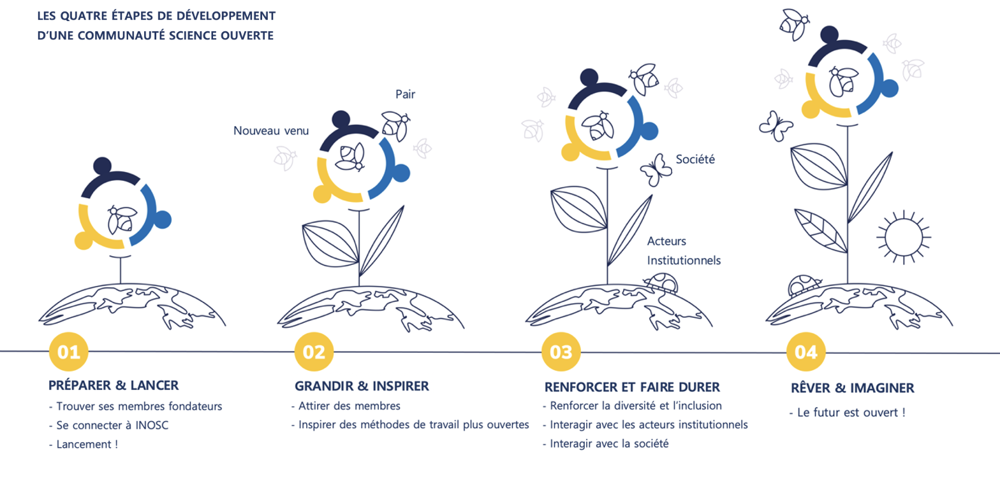

---
# Title, summary, and page position.
linktitle: 'Partie 2 : Lancez et renforcez votre Communauté science ouverte'
summary: ''
weight: 1
icon: book
icon_pack: fas

# Page metadata.
title: 'Partie II'
date: "2021-10-11"
type: book  # Do not modify.
---

Nous décrivons **quatre étapes** dans la mise en place d'une OSC (*Figure 6*). Ces étapes sont présentées par ordre chronologique, mais il se peut très bien que, en fonction de votre situation, l'ordre change. Cela ne pose aucun problème ! Certains aspects de ces étapes peuvent ne pas être "terminés" au moment de passe à l'étape suivante, mais demander un travail en continu. Néanmoins, ces étapes apportent une méthode pour faire décoller votre communauté. Alors c'est parti !

***

***Figure 6**. Les quatre étapes du lancement et de la montée en puissance d'une Communauté science ouverte*

***

## **Étape 1&nbsp;: Préparer et lancer**

### 1a. Membres fondateurs : coordinateurs de la Communauté et ambassadeurs par faculté

La première chose dont vous avez besoin pour faire décoller une OSC est (au moins) un **coordinateur de la Communauté**, qui prend l'initiative de lancer une OSC. C'est peut-être vous ! En observant les personnes qui ont lancé des OSC jusqu'à présent, nous pouvons faire ressortir le profil suivant :

- Passion pour la science ouverte
- Chercheur ou chercheuse en début ou en milieu de carrière (de doctorant à maître de conférences / chargé de recherches)
- Enthousiasme
- Extraversion
- Optimisme
- Capacité à inspirer les autres
- Inclusion
- Innovation
- Esprit d'équipe
- Bonne connection au sein de l'université et/ou capacité à établir de nouvelles connexions (par exemple avec les doyens, bibliothécaires, services de soutien à la recherche, diverses instances, etc.)  
- Être prêt·e à essayer et à échouer (et à réessayer !)

Évidemment, cela ne signifie pas que *seules* les personnes présentant le profil ci-dessus sont aptes à devenir coordinatrices de la Communauté ; nous soulignons seulement que ces caractéristiques, communes aux personnes qui ont relevé le défi jusqu'à présent, ont servi la création de nos Communautés. D'après notre expérience, il est plus durable (et beaucoup plus amusant !) de démarrer avec plusieurs coordinateurs. Recherchez des collègues partageant les mêmes idées et désireux de lancer une OSC avec vous.
Les personnes occupant des postes de direction impliqués dans les programmes de science ouverte au sein de votre institution pourraient également être intéressées par la création d'une OSC locale. Cependant, plutôt que de coordonner elles-mêmes la Communauté, elles peuvent être en mesure de *faciliter et soutenir* le lancement d'une OSC. Par exemple, elles peuvent rechercher activement des personnes au sein de leur université qui correspondent au profil de coordinateur de Communauté ci-dessus ou, mieux encore, ouvrir un poste (rémunéré). Nos expériences à ce jour nous amènent à recommander deux coordinateurs de la Communauté (0,2 - 0,4 ETP chacun).
Il est également possible pour des personnes qui ne sont pas des chercheurs actifs (par exemple le personnel de soutien à la recherche ou les bibliothécaires) de lancer et de faciliter une OSC. Cela a été le cas, par exemple, à Rotterdam ([OSCR](https://www.openscience-rotterdam.com/home/)) et à Galway ([OSCGalway](http://osc-galway.ie/))[^1]. Dans ce cas, les chercheurs actifs sont inclus dans les décisions stratégiques liées à la sélection des thèmes et à la priorisation des activités. L'un des principaux aspects qui rendent les OSC attrayantes pour les (nouveaux) membres est que la Communauté est *bottom up* : pour les chercheurs, *par* les chercheurs. Les OSC fonctionnent en parallèle - mais indépendamment - des politiques ou initiatives locales. Il est important de souligner cette nature ascendante lors des présentations de la CSO, en particulier si les coordinateurs de la Communauté ne sont pas eux-mêmes des chercheurs actifs.

Jusqu'à présent, les coordinateurs de Communauté se sont auto-désignés et, quand c'était possible, les ambassadeurs par faculté ont été choisis par les coordinateurs de Communauté (par exemple, à Utrecht et à Leyde, le recrutement s'est fait par les lettres d'information internes et les réseaux sociaux). Cependant, il est également possible d'élire les coordinateurs de Communauté et les ambassadeurs par faculté parmi les membres de la Communauté, ou qu'ils soient recrutés par l'établissement dans le cadre d'une stratégie plus large.
Bien que la mise en place d'une OSC exige un engagement et un investissement en temps substantiels, nos expériences ont été très enrichissantes. En tant que coordinateurs de Communauté, nous avons considérablement étendu nos réseaux professionnels à tous les niveaux de l'université, y compris la présidence, les doyens, les services d'appui et les bibliothécaires, ce qui nous a permis d'accroître notre influence sur les politiques et les infrastructures. Sur le plan personnel, nous avons acquis des compétences transférables utiles, telles que la gestion de projet, la gestion de communauté et le leadership. Plus important encore, il est extrêmement gratifiant de co-créer des solutions à grande échelle avec des collègues inspirés et partageant les mêmes idées, en s'inscrivant dans quelque chose de plus grand encore pour l'amélioration de la science et de la société.

### 1b. Se connecter à INOSC : Principes directeurs et Code de conduite

L'étape suivante pour les coordinateurs de la Communauté tout juste nommés sera de **vous connecter à notre réseau : l'International Network of Open Science/Scholarship Communities (INOSC)**. Il existe une grande variété et une grande flexibilité dans la façon dont les différentes Communautés science ouverte rejoignant INOSC s'organisent. Ce que nous avons en commun c'est un ensemble de Principes directeurs (*Encadré 2*) et un [Code de conduite](https://osf.io/6gsye/). Et nous apprenons les uns des autres ! Dans [cet espace de travail Slack](https://osc-netherlands.slack.com/#/), vous pouvez discuter avec les coordinateurs de toutes les OSC, qui vous aideront à démarrer.

***

> **Principes directeurs**
> - les Communautés science ouverte (OSC) sont des plateformes ascendantes créées par et pour les chercheurs afin d'échanger des connaissances et du savoir-faire sur les pratiques de science ouverte (SO)
> - les OSC sont inclusives
> - les chercheurs sont le public cible des OSC, mais les étudiants, les alliés de la SO et personnes intéressées par la recherche sont également invités à rejoindre la Communauté
> - aucune connaissance préalable n'est requise pour faire partie de la Communauté, et les membres ne sont en aucun cas tenus de s'engager formellement à adopter des pratiques de SO
> - les OSC organisent, promeuvent et facilitent des événements de science ouverte pour (1) apprendre et discuter des pratiques de science ouverte, (2) partager les connaissance de la science ouverte, et (3) construire des réseaux professionnels
> - les événements sont ouverts aux membres et aux non-membres, et sont gratuits dans la mesure du possible
> - les participants et les organisateurs d'événements organisés par les OSC doivent adhérer au [Code de conduite] (https://osf.io/6gsye/)
> - les OSC encouragent les discussions critiques sur les avantages et les inconvénients des pratiques de science ouverte. Nous nous abstenons d'être normatifs ou condescendants, et ne disons pas aux autres ce qu'ils doivent faire. Il est essentiel de respecter les méthodes de travail et les décisions de chacun à cet égard.

***Encadré 2.** Principes directeurs des Communautés science ouverte. La version complète et le Code de conduite [sont disponibles en ligne](https://osf.io/6gsye/).*

***

Les **Principes directeurs** et le **Code de conduite** représentent le socle commun à toutes les OSC et ne doivent pas être modifiés. Si vous estimez que certains aspects de ces documents ne conviennent pas à votre Communauté, veuillez en faire part dans le canal Slack des coordinateurs de Communauté. Vous êtes libres de compléter ces documents par des principes adaptés à votre communauté particulière, tant qu'ils ne se contredisent pas. [Vous trouverez en ligne](https://osf.io/6gsye/) la version complète des Principes directeurs et le Code de conduite, ainsi que la procédure pour ajouter un *addendum* local.
Une fois que vous acceptez les Principes directeurs et le Code de conduite, vous êtes autorisés à créer votre propre logo **personnalisé**, sur la base de notre modèle et dans le respect des restrictions[^2] indiquées dans notre [Charte graphique](https://docs.google.com/document/d/1MrAsChwb81gFXQX1_WUfdgo95HqH4t_rQU3DvGZHDfE/edit). En cas de doute, [contactez les coordinateurs de l'OSCU](mailto:openscience.utrecht@gmail.com).

### 1c. Visibilité en ligne : site web et réseaux sociaux

Ce dont vous avez besoin ensuite est un **site web**, outil indispensable pour augmenter la visibilité en ligne d'une OSC. Sur le site web, les activités de votre OSC sont annoncées et les noms et compétences de ses membres sont mis en avant via des pages de profil et des interviews. Jusqu'à présent, les sites web des OSC ont été créés avec Wordpress (par exemple, [Utrecht](https://openscience-utrecht.com/)), intégrés aux sites web internes des universités (par exemple, [Leiden](https://www.universiteitleiden.nl/open-science-community-leiden)), ou avec le logiciel [R](https://cran.r-project.org/) en combinaison avec [GitHub Pages](https://pages.github.com/) (par exemple, [Nijmegen](https://openscience-nijmegen.nl/index) ou [Rotterdam](https://www.openscience-rotterdam.com/home/)). Par souci de cohérence et pour être identifiés plus facilement, les noms de domaine des OSC suivent souvent la forme *www.openscience-[CITY].com* (par exemple, [Groningen](https://openscience-groningen.nl/)), avec quelques exceptions (par exemple [Eindhoven](https://osceindhoven.github.io/)).   
Bien que vous soyez libre de créer le site web de votre OSC comme bon vous semble, les éléments suivants sont obligatoires :
- une page d'accueil présentant la vision et la mission des OSC (*cf.* [Partie I]()) ainsi que nos Principes directeurs (voir *Encadré 2*)
- une rubrique consacré au [Code de conduite](https://osf.io/6gsye/)
- une rubrique avec les noms et/ou les profils des membres de la Communauté.
D'autres fonctionnalités que vous pouvez envisager pour votre site web sont : (*1*) une page d'actualités sur les avancées de la SO ; (*2*) un agenda pour les événements sur la SO ; (*3*) des informations générales sur la SO ; ou (*4*) une page pour présenter les initiatives des membres.

En ce qui concerne les réseaux sociaux, [Twitter](http://twitter.com) est un outil puissant pour entrer en contact avec d'autres passionnés de science ouverte, partager des connaissances et entamer des collaborations sur divers projets. Sur Twitter, les OSC annoncent leurs activités internes, retweetent des événements externes (par exemple des conférences), font la promotion de textes de réflexion (par exemple des articles de blog, des *preprints*) et des opportunités de financement. Chaque OSC a son propre compte Twitter (par exemple, [OSCU](https://twitter.com/OpenSciUtrecht), [OSCG](https://twitter.com/OSCGroningen)) : par souci de cohérence et pour être identifié plus facilement, l'identifiant Twitter est généralement *@OSC* suivi de la ville (par exemple, [@OSCLeiden](https://twitter.com/OSCLeiden)).

Les communications internes au quotidien peuvent tirer profit des outils de messagerie instantanée. Les OSC utilisent avec succès [Slack](https://slack.com/) et [Element](https://element.io/). Slack est très populaire, possède une interface utilisateur intuitive et interagit de manière transparente avec d'autres services (par exemple Google Drive, Microsoft Office 365). Cependant, il s'agit d'un logiciel propriétaire et la version gratuite présente [certaines limites](https://slack.com/intl/en-nl/help/articles/115002422943-Message-file-and-app-limits-on-the-free-version-of-Slack?eu_nc=1) (par exemple, l'historique des discussions est masqué après 10 000 messages). Element, bien que légèrement moins convivial, est gratuit et sous licence libre, basé sur le système de communication décentralisé sécurisé [Matrix](https://matrix.org/), et les intégrations avec d'autres produits sont activement développées et maintenues par des contributeurs libristes.

### 1d. Attirer les premiers membres

Dans les premières étapes d'une OSC, le bouche à oreille est le moyen le plus efficace d'attirer des membres : parlez à des collègues qui s'intéressent à la SO et/ou qui ont déjà une expérience des pratiques de SO, et demandez-leur s'ils sont prêts à rejoindre la communauté. Notez que *vos premiers membres ont une grande importance* : s'ils sont tous issus d'une seule faculté, il sera plus difficile d'attirer des membres d'autres facultés à un stade ultérieur, car ils penseront que cette communauté n'est pas pour eux. Il en va de même pour l'expertise en SO : si vous n'avez que des experts parmi vos membres, les nouveaux venus seront plus réticents à vous rejoindre. Veillez donc à ce que vos premiers membres forment un groupe hétérogène.

### 1e. Entrer en relation avec initiatives de science ouverte locales

Il est aussi fortement recommandé à ce stade d'entrer en relation avec des projets connexes locaux (par exemple dans le service de documentation), même si vous êtes encore dans la phase de maturation de votre Communauté. Il est important d'être au courant de ce qui se passe dans votre établissement en matière de science ouverte ; qui plus est, ces personnes sont généralement très désireuses de vous aider, par exemple en organisant des ateliers ensemble ou en vous mettant en contact avec d'autres parties prenantes.

### 1f. Lancement !

Une fois les premiers membres réunis et quelques ateliers ou événements en vue, il est temps de rendre votre Communauté officielle ! Une excellente façon de le faire est d'organiser un événement de lancement comprenant, par exemple quelques courts exposés par vos membres fondateurs sur leur enthousiasme pour la SO et la Communauté. Demandez à vos premiers membres de vous aider en invitant leurs collègues à l'événement de lancement et en faisant connaître la communauté.  
Veillez à ce que l'événement soit festif et convivial, par exemple en décorant la salle et en offrant des boissons et de la nourriture. Il est également pertinent d'inviter quelqu'un à prendre des photos de l'événement, qui pourront ensuite être diffusées dans les lettres d'information, sur les réseaux sociaux et sur le site web de la Communauté.

## **Étape 2&nbsp;: Grandir et inspirer**

Dans l'étape suivante, les deux principaux objectifs sont : (1) attirer plus de membres, et (2) inspirer les membres à rendre leurs méthodes de travail plus ouvertes.

### 2a. Attirer des membres

Tout d'abord, vous devez investir dans la visibilité de votre Communauté. Commencez à vous faire connaître lors de réunions et dans les lettres d'information des composantes de recherche et de formation. Vous pouvez également imprimer des dépliants ou des autocollants (voir la [Charte graphique](https://docs.google.com/document/d/1MrAsChwb81gFXQX1_WUfdgo95HqH4t_rQU3DvGZHDfE/edit) pour des exemples). Il peut être très utile de demander à vos premiers membres d'aider à cette communication. Les nouveaux venus seront plus enclins à rejoindre la communauté s'ils en entendent parler par des collègues de leur propre discipline ou composante, donc utilisez le réseau de vos membres. D'après notre expérience, un moyen efficace d'attirer de nouvelles personnes est de faire en sorte que les membres actuels, de préférence en responsabilité, parlent de la Communauté ou envoient un courriel à leurs collègues, leur équipe de recherche, leur département ou leur faculté, indiquant qu'ils ont rejoint la communauté et suggérant à leurs collègues d'en faire autant. Il est également pertinent d'être visible lors d'événements locaux auxquels participent de nombreux nouveaux venus, même si ces événements ne concernent pas la SO. Essayez d'obtenir un créneau pour parler de SO et de votre Communauté, même s'il ne s'agit que d'un intervention d'une minute. Une autre option, souvent plus facile à réaliser, est d'avoir un stand d'information lors d'un événement, où vous pouvez interagir avec de nouveaux membres potentiels. Il est également utile d'avoir une table *"S'INSCRIRE ICI"* lors des événements où les nouveaux venus peuvent s'inscrire sur place. Des produits dérivés et des gadgets tels que des autocollants, des porte-clés et des bouteilles d'eau portant le logo de la communauté peuvent également contribuer à attirer de nouveaux membres et à renforcer l'esprit de la Communauté (si votre budget le permet).

Pour attirer de nouveaux membres, il est crucial d'avoir une stratégie de communication claire. Pour cela, il est essentiel de comprendre votre public cible. Ils ne sont pas vous ! Si la SO est une priorité pour vous, il l'est souvent moins pour les nouveaux venus. Il est essentiel de ne pas être condescendant à ce sujet. Les personnes qui sont particulièrement passionnées par la SO peuvent considérer que leurs méthodes de travail sont supérieures à celles des autres et exprimer ce sentiment. Le fait d'être exposé à de tels points de vue peut aliéner les nouveaux arrivants et entraîner une résistance inutile en créant une distinction contre-productive "nous contre eux". Les nouveaux arrivants sont plus susceptibles de rejoindre une communauté où ils peuvent explorer et formuler leurs opinions et leurs doutes, par opposition à un "club d'experts" qui porte un jugement sur les méthodes de travail des autres. Il est donc essentiel de trouver le bon ton. Veillez à être inclusif, humble et respectueux dans toutes vos communications. Insistez sur le fait que l'OSC est une communauté d'apprentissage et que la communication est bidirectionnelle : les nouveaux venus et les pairs expérimentés apprennent les uns des autres et identifient ensemble les obstacles et les opportunités pour rendre la transition vers la SO plus agréable et plus fluide.   
Le fait que la SO n'est pas la priorité de votre public cible signifie également que vous devez faire en sorte que la barrière à l'entrée aux événements soit aussi basse que possible. Par exemple, faites en sorte que les gens n'aient pas à se déplacer beaucoup pour assister aux événements, en organisant par exemple des événements en ligne, ou à différents endroits du campus. Le fait d'avoir à changer de bâtiment peut littéralement faire la différence pour que les gens participent ou non. Veillez à ce que les nouveaux venus puissent se reconnaître dans les événements que vous organisez. Essayez de faire tout votre possible pour amener vos événements vers les gens, tant en termes de logistique que de thèmes. Comme nous l'avons mentionné plus haut, les boissons, la nourriture et les goodies sont souvent appréciés (si votre budget le permet).

### 2b. Inspirer les membres à rendre leurs méthodes de travail plus ouvertes

Les OSC disposent de divers outils et formats pour promouvoir l'appropriation de la science ouverte. Nous énumérons ici ceux qui se sont avérés particulièrement efficaces.

#### Site web de la Communauté
Sur les sites web des OSC, les membres indiquent leur expertise en matière de SO : par exemple, le site web de l'OSC Rotterdam ([OSCR](https://www.openscience-rotterdam.com/home/)) présente les compétences sur la SO de chaque membre via des [diagrammes en radar](https://www.openscience-rotterdam.com/2019/04/schettino/). Cela permet de trouver et de contacter facilement un collègue lorsqu'on a une question sur un sujet particulier lié à la SO. La recherche peut être effectuée au sein d'une composante spécifique, ou étendue à d'autres disciplines. Les membres peuvent également indiquer sur leur page de profil les sujets de SO sur lesquels ils souhaitent en savoir plus. Ceci peut faciliter une sorte de "mise en relation" entre les membres qui veulent partager leurs connaissances sur la SO et les membres qui veulent en apprendre davantage sur certains aspects de la SO. Une fonction intégrée permettant d'apparier automatiquement ces profils serait très utile, sinon les coordinateurs de la Communauté peuvent envoyer des courriels aux membres en leur proposant de se rencontrer. Cette fonctionnalité pourrait ressembler à un site de rencontres, sans la romance (mais qui sait !).   
Les informations du site web peuvent également inspirer l'engagement dans les pratiques de la SO en *définissant des normes*. En démontrant l'expérience et l'intérêt pour les pratiques de la science ouverte, nous envoyons le message que la science ouverte est la voie à suivre.

#### Lettre d'information
Une lettre d'information est un moyen efficace de toucher un grand nombre de personnes et de les informer des actualités et événements de la SO. Nos lettres d'information sont généralement bien lues, avec environ 50 % des abonnés qui ouvrent le message et 10 % qui cliquent sur des éléments du message[^3]. Faites-les courtes et attrayantes, et essayez de ne pas noyer vos abonnés sous les messages (un envoi mensuel est suffisant).

#### Conférences, ateliers et groupes d'étude
Lorsque vous choisissez les thèmes de vos événements (conférences, ateliers…), nous vous recommandons de demander l'avis de vos membres. Quels sujets aimeraient-ils voir abordés ? Veillez à proposer un ensemble d'événements diversifiés, en termes de sujets et de format. Vos membres auront des expériences contrastées de la SO, et il est crucial de répondre aux besoins de tous. Nous présentons ici des formats adaptés à différents niveaux d'appropriation des pratiques de SO, depuis les séances introductives jusqu'aux ateliers pratiques approfondis, en passant par les groupes d'étude (*Tableau 2*).

Les *Exposés* sont un format utile pour introduire un sujet à un large public, par exemple un survol de la science ouverte ou une introduction aux *preprints*. Un format particulier de conférences fréquemment adopté dans les OSC sont les *présentations flashs*, des exposés courts (5-10 minutes) pour partager son expérience d'une pratique de SO. Les orateurs n'ont pas besoin d'être des experts, il suffit d'avoir un usage un peu plus avancé que ses collègues sur l'utilisation d'un outil ou d'une technique particulière. Une série de présentations flash peut être centrée sur une pratique spécifique (par exemple le pré-enregistrement ou *registered reports*) ou cibler un public (par exemple les doctorants) ou une discipline particulière (par exemple l'économie comportementale). De nombreux exposés et ateliers organisés par les OSC sont disponibles en ligne pour être réutilisés. Nous complétons souvent le retour expérience des chercheurs par le regard expert des bibliothécaires.   
Afin d'attirer les nouveaux venus, il est pertinent de restreindre le périmètre d'un atelier à un public particulier. Par exemple, les nouveaux venus peuvent être plus enclins à participer à un atelier "Données ouvertes et données FAIR pour les économistes" qu'à un atelier sur les données ouvertes et données FAIR en général. Bien entendu, cela présente l'inconvénient de devoir organiser un atelier pour chaque discipline. Si ce n'est pas possible alors vous pouvez vous en tenir à des ateliers pour l'ensemble des composantes, lesquels peuvent inspirer des perspectives interdisciplinaires lorsque des représentants de différentes disciplines se mettent à échanger.   
Si les exposés et présentations flash informent et inspirent les nouveaux venus à la SO, les ateliers avancés constituent l'étape suivante dans les changements de comportement.

Les *ateliers* sont des séances interactives visant à s'approprier des outils qui augmentent l'ouverture et la transparence de la science. Il peut s'agir de logiciels (par exemple R et son utilisation pour l'analyse reproductible de données) ou de plateformes collaboratives en ligne (par exemple [Open Science Framework](https://osf.io/)). L'animateur de l'atelier présente l'outil et le problème auquel il s'attaque, puis enchaîne sur des exemples pratiques et des tutoriels que les participants pourront ensuite adapter à leur cas particulier. Les participants sont incités à préparer l'atelier, par exemple en apportant leur propre ordinateur portable avec le logiciel déjà installé.

Un niveau d'engagement supplémentaire peut être atteint dans les *groupes d'étude* ou *programmes de mentorat*, où un groupe de pairs travaille sur une période donnée à la mise en œuvre d'une pratique de SO, sous la supervision d'un mentor expérimenté. De telles initiatives permettent aux membres non seulement d'acquérir un bon socle de connaissances, mais aussi d'entrer en contact avec des collègues confrontés à des problèmes similaires, ce qui facilite l'élaboration rapide de solutions partagées et renforce le sentiment de communauté.

Pour que les initiatives décrites ci-dessus fonctionnent, la Communauté a besoin à la fois d'un public (par exemple les nouveaux venus) et de collègues qui ont l'expérience d'une ou plusieurs pratiques de SO et qui sont prêts à partager leurs connaissances. Les avantages pour les nouveaux venus à la SO sont assez clairs. Mais quels sont les avantages pour ce dernier groupe ? Les innovateurs et les premiers adeptes, généralement fiers de leur méthode de travail ouverte, travaillent souvent dans des environnements où leurs efforts ne sont pas reconnus car peu répandus. Les OSC donnent une place, valident et valorisent leur expertise en montrant que des personnes s'intéressent à l'amélioration des pratiques de recherche, créant ainsi un sentiment d'appartenance qui peut motiver à rester engagé dans la SO. De plus, les OSC offrent l'opportunité de piloter des initiatives, augmentant ainsi son propre impact et sa visibilité dans l'environnement académique local. Cela permet également aux membres qui promeuvent déjà activement la SO d'accélérer leurs initiatives.

***

|              | Présentation flash | Atelier   | Groupe d'étude |
| :----------- | :------------: | ---------: | -----------: |
| **Objectif**     | Inspirer        | Impliquer     | Engager       |
| **Public** | Ouvert           | Intéressé | Impliqué     |
| **Intervenant**  | Débutant       | Expert     | Expert       |

***Tableau 2**. Synthèse des formats d'événement et le niveau d'engagement dans la SO correspondant.*

***

#### Journal Clubs

Les *journal clubs* sont des réunions régulières (par exemple toutes les deux semaines ou mensuelles) au cours desquelles les participants discutent d'articles et d'autres textes relatifs à la SO. Le texte à discuter est communiqué à l'avance par courriel et sur Twitter, avec des relances dans les jours précédant la réunion. En général, un discutant prépare un court résumé de l'essentiel du texte et la discussion entre les participants est encouragée. Le discutant peut être l'un des organisateurs, un participant ou l'un des auteurs du texte examiné lors de la séance.   
Il existe des exemples de ReproducibiliTea (voir *Encadré 3*) au sein d'une OSC à [Leiden](https://twitter.com/LeidenTea), [Groningen](https://openscience-groningen.nl/activities/reproducibilitea/), et [Rotterdam](https://www.openscience-rotterdam.com/2019/10/oscr-reproducibilitea/). Dans le cas des *journal clubs en présentiel*, les organisateurs réservent une salle et fournissent des rafraîchissements (ou demandent à tous les participants de participer en apportant quelque chose à partager). Si le *journal club* est en ligne, les coordinateurs organisent la réunion - en utilisant [Zoom](https://zoom.us/), [Jitsi Meet](https://meet.jit.si/), [Microsoft Teams](https://products.office.com/en-us/microsoft-teams/group-chat-software), ou tout autre service approprié - et modèrent la discussion.

#### Webinaires et rencontres en ligne

Les événements en ligne facilitent le partage des connaissances avec le plus grand nombre, y compris des personnes qui ne sont pas membres d'une OSC. Les orateurs (généralement membres d'une OSC) sont invités à montrer aux participants comment utiliser des outils pratiques pour améliorer l'ouverture et la transparence de la recherche. Citons par exemples "Utiliser Gitbook pour vos supports de cours" (dans le cadre de l'initiative [OSCU OSCoffee](https://openscience-utrecht.com/OSCoffee/)) et "[Introduction à Git(Hub)](https://www.openscience-rotterdam.com/2020/04/intro-github-apr2020/)" (organisé par OSCR).   
Les coordinateurs organisent généralement la réunion - en utilisant [Zoom](https://zoom.us/), [Jitsi Meet](https://meet.jit.si/), [Microsoft Teams](https://products.office.com/en-us/microsoft-teams/group-chat-software), ou tout autre service approprié - et modèrent la discussion.

#### Initiatives des membres

La force d'une Communauté dépend des contributions de ses membres. Les membres peuvent accroître l'ampleur et la diversité des activités organisées au sein de la Communauté tout en allégeant la charge organisationnelle qui pèse sur les épaules des coordinateurs de la Communauté. *Les initiatives des membres* sont généralement conçues pour une sous-partie de la Communauté et se concentrent sur des domaines spécifiques de la science ouverte. Si les membres sont libres de développer leurs propres initiatives, il peut être encore plus efficace de promouvoir des formats existants qui ont fait leurs preuves dans d'autres institutions, par exemple les *journal clubs* ReproducibiliTea, les clubs de science R.I.O.T. et les ambassadeurs des données (voir *Encadré 3*). Ces initiatives peuvent s'inscrire sous l'égide de l'OSC locale. Les coordinateurs de la Communauté peuvent promouvoir et soutenir ces initiatives en les présentant sur le site web, dans la lettre d'information et dans les réseaux sociaux. Les collègues des institutions qui ont déjà mis en place ces initiatives peuvent être invités à partager leur expérience ou être interviewés lors d'événements ou dans la lettre d'information, afin de motiver les membres à lancer des instances locales. Que les membres conçoivent leurs propres initiatives ou qu'ils s'inspirent d'exemples éprouvés, il s'agit d'excellentes occasions d'acquérir de l'expérience en matière d'organisation et de pilotage, ce qui est de plus en plus important pour le développement d'une carrière académique.

***

> [**ReproducibiliTea**](https://reproducibilitea.org/)
> 
>
> Les *journal clubs* ReproducibiliTea aident les chercheurs en début de carrière à créer des clubs de lecture sur la science ouverte dans leur établissement. Les sujets de discussion vont des moyens d'améliorer la science aux implications sociales du mouvement de la science ouverte.

 

> [**Club de science R.I.O.T.**](http://www.riotscience.co.uk/)
> 
>
> Le club de science R.I.O.T. organise des séminaires où les chercheurs peuvent s'informer sur les réformes et les pratiques de la science ouverte. Les intervenants donnent des conférences, discutent d'articles, donnent un éclairage sur des logiciels et des outils, et recommandent de (nouvelles) techniques statistiques, dans le but principal d'encourager la science reproductible, interprétable, ouverte et transparente.

 

> [**Ambassadeurs des données**](https://doi.org/10.5281/zenodo.3383814)
>
> Les ambassadeurs des données sont des chercheurs volontaires qui encouragent à la bonne gestion des données de recherche et soutiennent les principes FAIR.

 

> [**Les Carpentries**](https://carpentries.org/)
> 
>
> Les Carpentries (un nom qui signifie "ateliers de menuiserie") enseignent aux chercheurs les compétences de base en informatique et en science des données. Le projet comprend les communautés [Software Carpentry](https://software-carpentry.org/) sur les logiciels, [Data Carpentry](https://datacarpentry.org/) sur les données et [Library Carpentry](https://librarycarpentry.org/) sur l'information scientifique.

 
 

> [**SIOS**](https://studentinitiativeopenscience.wordpress.com/)
> 
>
> L'Initiative étudiante pour la science ouverte (*Student Initiative for Open Science* ou SIOS) promeut et diffuse les pratiques de science ouverte au sein de la communauté étudiante en organisant des conférences, des débats et des ateliers. En outre, SIOS encourage la mise en œuvre de pratiques ouvertes dans les curricula, par exemple le libre accès à tous les articles et le pré-enregistrement des projets de thèse.

***Encadré 3.** Exemples d'initiatives et de formats éprouvés pour promouvoir la science ouverte, qui peuvent être transposés localement dans une OSC.*

***

## **Étape 3&nbsp;: Renforcer et faire durer**

À cette étape, vous augmentez la diversité de vos membres, vous multipliez les interactions avec les parties prenantes et vous inscrivez votre Communauté dans la durée. C'est également le bon moment pour évaluer honnêtement l'efficacité de votre Communauté et pour identifier ses possibilités de développement.

### 3a. Diversité et inclusion

Prenez le temps d'analyser la **diversité de vos membres**. Êtes-vous satisfait de la proportion de nouveaux venus et de membres expérimentés ? Avez-vous des membres dans toutes les composantes de recherche ? La question clé est la suivante : qui vous manque-t-il ? Pour améliorer la diversité de vos membres, envisagez de vous adresser à de nouveaux publics cibles, tels que les étudiants, les collègues d'autres disciplines ou les membres sans affiliation universitaire (citoyens, entreprises, société civile organisée).

### 3b. Acteurs institutionnels : politique, infrastructure et soutien

Dans notre expérience, les acteurs institutionnels - comme les personnes responsables de la politique, de l'infrastructure et du soutien à la recherche - sont souvent désireuses de collaborer avec les OSC (voir *Tableau 3*). Identifiez ces personnes dans votre établissement et portez votre Communauté à leur attention. Assurez-vous de leur faire passer un message gagnant-gagnant. Nous avons un objectif commun : une mise en œuvre harmonieuse et efficace des pratiques de SO. Les Communautés peuvent servir de vecteur pour aider les institutionnels à obtenir un retour des chercheurs. Ce retour, par exemple sur la façon dont les chercheurs font l'expérience des opportunités et contraintes concernant les pratiques de SO, est très précieux pour eux. En se prêtant à cet exercice, les membres de la Communauté ont la possibilité d'influencer la politique, l'infrastructures et le soutien à la recherche.   
Il n'y a pas de recette toute prête pour étendre l'influence de votre Communauté et les opportunités dépendront fortement de votre environnement local. C'est une question de réseau et de lobbying. Dans notre expérience, il est plus efficace (et plus agréable !) de se concentrer sur les personnes occupant des postes de direction qui sont déjà favorables à la SO. Si vous rencontrez une résistance, ne la combattez pas : explorez plutôt d'autres voies. Un format qui a bien fonctionné pour nous consiste à organiser des réunions où les personnes responsables de la politique et de l'infrastructure peuvent interagir avec les membres de la Communauté. Utilisez la lettre d'information pour informer les membres de la communauté des nouvelles politiques et des nouveaux services, et fournissez des canaux pour le retour d'information[^4].   
Un partenariat qui s'est avéré bénéfique est celui des *bibliothécaires et documentalistes*, qui sont essentiels pour le soutien à la recherche. Les bibliothécaires sont souvent très progressistes en ce qui concerne la SO et la soutiennent depuis des années, notamment en ce qui concerne l'accès libre et les données ouvertes. Cependant, dans notre expérience, leurs connaissances et leur potentiel ne sont pas souvent mobilisés par les chercheurs. Un moyen efficace de favoriser la collaboration avec les bibliothécaires est d'organiser un atelier mixte avec deux intervenants : un bibliothécaire et un chercheur. Combiner l'expertise d'un bibliothécaire avec l'expérience pratique d'un chercheur peut être très instructif, tant pour les nouveaux venus que pour les praticiens experts de la SO.

***

| Partie prenante            | Donne                                                         | Reçoit                                         |
| :--------------------: | -----------------------------------------------------------: | -------------------------------------------: |
| Nouveaux venus | Retour critique sur les difficultés et les cas limites | Compétences de SO, influence sur la politique et l'infrastructure |
| Collègues expérimentés colleagues | Partage d'expérience | Capacité à inspirer les autres, *leadership* pour lancer des initiatives, consolidation des compétences de SO |
| Décideurs (politique, infrastructure) | Ouverture aux autres et à leurs contributions | Idées éprouvées et expériences qui aident à remodeler ou transformer les manières de travailler la culture de l'établissement |
| Bibliothécaires et services support | Formation à la SO | Public intéressé par la SO |

***Tableau 3**. Les relations donnant-donnant entre parties prenantes et leurs publics.*

***

### 3c. Interactions entre le monde académique et la société

Pour que la science soit vraiment ouverte, il est important d'instaurer une relation de respect mutuel et de critique constructive entre la science et la société. Le grand public est sans doute la sphère envers laquelle les scientifiques ont le plus de comptes à rendre, et son implication peut être bénéfique à la science, par exemple en élargissant le débat ou en apportant des perspectives profanes précieuses. Les points de vue des citoyens et des scientifiques [diffèrent souvent](https://www.pewresearch.org/science/2015/01/29/public-and-scientists-views-on-science-and-society/), mais la science dépend des fonds publics et vise à être une source fiable de connaissances. La science ouverte représente donc également l'implication significative du grand public, par exemple en rendant la science plus accessible, en fournissant des résumés et des synthèses pour les médias et les profanes, en impliquant les citoyens dans la programmation de la recherche (par exemple, le [*'Nationale Wetenschapsagenda'*](https://vragen.wetenschapsagenda.nl/) aux Pays-Bas ou le [Programme REPERE](http://www.programme-repere.fr/) en France), et en atteignant un [but commun par la science citoyenne](https://mfr.de-1.osf.io/render?url=https://osf.io/6qjyg/?direct%26mode=render%26action=download%26mode=render). En tant que Communauté SO, l'inclusion du public non-chercheur dans le débat, par exemple sur la manière de rendre la science accessible à tous, peut apporter une plus value aux chercheurs et enseignants au sein de la Communauté.

### 3d. Financement

À ce stade, vous avez un nombre croissant de membres et des événements bien installés. Il est maintenant temps d'investir pour faire durer la Communauté, en entretenant et en augmentant ses capacités à agir, ce qui est étroitement lié à l'obtention de financements.   
Les Communautés sont souvent lancées par des doctorants : leur énergie et enthousiasme peuvent être le carburant du succès de la Communauté, mais leurs contrats temporaires rendent la Communauté vulnérable. Il est recommandé d'inclure des collègues titulaires dans le groupe socle ou d'inclure de nouveaux doctorants qui resteront après le départ des fondateurs. Pensez également à *élargir votre équipe socle*. Par exemple, promouvez des *ambassadeurs par faculté* qui se concentrent sur les activités et l'implication de leurs composantes respectives (ainsi l'OSCU a des ambassadeurs pour les sept facultés, impliqués chacun sur 10% de leur temps). Vous pouvez également impliquer le personnel susceptible de vous aider dans les tâches d'organisation, par exemple au service de documentation ou dans les services de soutien à la recherche.
À ce stade, il est également essentiel d'*obtenir des financements*. Oui, la vie serait beaucoup plus facile si vous étiez en mesure d'obtenir un financement dès le départ (et nous vous recommandons vivement d'étudier les opportunités offertes par votre établissement). Cependant, l'obtention d'un financement est souvent plus efficace si vous avez déjà une réussite à montrer. Il faut déployer un effort de lobbying pour convaincre les collègues qui peuvent allouer un budget. À cet égard, il vaut mieux pouvoir expliquer clairement comment votre Communauté rend la politique et les projets institutionnels plus efficaces. La source du message étant importante, veillez à inclure dans vos demandes des membres occupant des postes de direction. Vos chances d'obtenir un financement dépendront du degré d'urgence des politiques locales et nationales de SO, et de votre capacité à vous aligner avec elles. Malheureusement, il n'existe pas de solution ou de stratégie unique, car ces circonstances diffèrent d'un établissement à l'autre. Dans l'[espace de travail Slack](https://osc-netherlands.slack.com/#/) des coordinateurs de Communauté, nous disposons d'un canal distinct pour discuter des questions liées au financement. Voir par exemple [cette demande de financement par l'Open Science Community Leiden](https://docs.google.com/document/d/1RFxmQ0xbh8ZgQe0XiOGv2T7Xmj3TW5chRQq5X6hJq3w/edit).

### 3e. Développement de la communauté

Vous avez réuni un groupe de passionnés - vous espérez vraiment faire tenir dans la durée l'énergie, la passion et la dynamique de la Communauté. Peut-être constatez-vous qu'au fur et à mesure que la Communauté se développe organiquement, une charge de plus en plus grande repose sur vous (notamment sur le plan administratif) et cela vous épuise. Peut-être avez-vous entendu certains membres des débuts vous dire qu'ils trouvent que leur expérience n'est plus gratifiante, à moins qu'il y ait de la place pour qu'ils puissent grandir ou prendre les manettes. Peut-être y a-t-il des désaccords et des conflits émergents entre certains membres de la Communauté.

Il est important de toujours se demander *pourquoi* - quel est l'objectif de la Communauté, et pourquoi les personnes la rejoignent ou y restent ? Ces motivations *changent* constamment.

Voici quelques raisons de rejoindre et appartenir à une Communauté :
- *co-création* : travailler ensemble à quelque chose de significatif / contribuer à des initiatives significatives ;
- *montée en compétences* : apprendre de nouvelles compétences / acquérir une expérience plus diversifiée ;
- *réseautage* : rencontrer de nouvelles personnes / entretenir des contacts existants ;
- *soutien* : soutien émotionnel, partage d'idées, dépannage.

Les objectifs des membres de votre Communauté peuvent tout à fait être différents ! Il est important de les découvrir, pour vous aider à concevoir un programme d'animation efficace. *Par exemple, si l'objectif le plus important pour l'essentiel de votre Communauté est de co-créer avec d'autres, vous pourrez concevoir des sessions et groupes de travail pour que vos membres puissent se retrouver et créer quelque chose ensemble.*

Mozilla Open Innovation et le Copenhagen Institute of Design proposent [six grandes façons de construire ses valeurs ensemble en tant que communauté](https://medium.com/mozilla-open-innovation/a-framework-of-open-practices-9a17fe1645a3). Il s'agit d'un canevas utile pour commencer à réfléchir aux différentes possibilités — mais une fois encore, seules comptent celles qui sont les plus utiles à *votre Communauté*.

Pour savoir quels sont ces objectifs, vous pouvez :
- face à face avec les membres - ces échanges vous apporteront des informations plus complètes que par tout autre moyen, et les membres se sentiront plus valorisés et autorisés à prendre des décisions !
- enquêtes - moins longues que les échanges individuels, elles permettent d'obtenir rapidement des informations sur ces questions clés ;
- atelier de co-conception - permet de relier les membres entre eux et aux objectifs, mais nécessite une organisation et un effort de conception plus importants.

La possibilité de continuer à apprendre et à grandir en participant à une Communauté est un moteur important pour rester engagé et actif. Il faut envisager des *trajectoires*, depuis le premier contact (entendre parler de la Communauté par un ami ou participer à un séminaire de la Communauté) jusqu'à la participation soutenue aux activités de la Communauté et, éventuellement, à sa coordination.

La [montagne de l'engagement](https://docs.google.com/document/d/1mOxQYVIAnSFjwzx3sVXxZw2XdP18WxjP9nxcMXtNqIo/edit) est l'un des meilleurs canevas pour esquisser ces trajectoires et, en fin de compte, tracer *une architecture de la participation* : elle aide à envisager comment les membres pourraient évoluer entre les différents niveaux de participation, et ce qui les motiverait à progresser et à s'impliquer davantage.

En fin de compte, une Communauté est constituée de *personnes*, ce qui signifie que le programme d'animation doit évoluer selon les arrivées et les départs des membres, et que leurs situations et priorités changent. Il n'y a pas de programme parfait, et la meilleure stratégie consiste à *construire-mesurer-apprendre-répéter* : écouter activement, encourager les retours et critiques constructives, réfléchir, ajuster et agir en conséquence.

### 3f. Critères de succès

Nous suggérons ici un ensemble de mesures qui peuvent vous aider à évaluer le succès de votre Communauté. Ces indicateurs n'offrent toutefois qu'une vision partielle d'une Communauté et ne doivent pas se substituer à une évaluation qualitative minutieuse, par exemple en discutant régulièrement avec les membres de la Communauté pour comprendre leurs besoins et leur proposer des activités pertinentes (événements, stratégie de communication…). Comprendre la relation entre les indicateurs et le changement de comportement nécessite une enquête qualitative approfondie pour mettre en évidence. Néanmoins, lorsqu'ils sont utilisés avec précaution, les indicateurs suivants peuvent aider à évaluer le succès de la sensibilisation de la Communauté.

#### Indicateur n°&nbsp;1 : nombre et caractéristiques des membres

L'indicateur de réussite le plus évident est le nombre de membres et son évolution dans le temps. Dans le détail, regardez par exemple le ratio entre les nouveaux venus et les collègues expérimentés dans votre Communauté. Comment vos membres sont-ils répartis entre les différentes composantes ? Quelle est la part des différents profils, par exemple, les doctorants, les enseignants et chercheurs titulaires, les documentalistes, etc. Bien qu'il n'y ait pas d'objectif à atteindre, demandez-vous ce que vous considérez comme des limites supérieures et inférieures pour que votre communauté soit autonome et atteigne ses objectifs généraux (être un lien entre les experts et les novices de la SO).

#### Indicateur n°&nbsp;2 : nombre et typologie des interactions au sein de la Communauté

La probabilité d'inspirer l'engagement envers les pratiques de SO est sans doute corrélée au nombre et au type d'interactions au sein de votre communauté. Par exemple, combien de personnes assistent aux événements de l'OSC ? La participation varie-t-elle en fonction du type d'événement (par exemple ateliers vs. conférences) ? L'activité au sein des initiatives des membres est très pertinente à cet égard, il est donc important d'être en communication constante avec tous les organisateurs.   
Il est également pertinent de prendre en compte les statistiques de fréquentation du site web et/ou les statistiques de la lettre d'information, par exemple le nombre de personnes qui l'ouvrent et cliquent sur les liens.   
La présence sur les réseaux sociaux est un indicateur supplémentaire. De nombreuses OSC ont une visibilité et des abonnés en nombre sur Twitter. L'activité sur les réseaux sociaux facilite les interactions entre les OSC, et avec d'autres parties prenantes du monde entier. Cependant, il est important de prendre en compte le flux d'information qui atteint effectivement votre public cible local. Vérifiez les profils de vos abonnés et ceux des personnes qui aiment et repartagent vos tweets, afin de vous assurer que vous ne vous contentez pas de "prêcher les convertis".   
Enfin, il serait intéressant de savoir combien de personnes ont contacté les membres pour poser des questions sur les pratiques de SO. Nous n'avons pas encore de procédures en place pour enquêter systématiquement sur le nombre de collaborations professionnelles nées au sein de la Communauté… si vous avez des idées, faites-le nous savoir !

#### Indicateur n°&nbsp;3 : nombre et type d'interactions avec d'autres parties prenantes

Gardez une trace des interactions formelles et informelles que vous avez avec les *managers* locaux, les décideurs, et les responsables d'infrastructures et de services de soutien. Dans la mesure du possible, rendez votre rôle et votre apport explicites et gardez une trace de votre contribution quand elle est mise en œuvre. Cela vaut également pour les interactions avec les parties prenantes en dehors de votre établissement, par exemple au niveau national et international. En outre, vous pouvez suivre le nombre de collaborations avec le service de documentation et déterminer dans quelle mesure elles ont incité les chercheurs à mettre en œuvre les pratiques de SO dans leurs méthodes de travail.

Outre ces indicateurs, vous pouvez mener des enquêtes et des entretiens à intervalles réguliers, afin de suivre les comportements d'adoption des pratiques de SO, et d'évaluer dans quelle mesure la participation à l'OSC facilite la transition vers la SO. Les enquêtes vous permettent d'avoir une vue d'ensemble du type et de la portée des pratiques de SO au sein de votre établissement, et donnent une meilleure idée des différences entre les disciplines. Toutefois, les enquêtes peuvent prendre du temps, nécessiter des connaissances spécialisées, et il est difficile de tirer des conclusions causales, autant de mises en garde dont il faut tenir compte au stade de la conception.   
Retenez qu'il est difficile d'évaluer le succès de votre communauté. Néanmoins, il est important de prendre le pouls de la Communauté et de votre travail de coordination, notamment pour déterminer les possibilités de l'orienter et la développer. Les indicateurs fournis dans cette section, utilisés avec précaution, peuvent être utiles à cet égard.

## **Étape 4&nbsp;: Rêver et imaginer**

Que se passe-t-il une fois que votre Communauté est en place et fonctionne ? C'est à vous d'en décider ! Le contenu de ce kit de démarrage reflète notre expérience avec les OSC à ce jour. Nous espérons qu'un jour, la SO deviendra une pratique tellement courante que les OSC n'auront plus besoin de se concentrer uniquement sur la SO. Les OSC pourront alors évoluer pour devenir des plateformes visant à explorer les moyens d'innover dans la recherche, ou des réseaux permettant d'initier des collaborations (interdisciplinaires). En attendant, nous continuerons d'attirer les nouveaux venus à la SO, pour les aider à ouvrir leurs méthodes de travail et à interagir avec les politiques, l'infrastructure et la société pour façonner la transition vers la SO. Cette transition est un processus continu, avec des acteurs locaux, nationaux et internationaux, qui avancent chacun à leur propre rythme. Et elle ne sera pas un long fleuve tranquille. Nous devons être agiles, désireux et capables d'adapter nos méthodes pour relever des défis imprévus. Parfois, la navigation se fera en douceur, parfois ce sera la tempête. Mais ensemble, notre flotte d'OSC peut naviguer en enfer ou en haute mer. Et un jour, nous regarderons en arrière et constaterons que la science est devenue plus ouverte, plus efficace et plus amusante, et que nous avons ouvert la voie aux générations à venir.

[^1]: Notons qu'OSCGalway a choisi d'utiliser dans son nom l'expression "Open Scholarship" plutôt que "Open Science" afin de ne pas se fermer aux collègues qui ne se reconnaissent pas dans le terme de "science". Aux Pays-Bas, les coordinateurs de Communauté ont conservé l'expression "Open Science" qui est la plus répandue. Comme mentionné précédemment, le terme de "science" est utilisé ici dans son sens le plus large.
[^2] : Le logo OSC présente des similitudes avec le [logo Ubuntu](https://design.ubuntu.com/brand/ubuntu-logo/). Nous avons convenu avec Canonical Ltd. de se prémunir de toute confusion concernant nos logos respectifs grâce à un ensemble de règles, par exemple que les OSC n'utilisent pas la même palette de couleurs qu'Ubuntu.
[^3]: Ces chiffres sont basés sur la lettre d'information de l'Open Science Community Utrecht.
[^4] : Il y a, bien sûr, de nombreuses politiques et infrastructures qui ne sont pas déterminées localement, mais plutôt au niveau national ou international. Ça vaut la peine d'investir du temps dans les relations avec les parties prenantes pertinentes au niveau (inter)national également.
