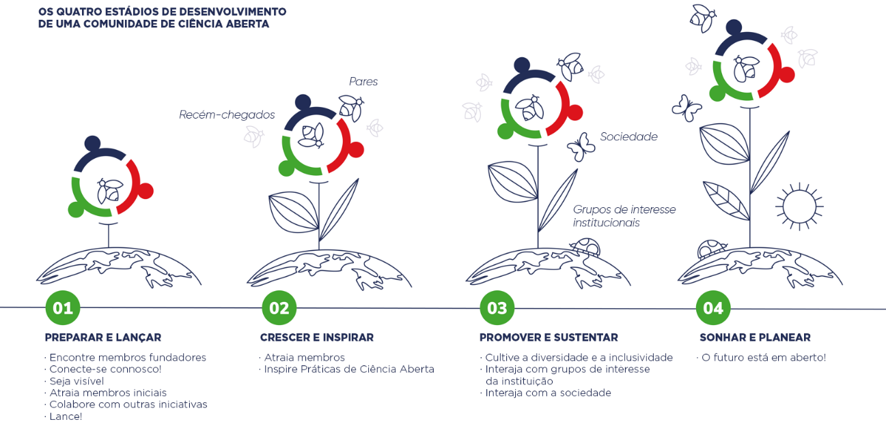

A Ciência Aberta melhora a qualidade, a acessibilidade e a eficiência da ciência, mas não é ainda a norma em investigação. Enquanto académicos e estudantes pioneiros estão a desenvolver e a adotar práticas de Ciência Aberta, a maioria continua a manter o status quo. Para se conseguir passar a forma de trabalhar destes pioneiros para a prática comum, é preciso envolver uma proporção crítica da comunidade de investigação. É aqui que as Comunidades de Ciência Aberta entram em ação!

As Comunidades de Ciência Aberta representam um local onde recém-chegados e colegas experientes interagem e inspiram-se mutuamente a adotar práticas e valores de Ciência Aberta. Aqui, identificam-se oportunidades e ameaças, e fornece-se feedback sobre políticas, infraestruturas e serviços de apoio. Da mesma forma, as Comunidades de Ciência Aberta são lugares onde investigadores e partes interessadas da sociedade se podem encontrar, inspirar e co-criar.

Tanto o tamanho como o número de Comunidades de Ciência Aberta continuam a crescer. Ao criar impulso e massa crítica, as Comunidades de Ciência Aberta inauguram uma mudança cultural em direção à Ciência Aberta.

Você pode fazer parte disso!

Este Kit de Iniciação fornece a lógica, o design e as diretrizes para iniciar sua própria Comunidade de Ciência Aberta, a nível local. Siga connosco este caminho e conecte-se.

Juntos, tornamos a ciência aberta!

***

***
