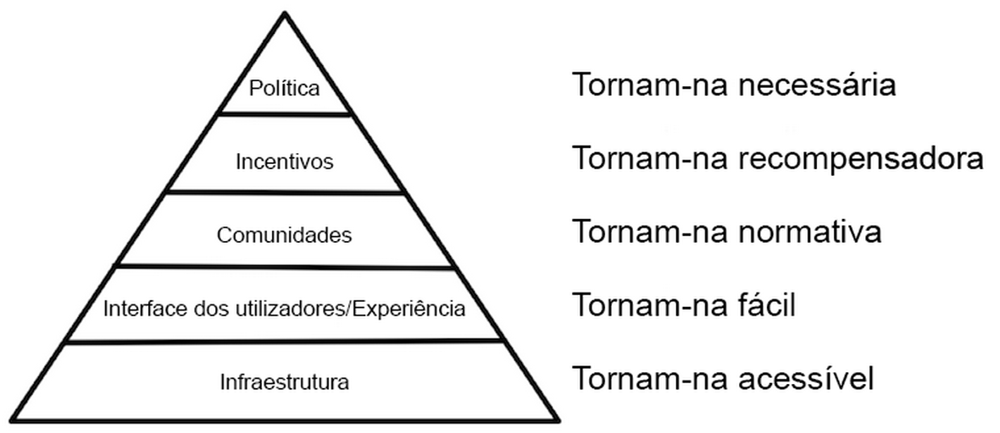
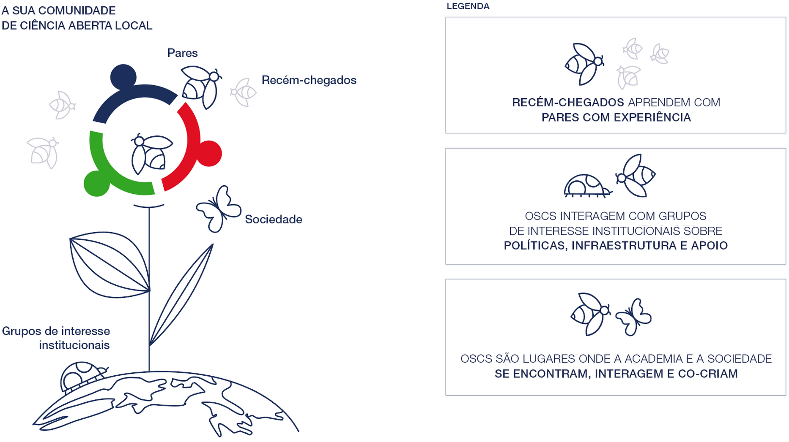
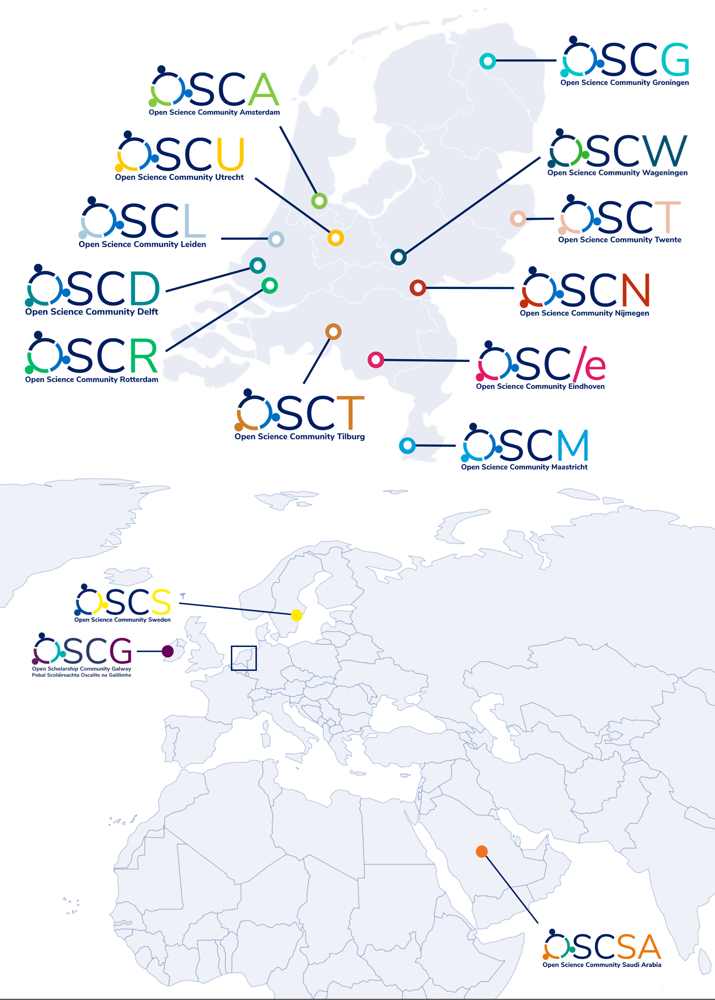
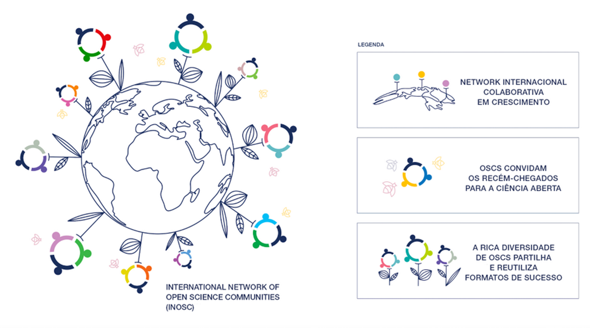

---
# Title, summary, and page position.
linktitle: 'Seção I : Introdução às Comunidades Científicas Abertas'
summary: ''
weight: 1
icon: book
icon_pack: fas

# Page metadata.
title: 'Seção I'
date: "2022-05-11"
type: book  # Do not modify.
---

## I.1 O papel das comunidades na transição para a Ciência Aberta

A Ciência Aberta[^1] engloba um [conjunto grande e crescente de práticas](https://www.fosteropenscience.eu/themes/fosterstrap/images/taxonomies/os_taxonomy.png) que tornam a produção académica (publicações, dados, código, protocolos, etc.) mais acessível, transparente, confiável e inclusiva. A lógica por trás de qualquer uma destas práticas é que [a abertura aumenta a qualidade, a eficiência e o impacto da ciência](https://doi.org/10.3390/publications7030046). Si certaines de ces pratiques commencent à se généraliser (par exemple l'accès libre aux publications), d'autres sont loin d'être courantes (par exemple les données ouvertes et les preprints). Enquanto algumas práticas estão a começar a tornar-se mais difundidas (como a *Publicação em Acesso Aberto*), outras estão longe de ser aplicadas de forma corrente (por exemplo, *Dados abertos e Pré-impressões*). Se está a ler este Kit de Iniciação, provavelmente conhece muitas destas práticas e está convencido de que a Ciência Aberta é benéfica para a ciência e para a sociedade. Nós também!

À primeira vista, a transição para a Ciência Aberta pode parecer bastante fácil de realizar. Por que motivo as pessoas não abraçariam este grande novo conjunto de práticas? Na realidade, requer nada menos do que uma profunda mudança cultural na academia. Conforme articulado por Brian Nosek nesta [publicação no blog](https://cos.io/blog/strategy-culture-change/), uma mudança de cultura precisa de um conjunto de ingredientes-chave que podem ser representados como uma pirâmide (*Figura 1*).

***

***Figura 1**. A pirâmide da mudança de cultura. Imagem de Brian Nosek (sous [licenciada CC BY-ND 4.0](https://twitter.com/BrianNosek/status/1446528277271748611)), reproduzida da publicação do blog [Strategy for Culture Change](https://www.cos.io/blog/strategy-for-culture-change).*

***

No topo desta pirâmide está a **Política**. Para uma mudança cultural em direção à Ciência Aberta na academia, são necessárias políticas para a promover e garantir que os incentivos institucionais estejam alinhados com a Ciência Aberta. Na base dessa pirâmide, encontramos a **infraestrutura** necessária. Ter uma infraestrutura confiável, flexível e fácil de usar é essencial para colocar a Ciência Aberta em prática. As plataformas online permitem fluxos de trabalho colaborativos (por exemplo, a [Open Science Framework](https://cos.io/)), para armazenar e partilhar materiais, dados, código e os resultados (veja também a [European Open Science Cloud](https://www.eosc-portal.eu/)) e serviços de suporte, como aqueles fornecidos por Bibliotecas Universitárias ou de Politécnicos. Apesar das políticas recentes e da infraestrutura disponível, ainda estamos a aguardar uma verdadeira mudança cultural. O que está nos está a atrasar? Este desafio está na camada do meio da pirâmide, nas **Comunidades** que tornam a Ciência Aberta estatutária. Atualmente, a comunidade académica comprometida com a Ciência Aberta é relativamente pequena e consiste principalmente de pessoas pioneiras, que muitas vezes já são bastante experientes com práticas de Ciência Aberta. Estes pioneiros geralmente desempenham um papel consultivo em políticas e infraestrutura. Embora a sua contribuição seja extremamente valiosa, eles podem ignorar obstáculos enfrentados pelos recém-chegados à Ciência Aberta. Estes recém-chegados abrangem o campo académico de forma ampla: eles não serão apenas estudantes ou investigadores em início de carreira, mas provavelmente também académicos seniores, com prática de trabalho científico de décadas, que se interessaram agora em trabalhar de forma aberta com outros académicos. Sem envolver esta comunidade mais alargada e apelar para objetivos e valores científicos partilhados, a Ciência Aberta corre o risco de se tornar demorada, em vez de enriquecer as metodologias de trabalho de todos. A prática de Ciência Aberta em larga escala depende, portanto, da sua capacidade de ser adotada, dos pioneiros para a maioria da comunidade académica (*Figura 2*).

***

***Figura 2**. [O Ciclo de Vida de Adoção da Inovação, ou Curva do Sino de Roger](https://en.wikipedia.org/wiki/Technology_adoption_life_cycle#/media/File:DiffusionOfInnovation.png), indicando os estágios pelos quais qualquer inovação normalmente passa: Inovadores, Adotantes Iniciais, Maioria Inicial, Maioria Tardia e Retardatários.*

***

Qualquer mudança cultural precisa de massa crítica para desafiar e mudar o *status quo*, e a contribuição dos recém-chegados é essencial para refinar a política e a infraestrutura necessárias para alcançar uma ampla adoção da Ciência Aberta. O principal desafio na transição para a Ciência Aberta é, portanto, um **desafio social**: como atrair a massa crítica necessária da comunidade académica? Enquanto muitos experimentam a transição para a abertura como libertadora e mais de acordo com motivações intrínsecas, outros hesitam em mudar, por várias razões. Podem sentir-se confortáveis com ​​as suas práticas atuais, não entender os benefícios adicionais, não considerar que vale a pena o investimento ou ficar sobrecarregados e frustrados pelo simples acumular de novas informações, e pela falta de práticas padronizadas e de reconhecimento institucional. Alguns podem até sentir que a Ciência Aberta é apenas uma fase e desejarão esperar até que acabe. A realidade é que não vai acabar. A transição é real e todos os estudiosos e investigadores terão de lidar com ela. É a hora de construirmos e moldarmos esta transição e, para isso, precisamos da contribuição da comunidade académica no geral.

É aqui que as Comunidades de Ciência Aberta (em inglês *Open Science Communities*, OSCs) entram em cena. São comunidades de aprendizagem "de baixo para cima", projetadas para atrair uma grande parte dos investigadores. Fazemos isto tornando a Ciência Aberta mais **visível**, mais **acessível** e explorando os **obstáculos e os requisitos** para que os recém-chegados tornarem as suas práticas de trabalho mais abertas. Para uma introdução mais elaborada do papel das OSC na transição para a Ciência Aberta, leia nosso [Whitepaper](https://doi.org/10.1093/scipol/scab039).

Para incentivar uma mudança global em direção à Ciência Aberta, precisamos de muitas OSCs locais, em todo o mundo. É com este objetivo em mente que criámos este Kit de Iniciação, para inspirar e capacitar pessoas como você a criar uma OSC local. A chave para acelerar a transição para a Ciência Aberta pode, literalmente, estar nas suas mãos.

## I.2 O Nosso formato para Comunidades de Ciência Aberta

O formato de OSCs que apresentamos neste Kit de Iniciação é uma comunidade de aprendizagem **ascendente**, composta por membros de várias disciplinas científicas e estádios de carreira. O principal público-alvo das OSCs são académicos, mas também é extensível a outros. A indústria, ministérios ou cidadãos, também são bem-vindos.

A nossa visão e missão são:

> **Visão e missão**
>
> A Ciência Aberta melhora a qualidade, a acessibilidade e a eficiência da ciência, mas ainda **não é a norma** na investigação. Enquanto académicos pioneiros estão a desenvolver e a adotar práticas de Ciência Aberta, a maioria mantém o *status quo*. Para *passar dos pioneiros à prática comum*, precisamos de envolver uma proporção crítica da comunidade de investigadores.
>
> É aqui que as Comunidades de Ciência Aberta entram.
>
> As Comunidades de Ciência Aberta fornecem um local onde **recém-chegados e colegas experientes** interagem e **se inspiram uns aos outros** a incorporar práticas e valores de Ciência Aberta nos seus métodos de trabalho, enquanto fornecem feedback sobre políticas, infraestrutura e serviços de apoio.
>
> Juntos, fazemos da Ciência Aberta a norma!

A missão acima pode ser dividida em objetivos práticos (*Figura 3*) :

> **Objetivos**
> - Convide recém-chegados para a Ciência Aberta
> - Aumente o seu envolvimento em práticas de Ciência Aberta
> - Sirva como um terreno fértil para iniciativas de Ciência Aberta
> - Interaja com políticas, infraestrutura e serviços de apoio
> - Promova interações entre a academia e a sociedade

***

***Figura 3**. Infográfico que destaca os principais objetivos de uma Comunidade de Ciência Aberta (ver legenda).*

***

*Objetivo n°&nbsp;1 - Convide os recém-chegados para a Ciência Aberta*  
O objetivo principal de uma OSC é dar as boas-vindas aos recém-chegados à Ciência Aberta e fornecer uma plataforma onde possam aprender com os seus pares e identificar maneiras de superar barreiras ao fazer a transição para métodos de trabalho (mais) abertos. Uma OSC é uma comunidade de aprendizagem: não precisa de ter nenhuma experiência com Ciência Aberta para ingressar na comunidade ou para se comprometer com essas práticas ao ingressar. O que une os membros da comunidade é o interesse pela Ciência Aberta, exibido publicamente no site da sua Comunidade.
Para interagir com os recém-chegados, é fundamental que eles saibam da existência da sua Comunidade de Ciência Aberta. É preciso que esteja visível. Além disso, os recém-chegados precisam de ser atraídos para a comunidade. Precisam de se sentir em casa. É esta a chave para se atingir o tom certo. Fornecemos orientações práticas a esse respeito na [*Seção II*]().

*Objetivo n°&nbsp;2 - Aumente o envolvimento com as práticas de Ciência Aberta*   
Aumentar o envolvimento com as práticas de Ciência Aberta é central para a nossa missão. Isto inclui inspirar os recém-chegados a dar os seus primeiros passos, mas também a consolidar as práticas atuais de Ciência Aberta entre colegas que já aderiram ao (partes do) seu método de trabalho. A nossa principal estratégia é facilitar a troca de conhecimento entre os pares. Na [*Seção II*](), fornecemos vários exemplos práticos de formatos que promovem a troca de conhecimento entre pares.

*Objetivo n°&nbsp;3 - Sirva como terreno fértil para iniciativas de Ciência Aberta*
O sucesso de uma Comunidade depende das contribuições dos seus membros. Portanto, é importante **permitir que os membros iniciem as suas próprias iniciativas** dentro da Comunidade. Essas iniciativas dos membros podem ser facilitadas fornecendo diretrizes, anunciando-as no website, no *boletim informativo*, nos media social e, se possível, alocando orçamento. Em vez de desenvolver novas iniciativas, os membros também podem adotar formatos existentes que tiveram sucesso comprovado noutras instituições (por exemplo, noutras OSCs). Diretrizes práticas e exemplos de formatos de sucesso são detalhados na [*Seção II*]().

*Objetivo n°&nbsp;4 - Interaja com políticas, infraestrutura e serviços de apoio*   
Uma das principais características de uma OSC é que ela opera **independentemente** da política institucional. Isso significa que a comunidade é uma organização autodirigida que não recebe instruções, metas ou tarefas de outros. No entanto, as OSCs não devem operar isoladamente. Conforme discutido na [*Seção I.I*](#I.1-O-papel-das-comunidades-na-transição-para-a-Ciência-Aberta), as OSCs estão bem posicionadas entre a política e a infraestrutura. A política descreve o que é necessário, desejado e incentivado; a infraestrutura determina o que é possível; mas a comunidade determina como as coisas são feitas na prática. Para facilitar uma transição suave para a Ciência Aberta, todas as partes interessadas precisam de colaborar. Portanto, o(s) coordenador(es) da(s) comunidade(s) esforça(m)-se para aumentar as conexões com colegas em cargos de liderança, em particular aqueles envolvidos em **políticas institucionais, infraestrutura e apoio**. Exemplos práticos de colaboração são discutidos na [*Seção II*]().

*Objetivo n°&nbsp;5 - Promova interações entre a academia e a sociedade*
Ciência Aberta significa não apenas aberta aos colegas da academia, mas também à sociedade. Portanto, promovemos interações entre académicos e partes interessadas da sociedade, como a sociedade civil, civis, doentes, políticos e a indústria. Um primeiro passo é tornar o nosso trabalho acessível a essas partes interessadas. Quando aplicável, também incentivamos o seu envolvimento em todas as etapas do ciclo de investigação.

***

| Objetivos       | Público-alvo     | Estratégias e formatos   |
| :------------- | :----------: | -----------: |
| Alcance e inclua os recém-chegados em Ciência Aberta | Recém-chegados | Website, boletim informativo, folhetos, mercadoria, media, tom |
| Aumente o envolvimento com as práticas de Ciência Aberta | Recém-chegados e colegas experientes | Palestras, workshops, simpósios, programas de mentoria, fóruns |
| Sirva como terreno fértil para iniciativas de Ciência Aberta | Recém-chegados e colegas experientes | Iniciativas de membros, coleção de formatos estabelecidos |
| Forneça informações para políticas, infraestrutura e apoio | Reitor, conselho, bibliotecários, especialistas em TI | Reuniões regulares com as partes interessadas |
| Promova interações entre os académicos e a sociedade | Académicos, atores da sociedade civil e cidadãos | Simpósios, reuniões de informação, festivais de ciências, comunicação online |

***Tabela 1**. Objetivos e públicos-alvo. Estratégias e formatos são detalhados na [*Seção II*]().*

***

## I.3 História e Realizações das nossas Comunidades de Ciência Aberta (OSC)

Para ter uma ideia de como uma OSC pode evoluir, vamos dar recordar como avançaram na Holanda. A primeira OSC foi a de Utrecht ([OSCU](https://openscience-utrecht.com/)), iniciada em 2018 nesta Universidade por dois investigadores entusiastas da Ciência Aberta. Começaram e tornaram mais visível a prevalência de práticas de Ciência Aberta na sua universidade, pedindo a colegas que estavam envolvidos em Ciência Aberta para se juntarem numa Comunidade e publicarem a sua experiência em Ciência Aberta no website dessa Comunidade. Além disso, recrutaram membros que estavam interessados ​​em Ciência Aberta, mas que não tinham experiência anterior com ela. Estes membros poderiam entrar em contato com os seus colegas mais experientes para saber mais sobre práticas de Ciência Aberta. Por outro lado, os membros da OSCU receberam um boletim mensal e os fundadores começaram a envolver-se na comunidade ao redor do campus e nos media. Com o tempo, o número de membros aumentou e a OSCU começou a organizar uma série de workshops cujos temas foram baseados nos resultados a um inquérito aos seus membros. Além disso, os fundadores criaram um [tutorial passo a passo](https://openscience-utrecht.com/community-blueprint/) descrevendo como iniciaram a OSCU, para ajudar colegas de outras universidades a iniciar uma iniciativa semelhante na sua universidade. Dentro de um ano, colegas de várias universidades holandesas (*Figura 4*) iniciaram OSCs paralelas, operando sob um acrónimo e logotipo semelhantes e partilhando um conjunto de Princípios Orientadores e um Código de Conduta[^2].

Após um ano, a OSCU obteve um orçamento da Universidade de Utrecht para desenvolver e sustentar as suas atividades, o que levou à nomeação de Embaixadores das Faculdades para promover a Comunidade nas suas respetivas faculdades por meio de reuniões da OSC-NL (OSC Holanda). Após a primeira reunião da OSC-NL, organizaram-se uma série de workshops e de eventos de Ciência Aberta, muito além de Utrecht. Por exemplo, no primeiro ano após participar do primeiro OSC-NL, a Open Science Community Groningen (OSCG) realizou uma petição na qual 244 funcionários da Universidade de Groningen indicaram que estariam dispostos a apoiar ativamente a OSCG. Após o início oficial, o OSCG organizou seis palestras e workshops (por exemplo, sobre visualização de dados, relatórios registados e pré-registo para estudos qualitativos), lançou um [website](https://openscience-groningen.nl/), uma [conta no Twitter](https://twitter.com/OSCGroningen) (com 420 seguidores para já) e um [canal no YouTube](https://www.youtube.com/channel/UCNqQuXVcwnnof_7QEIaabdQ), e passou a enviar uma newsletter bimestral da OSCG (227 assinantes). Mais recentemente, em colaboração com a Biblioteca da Universidade, criaram um [Prémio de Investigação Aberta](https://openscience-groningen.nl/call-for-submissions-open-research-awards/) anual para colaboradores e estudantes universitários.

Em menos de dois anos, surgiram onze OSCs na Holanda e duas fora da Holanda (*Figura 4*), que organizaram diferentes atividades de Ciência Aberta e que se preocuparam em saber onde poderiam contribuir mais dentro daquela universidade específica (veja a *tabela 2* para uma visão geral das concretizações). Embora essa abordagem orgânica fosse rápida, divertida e eficaz no curto prazo, faltava uma estratégia ou uma meta abrangente e clara. As decisões eram tipicamente tomadas *ad hoc* (devemos organizar outro workshop? Ou iniciar um blog? Ou... Ou...) e era difícil avaliar o sucesso de nossas Comunidades na prática. Por isso, decidiu-se dar um passo atrás e refletir sobre nossos objetivos, estratégias e ferramentas, que agora articulamos neste Kit de Iniciação[^3].

> ***Tabela 2.** Conquistas das OSCs desde 2018.*
> - OSCs em doze[^4] Universidades Holandesas, totalizando mais de 700 membros (e a crescer!)
> - Três OSCs fora da Holanda: Suécia, Irlanda e Arábia Saudita
> - Muitos workshops e eventos de Ciência Aberta, com até 75 participantes
> - Vários blogs de Ciência Aberta escritos sobre vários tópicos relacionados com o tema da Ciência Aberta (por exemplo, ["10 Mitos da Ciência Aberta"](https://openscience-groningen.nl/10-open-science-myths/)
> - A OSCG lançou o [Open Research Award anual](https://openscience-groningen.nl/call-for-submissions-open-research-awards/)
> - Solicitações frequentes para ministrar palestras e workshops de Ciência Aberta em eventos nacionais e internacionais
> - Contribuição para grandes propostas de financiamento da UE e dos EUA
> - Solicitações frequentes para aconselhar na execução de políticas locais
> - Solicitação frequente para promover materiais (por exemplo, para bibliotecas universitárias ou para o projeto nacional ORCID)
> - Receção de reconhecimento local de [Reitores](https://www.uu.nl/sites/default/files/uu-oaj-2019-2020-henk-kummeling.pdf) e internacional, do [Center for Open Science](https://www.cos.io/blog/how-build-open-science-network-your-community) e da [Society for the Improvement of Psychological Science](https://improvingpsych.org/mission/awards/)

***

***Figura 4**. Visão geral das atuais Comunidades de Ciência Aberta. A partir de janeiro de 2022, a *Rede Internacional de Comunidades de Ciência Aberta* (INOSC) compreende Comunidades de Ciência Aberta em 12 locais na Holanda, uma na Irlanda, uma na Suécia e uma na Arábia Saudita. Imagem de [Anita Eerland](http://www.anitaeerland.com/about/), licença [CC BY-ND 3.0](https://creativecommons.org/licenses/by-nd/3.0/nl/deed.en).*

***

## I.4 Chamada à ação

Como coordenadores da comunidade local, estamos muito felizes e orgulhosos do que conquistámos até agora, mas queremos mais[^5]! É por isso que incentivamos colegas de todo o mundo a iniciarem OSCs locais nas suas universidades/ politécnicos ou centros de investigação, para criar impulso para uma mudança de cultura global na academia em direção à Ciência Aberta (*Figura 5*). Então, convidamo-lo a iniciar uma OSC local. Por favor, conecte-se connosco para que possa começar com um exemplo já desenvolvido e fazer uso de nossa rede ativa de Coordenadores da Comunidade, para trocar experiências e ideias. Além disso, à medida que a rede se expande, estaríamos em melhor posição para candidatura coletiva a financiamento (inter)nacional e contribuir para políticas (inter)nacionais. Tornar-se parte da crescente rede de OSCs significa que você adere aos nossos Princípios Orientadores e Código de Conduta coletivos, mas projeta e gere a sua comunidade como achar melhor, levando em consideração o contexto local. Juntos, fazemos da Ciência Aberta a norma, em benefício da ciência e da sociedade!

***

***Figura 5**. Objetivo e propósito da Rede Internacional de Comunidades Científicas Abertas (INOSC)).*

***

[^1]: O termo “Ciência” é usado aqui no seu sentido mais amplo e inclui áreas como humanidades, ciências sociais e engenharia; isto é, refere-se mais a qualquer forma de conhecimento.\
[^2]: É interessante notar que, embora as OSCs sejam abertas a membros de todas as disciplinas, os fundadores destas comunidades são muitas vezes investigadores da área das Ciências Sociais. Isso provavelmente ocorre porque o discurso em torno da Ciência Aberta é muito vivo nesta área, mas também porque a maioria dos coordenadores de OSCs participa nos mesmos eventos. Um dos mais influentes a este respeito é a reunião anual da Sociedade para o Aperfeiçoamento das Ciências Psicológicas ([SIPS](http://improvingpsych.org/)), onde o formato da OSC foi ativamente promovido pelos fundadores da OSCU.\
[^3]: No caso de Loek Brinkman e Antonio Schettino, esse processo de reflexão foi inspirado no programa [eLife Innovation Leaders](https://elifesciences.org/labs/ea8e2f51/introducing-innovation-leaders-2020), que também foi inspirado no [Mozilla Open Leaders](https://foundation.mozilla.org/en/initiatives/mozilla-open-leaders/).\
[^4]: OSCA é uma colaboração entre duas universidades: a Universidade de Amsterdã (UvA) e a Vrije Universiteit Amsterdam (VU).\
[^5]: [E nós apenas começámos!](https://www.youtube.com/watch?v=__VQX2Xn7tI)!