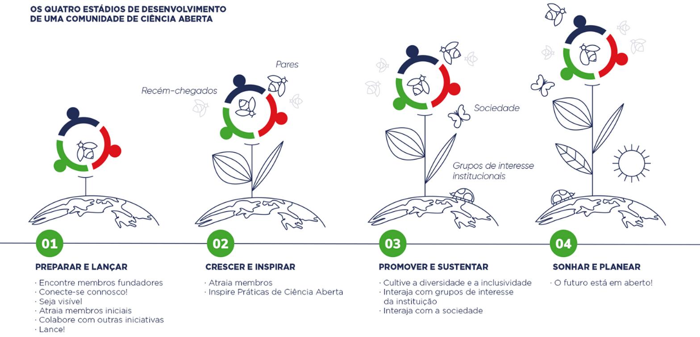

---
# Title, summary, and page position.
linktitle: 'Seção II: Lance e reforce a sua comunidade científica aberta
summary: ''
weight: 1
icon: book
icon_pack: fas

# Page metadata.
title: 'Seção II'
date: "2022-05-11"
type: book  # Do not modify.
---

Descrevemos **quatro etapas** na criação de uma OSC (*Figura 6*). Essas etapas são apresentadas em ordem cronológica, mas pode acontecer que, na sua situação, a ordem destas etapas seja invertida. Não há problema! Além disso, você pode perceber que certos aspetos desses estádios não estão "acabados" ao passar para o próximo estádio, mas exigem trabalho contínuo. No entanto, esses estádios fornecem um andaime para que a sua Comunidade saia do chão. Aqui vamos nós!

***

***Figura 6**. Os quatro estádios de iniciação e de promoção de uma Comunidade de Ciência Aberta.*

***

## **Etapa 1&nbsp;: Preparar e lançar**

### 1a. Membros fundadores: Coordenadores da Comunidade e Embaixadores de Docentes

A primeira coisa que precisa para uma OSC local arrancar é ter (pelo menos) um **Coordenador dessa Comunidade**, que tome a iniciativa. Esse poderia ser você! Olhando para as pessoas que iniciaram OSCs locais até agora, pode-se identificar o seguinte perfil:

- Adepto vigoroso da Ciência Aberta
- Investigador em início a meio de carreira (aluno de doutoramento / professor associado)
- Entusiasta
- Extrovertido
- Otimista
- Capaz de inspirar outras pessoas
- Inclusivo
- Pró-ativo
- Jogador da equipa
- Bem conectado dentro da Universidade e/ou capaz de estabelecer novas conexões (por exemplo, com reitores, bibliotecários, Departamentos de apoio à investigação, vários conselhos, etc.)
- Disposto a tentar e falhar (e a tentar novamente!)

Obviamente, isso não significa que *apenas* indivíduos com as características mencionadas sejam aptos a tornarem-se Coordenadores de Comunidades; destacamos apenas que são estes os traços comuns entre as pessoas que se empenharam no desafio até agora, e que têm sido benéficos para a formação das nossas comunidades. Pela nossa experiência, é mais sustentável (e muito mais divertido!) começar com mais de um Coordenador de Comunidade. Procure colegas com ideias semelhantes que queiram co-criar e co-liderar uma OSC consigo.

As pessoas da sua instituição, em posições de liderança, que estejam envolvidas em Programas de Ciência Aberta também podem estar interessadas em ter uma OSC local. No entanto, em vez de coordenar a própria Comunidade, podem estar em posição de *facilitar e de apoiar* o início da OSC. Por exemplo, podem procurar ativamente por pessoas dentro da Universidade que se encaixem no perfil de Coordenador de Comunidade descrito acima ou, melhor ainda, podem propor uma vaga para um cargo (pago). De acordo com as nossas experiências até agora, recomendamos dois Coordenadores de Comunidade (com dedicação de 20% - 40% do tempo cada).

Também é possível que pessoas que não são investigadores ativos (por exemplo, da equipa de apoio à investigação ou bibliotecários) iniciem e facilitem uma OSC. Foi o que aconteceu, por exemplo, em Roterdão ([OSCR](https://www.openscience-rotterdam.com/home/)) e Galway ([OSCGalway](http://osc-galway.ie/))[^1]. Nestes casos, investigadores ativos são incluídos nas decisões estratégicas relacionadas com a seleção de temas e priorização de atividades. Um dos principais aspetos que tornam as OSCs atrativas para (novos) membros é que a comunidade é *de baixo para cima*: para académicos, *por* académicos. As OSCs operam em paralelo – mas independentemente – de políticas ou iniciativas locais. É importante enfatizar esta natureza ascendente ao representar a OSC, especialmente se os Coordenadores de Comunidade não forem eles próprios investigadores ativos.

Até agora, os Coordenadores de Comunidades eram autonomeados e, quando aplicável, os Embaixadores Docentes eram escolhidos por estes Coordenadores (por exemplo, em Utrecht e Leiden, as vagas eram anunciadas por meio de boletins comunitários e media). No entanto, também é possível que Coordenadores de Comunidade e Embaixadores Docentes sejam selecionados a partir de um processo de eleição entre os membros da Comunidade ou, alternativamente, contratados pela instituição local como parte de uma estratégia mais ampla.

Embora a criação de uma OSC exija um compromisso substancial e investimento de tempo, as nossas experiências têm sido muito gratificantes. Como Coordenadores de Comunidade, ampliámos muito as nossas redes profissionais em todas as camadas da universidade, incluindo reitores, departamentos de apoio à investigação e bibliotecários, aumentando assim a nossa influência na política e na infraestrutura organizacional. A nível pessoal, adquirimos capacidades úteis e transferíveis, como a gestão de projetos, gestão de comunidades e liderança. Mais importante ainda, é extremamente gratificante cocriar soluções em larga escala com colegas inspiradores e com ideias semelhantes, fazendo parte de algo maior que o próprio, para a melhoria da Ciência e da sociedade.

### 1b. Conecte-se com a INOSC: Princípios Orientadores (GP) e Código de Conduta (CoC)

O próximo passo para os Coordenadores de Comunidade recém-nomeados será **conectar-se à nossa rede: a Rede Internacional de Comunidades de Ciência Aberta/Bolsas (INOSC)**. Há muita variedade e flexibilidade em como as diferentes OSC dentro da INOSC administram as suas comunidades. O que compartilhamos é um conjunto comum de Princípios Orientadores (*Tabela 3*) e um [Código de Conduta](https://osf.io/6gsye/). E aprendemos uns com os outros! No [espaço de trabalho do Slack](https://osc-netherlands.slack.com/#/), pode conversar com os coordenadores de todos os OSCs, que o ajudarão a começar.

***

> **Princípios Orientadores**
> - As Comunidades de Ciência Aberta (OSCs) são plataformas de baixo para cima, por e para investigadores trocarem conhecimento e know-how sobre práticas de ciência aberta
> - As OSCs são inclusivas
> - Os investigadores são o público-alvo das OSCs, mas estudantes, membros dos serviços de apoio a investigadores e outros interessados ​​em (realizar) investigação também são bem-vindos a juntarem-se à comunidade
> - Nenhum conhecimento prévio é necessário para fazer parte da comunidade, nem os membros são obrigados a comprometerem-se com todas as práticas abertas de ciência
> - As OSCs organizam, promovem e facilitam eventos de ciência aberta para (1) aprendizagem e discussão de práticas de ciência aberta, (2) partilha de conhecimento sobre ciência aberta, e (3) construção de redes profissionais
> - Os eventos são abertos a membros e a não membros e são gratuitos, sempre que possível
> - Os participantes e organizadores de eventos das OSCs devem aderir ao seu [Código de Conduta](https://osf.io/6gsye/)
> - As OSCs promovem discussões críticas sobre os prós e contras das práticas de Ciência Aberta. Abstemo-nos de ser normativos ou condescendentes e não dizemos aos outros o que fazer. O respeito pelos fluxos de trabalho e decisões de cada um a esse respeito é fundamental.

***Tabela 3.** Princípios Orientadores das Comunidades de Ciência Aberta. A versão completa e o Código de Conduta podem ser encontrados [aqui](https://osf.io/6gsye/).*

***

Os **Princípios Orientadores** (GPs) e o **Código de Conduta** (CoC) representam a base comum de todas as OSCs e não devem ser modificados. Se entender que certos aspetos desses documentos não se adequam à sua Comunidade, partilhe os seus pensamentos no canal Slack dos Coordenadores da Comunidade. Você é livre para complementar esses documentos com princípios adaptados à sua comunidade em particular, desde que não contradigam os GPs e/ou o CoC. Pode encontrar a [versão completa](https://osf.io/6gsye/) dos Princípios Orientadores e do Código de Conduta, bem como o procedimento para adicionar uma *adenda* local. Se concordar com os GPs e o CoC, pode criar o seu próprio logótipo **personalizado**, com base no nosso modelo. Observe que, embora tenha permissão para modificar certos aspetos do logótipo, existem algumas restrições[^2]. Veja o nosso [Guia de Estilo](https://docs.google.com/document/d/1MrAsChwb81gFXQX1_WUfdgo95HqH4t_rQU3DvGZHDfE/edit) para uma descrição detalhada do que você pode e não pode mudar no logótipo. Em caso de dúvida, [entre em contato com os Coordenadores da OSCU](mailto:openscience.utrecht@gmail.com).

### 1c. Visibilidade online: site e redes sociais

A próxima coisa que precisa é de um **website**, uma ferramenta indispensável para aumentar a visibilidade online de uma OSC. No site, as atividades da OSC são constantemente divulgadas e os nomes e capacidades dos membros da comunidade são destacados por meio de páginas de perfil pessoal e entrevistas. Os sites das OSCs foram, até agora, criados via Wordpress (por exemplo, [Utrecht](https://openscience-utrecht.com/)), incorporados em sites universitários internos (por exemplo, [Leiden](https://www.universiteitleiden.nl/open-science-community-leiden)) ou em combinação com [GitHub Pages](https://pages.github.com/) (por exemplo, [Nijmegen](https://openscience-nijmegen.nl/index) e [Rotterdam](https://www.openscience-rotterdam.com/home/)). Para consistência e para serem encontrados mais facilmente, os nomes de domínio OSCs geralmente seguem o formato *www.openscience-[CITY].com* (por exemplo, [Groningen](https://openscience-groningen.nl/)), com algumas exceções (por exemplo, [Eindhoven](https://osceindhoven.github.io/)).

Embora você seja livre para criar o site para o seu OSC da maneira que desejar, os seguintes elementos são necessários: 
- uma página inicial com as declarações de Visão e Missão das OSCs (ver [*Seção I*]()), bem como nossos Princípios Orientadores (ver *Quadro 2*)
- uma seção com o [Código de Conduta](https://osf.io/6gsye/)
- uma seção com nomes e/ou perfis de membros da comunidade

Outros recursos que você pode considerar para o site da sua comunidade são: (*i*) uma seção de notícias para desenvolvimentos de Ciência Aberta; (*ii*) uma seção de agenda para eventos de Ciência Aberta; (*iii*) informações gerais sobre Ciência Aberta; ou (*iv*) uma página para apresentar as iniciativas dos membros.

Em relação aos media, o [Twitter](http://twitter.com) é uma ferramenta poderosa de conexão com outros entusiastas de ciência aberta, partilhar conhecimento e iniciar colaborações frutíferas em vários projetos. No Twitter, as OSCs divulgam as suas atividades internas, apresentam eventos externos (por exemplo, conferências), promovem documentos importantes (por exemplo, posts em blogs, *pré-impressões*) e oportunidades de financiamento. Cada OSC tem a sua própria conta no Twitter (por exemplo, [OSCU](https://twitter.com/OpenSciUtrecht), [OSCG](https://twitter.com/OSCGroningen)). Para consistência e para ser encontrado mais facilmente, o identificador do Twitter é tipicamente *@OSC* seguido pela cidade (por exemplo, [@OSCLeiden](https://twitter.com/OSCLeiden)).

As comunicações internas diárias podem ser facilitadas por meio de ferramentas de mensagens instantâneas. As OSCs estão a usar o [Slack](https://slack.com/) e o [Element](https://element.io/) de forma produtiva. O Slack é muito popular, tem uma interface de usuário intuitiva e interage perfeitamente com outros serviços (por exemplo, Google Drive e Microsoft Office 365). No entanto, é um software privado e a versão gratuita tem [algumas limitações](https://slack.com/intl/en-nl/help/articles/115002422943-Message-file-and-app-limits-on-the-free-version-of-Slack?eu_nc=1) (por exemplo, o histórico do bate-papo fica oculto após 10.000 mensagens). O Element, embora um pouco menos amigável dos utilizadores, é gratuito e de código aberto, baseado no sistema de comunicação [Matrix](https://matrix.org/), descentralizado e seguro, e as integrações com outros produtos são desenvolvidas e mantidas ativamente por entusiastas de código aberto.

### 1d. Atraia membros iniciais

Nos estádios iniciais de uma OSC, atrair membros é mais eficaz pelo boca-a-boca: converse com colegas interessados ​​em Ciência Aberta e/ou que já tenham experiência com práticas de Ciência Aberta e pergunte se estão dispostos a juntar-se à sua Comunidade. Observe que *importa muito quem são seus membros iniciais*. Se todos os seus membros iniciais são de uma mesma faculdade, será mais difícil atrair membros de outras faculdades num estádio posterior, porque pensarão que esta Comunidade não é para eles. O mesmo vale para a experiência de Ciência Aberta. Se você tiver apenas especialistas em Ciência Aberta como membros, os recém-chegados ficarão mais relutantes em participar. Assim, certifique-se de que os seus membros iniciais sejam um grupo heterogéneo.

### 1e. Conecte-se a iniciativas de Ciência Aberta na sua organização

Também é altamente recomendável, nesta fase, conectar-se localmente com projetos relacionados (por exemplo, em Bibliotecas Universitárias ou de Politécnicos), mesmo quando ainda estiver na fase de criação da sua Comunidade. É importante estar ciente do que já está a acontecer na sua organização em relação à Ciência Aberta e, além disso, estas pessoas estão, geralmente, dispostas a ajudá-lo, por exemplo, a organizar workshops em conjunto, ou a conectá-lo a outras partes interessadas relevantes.

### 1f. Lançe!

Quando tiver um conjunto inicial de membros e talvez alguns planos para workshops ou eventos, é hora de oficializar sua comunidade! Uma ótima maneira de o fazer é organizar um evento inicial, incluindo, por exemplo, algumas palestras curtas dos seus membros fundadores sobre o motivo pelo qual acreditam na Ciência Aberta e na Comunidade. Peça aos seus membros iniciais para ajudar, convidando os colegas para o evento inicial e promovendo a Comunidade. Os membros atuais, preferencialmente em posição de liderança, podem enviar um e-mail para o seu grupo de investigadores, departamento ou corpo docente, para promover o evento.

Certifique-se de que o evento seja festivo e comemorativo, por exemplo, decorando a sala e oferecendo bebidas e snacks. Também vale a pena convidar alguém para tirar fotos do evento, que depois podem ser divulgadas em newsletters, redes sociais e no website da Comunidade.

## **Etapa 2&nbsp;: crescer e inspirar**

Na próxima etapa, os dois principais objetivos são: (1) atrair mais membros; e (2) inspirar os membros a tornar o seu trabalho mais aberto.

### 2a. Atraia membros

Em primeiro lugar, deve investir muito na visibilidade da sua Comunidade. Comece a divulgá-la em reuniões e em boletins de faculdades ou departamentos. Você também pode imprimir folhetos (consulte o [Guia de Estilo](https://docs.google.com/document/d/1MrAsChwb81gFXQX1_WUfdgo95HqH4t_rQU3DvGZHDfE/edit) para obter exemplos). Pode ser muito útil pedir aos seus membros iniciais para ajudar nesta promoção. Os recém-chegados são mais propensos a juntarem-se à Comunidade se ouvirem falar sobre isso de colegas da sua própria área científica ou departamento, então use a sua rede de membros. De acordo com a nossa experiência, uma forma eficaz de atrair novas pessoas é quando os membros atuais, preferencialmente em posições de liderança, falam sobre a comunidade ou enviam um e-mail aos seus colegas, grupo de investigação, departamento ou corpo docente, informando que ingressaram na Comunidade e sugerindo que os seus colegas também participem. Também vale a pena estar visível em eventos locais com muitos recém-chegados à Ciência Aberta, mesmo quando esses eventos não são sobre Ciência Aberta. Tente conseguir um espaço para falar sobre Ciência Aberta na sua comunidade, mesmo que seja apenas uma apresentação de um minuto. Outra opção, muitas vezes mais fácil de realizar, é ter uma banca de informações num evento, onde possa interagir com potenciais novos membros. Também ajuda ter um balcão *"Inscreva-se Aqui"*, presente em eventos onde os recém-chegados se podem inscrever no local. Merchandising e gadgets como autocolantes, chaveiros e garrafas de água com o logótipo da Comunidade também podem ajudar a atrair novos membros e a aumentar o sentimento de pertença à Comunidade (se o seu orçamento permitir).

Ao atrair novos membros, é crucial ter uma estratégia de comunicação clara. Para isso, é fundamental entender o seu público-alvo. Eles são diferentes de si! Embora a Ciência Aberta possa estar no topo da sua agenda, para os recém-chegados, geralmente tem menos prioridade. É crucial não ser condescendente com isso. As pessoas que são particularmente entusiastas pela Ciência Aberta podem considerar as suas redes de trabalho superiores às de outras pessoas e expressar esses sentimentos. Estar exposto a tais perspetivas pode alienar os recém-chegados e levar a uma resistência desnecessária, criando uma distinção contraproducente "nós versus eles". Os recém-chegados são mais propensos a ingressar uma comunidade onde podem explorar e formular as suas opiniões e dúvidas, em oposição a um "clube de especialistas" que julga as práticas de trabalho dos outros. Portanto, é fundamental atingir o tom certo. Certifique-se de que em todas as suas comunicações é inclusivo, humilde e respeitoso. Enfatize que a OSC é uma comunidade de aprendizagem e que a comunicação é bidirecional: recém-chegados e colegas experientes aprendem uns com os outros e identificam barreiras e oportunidades para tornar a transição para a Ciência Aberta mais divertida e fluente, juntos.

O facto da Ciência Aberta não ser a prioridade máxima para o seu público-alvo também significa que precisa de facilitar ao máximo o acesso a eventos. Por exemplo, certifique-se de que as pessoas não precisem de viajar para participar, por exemplo, organizando eventos on-line ou várias vezes em locais diferentes do campus. Ter de sair do prédio onde estudam ou trabalham pode literalmente fazer a diferença para a presença das pessoas. Certifique-se de que os recém-chegados podem identificar-se e relacionar-se com os eventos que está a organizar. Tente fazer tudo ao seu alcance para levar os seus eventos até as pessoas, tanto em termos de logística, quanto de temas. Como mencionado acima, bebidas gratuitas, snacks e brindes são frequentemente apreciados (se o seu orçamento permitir).

### 2b. Inspire os membros a tornar as suas redes de trabalho mais abertas

As OSCs têm à sua disposição diversas ferramentas e formatos para promover o comprometimento com a Ciência Aberta. Aqui listamos aqueles que provaram ser particularmente eficazes.

#### Website das OSCs

Nos sites das OSCs, os membros indicam a sua experiência em práticas de Ciência Aberta: por exemplo, o site da Open Science Community Rotterdam ([OSCR](https://www.openscience-rotterdam.com/home/)) visualiza as capacidades de Ciência Aberta de cada membro por meio de um [radar de ação](https://www.openscience-rotterdam.com/2019/04/schettino/). Isso fornece uma forma fácil de encontrar e entrar em contato com um colega quando tiver uma pergunta sobre um tópico específico de Ciência Aberta. A pesquisa pode ser feita dentro de uma competência específica ou expandida para outras, em diferentes disciplinas. Os membros também podem indicar os tópicos de Ciência Aberta sobre os quais desejam saber mais na sua página de perfil. Isto pode facilitar algum tipo de encontro entre membros que desejam partilhar o seu conhecimento de Ciência Aberta e membros que desejam aprender sobre aspetos específicos de Ciência Aberta. Um botão com essa função incluída que faça estas correspondências automaticamente seria muito útil, caso contrário, os Coordenadores da Comunidade poderiam enviar "correspondências" por e-mail com sugestões de colegas para “encontro”. Esse procedimento pode-se assemelhar ao formato de um site de namoro, sem o romantismo (mas quem sabe!).

As informações no site também podem inspirar o comprometimento com as práticas de Ciência Aberta ao *estabelecer normas*. Ao demonstrar a prevalência da experiência e interesse nas práticas de Ciência Aberta, comunicamos que a Ciência Aberta é o caminho a seguir.

#### Boletins informativos

Um boletim informativo é uma maneira eficiente de alcançar um grande número de pessoas e de informá-las sobre notícias e eventos de Ciência Aberta. As nossas newsletters são normalmente bem lidas, com cerca de 50% dos subscritores a abrir a newsletter e 10% a clicar nos itens das newsletters[^3]. Certifique-se que devem ser curtos e atraentes, e tente não sobrecarregar os seus assinantes com e-mails (uma vez por mês é suficiente).

#### Palestras, Workshops e Grupos de Estudos

Ao escolher os tópicos dos seus eventos (por exemplo, palestras, workshops), recomendamos que entre em contato com os seus membros, para obter sugestões. Quais os tópicos que eles gostariam que fossem abordados? Certifique-se de ter um conjunto diversificado de eventos, em termos de tópicos e de formato. Os seus membros terão diferentes níveis de abertura à alteração das suas práticas de trabalho, e é crucial atender às necessidades de todos. Aqui apresentamos formatos para níveis superiores de envolvimento com práticas de Ciência Aberta, desde introduções leves até workshops e grupos de estudo aprofundados e práticos (*Tabela 4*).

As *palestras* são um formato útil para apresentações: reuniões destinadas a partilhar informações para um público amplo. Exemplos típicos são sobre visões gerais de Ciência Aberta ou *introduções a Relatórios Registados*. Um formato específico de palestras frequentemente adotado nas OSCs são as palestras relâmpago, *palestras curtas* (5 - 10 minutos) onde os colegas partilham sua experiência com as práticas de Ciência Aberta. Os palestrantes não precisam ser especialistas, podem estar apenas um passo à frente dos seus colegas na utilização de uma determinada ferramenta ou técnica. Um conjunto de palestras relâmpago pode ser centrado numa prática específica (por exemplo, o *Pré-registo*) ou direcionado a um público específico (candidatos a doutoramento) ou disciplina (economia comportamental). Muitas das palestras e workshops organizados pelas OSCs são acessíveis online e abertos para reutilização. Frequentemente, complementamos a experiência prática de colegas com o conhecimento profundo de bibliotecários.

Para atrair recém-chegados, é benéfico restringir o tema de um workshop a um público específico. Por exemplo, os recém-chegados podem estar mais inclinados a participar num workshop sobre "Dados Abertos e FAIR para Economistas" do que um workshop sobre dados Abertos e FAIR em geral. Isso, é claro, vem com a desvantagem de que é necessário organizar diferentes workshops para diferentes disciplinas. Se isso não for viável, você também pode optar por workshops direcionados a toda a Universidade, com o benefício adicional de que eles podem inspirar resultados interdisciplinares, quando pessoas de diferentes disciplinas interagem umas com as outras.
Enquanto as palestras (relâmpago) efetivamente informam e inspiram os recém-chegados sobre Ciência Aberta, workshops aprofundados fornecem o próximo passo para a mudança comportamental.

Os *workshops* são sessões interativas destinadas à aprendizagem de ferramentas que aumentam a abertura e a transparência. Essas ferramentas podem ser softwares específicos ou plataformas colaborativas online, por exemplo, Utilização do R para análise de dados reprodutíveis ou um [Guia prático para a Estrutura de Ciência Aberta]((https://osf.io/)). O anfitrião da sessão fornece uma introdução geral sobre a ferramenta e qual a solução para um problema que ela aborda, seguida de exemplos práticos e tutoriais ao vivo que os participantes podem adaptar posteriormente para os seus casos específicos. Os participantes devem preparar-se com antecedência, por exemplo, trazendo o seu próprio portátil com o software relevante já instalado.

Um próximo nível de envolvimento pode ser alcançado em *grupos de estudo* ou *programas de orientação*, ou horas de partilha recorrentes, em que um grupo de colegas trabalha sobre como implementar uma prática de Ciência Aberta específica durante um período, sob a supervisão de um mentor experiente. Essas iniciativas não apenas fornecem aos membros uma boa base de conhecimento, mas também permitem que eles se conectem com colegas que lidam com questões semelhantes, facilitando o desenvolvimento rápido de soluções partilhadas e de um sentimento de pertença à comunidade mais forte.

Para que qualquer uma das iniciativas descritas acima funcione, a comunidade precisa tanto de um público (por exemplo, de recém-chegados) quanto de colegas que já tenham experiência com uma ou mais práticas de Ciência Aberta e que estejam dispostos a partilhar os seus conhecimentos. As vantagens para os recém-chegados à Ciência Aberta são bastante claras. Mas o que há para este último grupo? Pioneiros e utilizadores iniciais de ciência aberta, geralmente orgulhosos das suas práticas de trabalho aberto, geralmente trabalham em ambientes onde os seus esforços podem não ser apreciados, porque não é uma prática comum. As OSCs acolhem, validam e recompensam os seus conhecimentos, mostrando que mais pessoas se preocupam em melhorar as práticas académicas, criando assim um sentimento de pertença que pode ser um forte motivador para permanecer comprometido com a Ciência Aberta. Além disso, as OSCs oferecem oportunidades para papéis de liderança na criação de iniciativas de membros locais, aumentando assim o impacto e a visibilidade no ambiente académico local. Isto também oferece oportunidades de maior divulgação das suas iniciativas a membros que já promovem ativamente a Ciência Aberta.

***

|              | Conversa relâmpago | Workshop   | Grupos de estudo |
| :----------- | :------------: | ---------: | -----------: |
| **Objetivo**     | Inspirar        | Comprometer     | Assumir compromisso       |
| **Audiência** | Aberta           | Interessada | Comprometida     |
| **Orador**  | Iniciante       | Perito     | Perito       |

***Tabela 4**. Visão geral de formatos de eventos com nível correspondente de envolvimento em Ciência Aberta.*

***

#### Clubes de jornais

Os *clubes de periódicos* são reuniões regulares (por exemplo, quinzenais ou mensais) nas quais os participantes discutem artigos e outros documentos relacionados com a Ciência Aberta. O documento a ser discutido é comunicado antecipadamente via e-mail e Twitter, com lembretes frequentes nos dias que antecedem a reunião. Normalmente, um moderador prepara um breve resumo com o ponto principal do documento e a discussão entre os participantes é incentivada. O moderador pode ser um dos organizadores, um participante ou um dos autores do documento discutido durante a sessão.

Exemplos de "ReproducibiliTea" ou de "Chá da Reprodutibilidade", liderados por OSCs (veja o *Quadro 3*), podem ser encontrados em [Leiden](https://twitter.com/LeidenTea), [Groningen](https://openscience-groningen.nl/activities/reproducibilitea/) e [Rotterdam](https://www.openscience-rotterdam.com/2019/10/oscr-reproducibilitea/). No caso de *clubes de revistas presenciais*, os organizadores reservam uma sala e oferecem bebidas (ou pedem a todos os participantes que contribuam trazendo algo para partilhar). Se o *clube de jornais* estiver online, os organizadores marcam a reunião – usando [Zoom](https://zoom.us/), [Jitsi Meet](https://meet.jit.si/), [Microsoft Teams](https://products.office.com/en-us/microsoft-teams/group-chat-software) ou qualquer outro serviço apropriado – e moderam a discussão.

#### Webinars e encontros on-line

Os eventos online têm como objetivo a partilha de conhecimento com o maior número de pessoas possível, inclusive não membros de OSCs. Os palestrantes (normalmente membros do OSC) são convidados a mostrar ao público como usar ferramentas práticas para melhorar a abertura e a transparência da investigação. Dois exemplos são: a utilização da plataforma Gitbook para os seus materiais de curso (parte da iniciativa [OSCU OSCoffee](https://openscience-utrecht.com/OSCoffee/)) e [Introduction à Git(Hub)](https://www.openscience-rotterdam.com/2020/04/intro-github-apr2020/) (organizado pela OSCR).
Os coordenadores das OSCs normalmente configuram reuniões – usando [Zoom](https://zoom.us/), [Jitsi Meet](https://meet.jit.si/), [Microsoft Teams](https://products.office.com/en-us/microsoft-teams/group-chat-software) ou qualquer outro serviço apropriado – e moderam a discussão.

#### Initiatives des membres

A força de uma comunidade depende das contribuições dos seus membros. Os membros podem aumentar a magnitude e a diversidade das atividades organizadas dentro da comunidade, aliviando os Coordenadores da Comunidade. As *Iniciativas dos Membros* são geralmente adaptadas a uma subseção da Comunidade e concentram-se em áreas específicas de Ciência Aberta. Embora os membros sejam livres de desenvolver as suas próprias iniciativas, pode ser ainda mais eficaz promover formatos existentes que provaram ser bem-sucedidos noutras instituições, como, por exemplo, *clubes de jornais*, ReproducibiliTea, Clubes de Ciência R.I.O.T. (Reproducible, Interpretable, Open, and Transparent) e Campeões de Dados (veja a *Figura 7*). Estas iniciativas podem encontrar um lugar sob o guarda-chuva da OSC local. Os Coordenadores de Comunidade podem promover e apoiar estas iniciativas, divulgando-as no site, boletim informativo e redes sociais, utilizando a rede comunitária. Colegas de instituições que já possuem iniciativas deste tipo podem ser convidados a partilhar as suas experiências ou a serem entrevistados em eventos ou para boletins, para motivar os membros locais a impulsionar as suas organizações. Independentemente de os membros desenvolverem as suas próprias iniciativas ou de partirem de exemplos existentes, ambas são oportunidades poderosas para o ganho de experiência organizacional e de liderança, o que é cada vez mais relevante para o desenvolvimento de carreira na academia.

***

> [**Chá da Reprodutibilidade **](https://reproducibilitea.org/)
> 
>
> Os *clubes de periódicos* ReproducibiliTea ajudam investigadores em início de carreira a estabelecer clubes locais de Ciência Aberta nas suas Universidades. Os tópicos das discussões vão desde formas de melhorar a ciência (por exemplo, por meio de reformas estatísticas) até implicações sociais do movimento de Ciência Aberta.

 

> [**Clube da Ciência R.I.O.T. – “Rebelião”**](http://www.riotscience.co.uk/)
> 
>
> O Clube de Ciência R.I.O.T. organiza seminários onde os investigadores podem aprender sobre as práticas e reformas da Ciência Aberta. Os membros organizam palestras, discutem trabalhos, fornecem informação sobre software e ferramentas, e recomendam (novas) técnicas estatísticas, com o objetivo principal de incentivar a Ciência Reprodutível, Interpretável, Aberta e Transparente (R.I.O.T.).

 

> [**Campeões de Dados**](https://doi.org/10.5281/zenodo.3383814)
>
> Os Campeões de Dados são voluntários que promovem uma boa gestão de dados de investigação (RDM) e que apoiam os princípios de dados Localizáveis, Acessíveis, Interoperáveis ​​e Reutilizáveis ​​(FAIR).

 

> [**As Carpintarias**](https://carpentries.org/)
> 
>
> As Carpintarias ensinam capacidades básicas de computação e de ciência de dados aos investigadores. O projeto abrange as comunidades [Software Carpentry](https://software-carpentry.org/), [Data Carpentry](https://datacarpentry.org/) e [Library Carpentry](https://librarycarpentry.org/).

 
 

> [**SIOS**](https://studentinitiativeopenscience.wordpress.com/)
> 
>
> A Iniciativa Estudantil para a Ciência Aberta (*Student Initiative for Open Science*, SIOS) divulga a mensagem e as práticas de Ciência Aberta na comunidade estudantil, organizando palestras, debates e workshops. Além disso, a SIOS promove a implementação de práticas abertas em programas universitários, como por exemplo, o acesso aberto a todos os artigos e pré-registo de projetos de tese.

***Figura 7.**Exemplos de iniciativas e formatos bem-sucedidos para promover a Ciência Aberta, que podem ser implementados localmente numa Comunidade de Ciência Aberta.*

***

## **Etapa 3&nbsp;: Promover e Sustentar**

Nesta etapa, há um aumento da diversidade dos membros, aumentam as interações com as partes interessadas, e a sua Comunidade torna-se sustentável. Este também é um bom momento para avaliar criticamente a eficácia da sua comunidade e identificar oportunidades para um maior desenvolvimento.

### 3a. Diversidade e inclusão

Tire tempo e analise a **diversidade na sua associação**. Está satisfeito com a proporção de recém-chegados e de membros experientes? Tem membros em todas as faculdades/universidades? A pergunta chave aqui é: De quem sente falta? Para otimizar a diversidade da sua Comunidade, considere alcançar novos públicos-alvo, como estudantes, colegas de Universidades de Ciências Aplicadas ou membros sem afiliação universitária, como cidadãos, empresas privadas ou membros de sociedades civis.

### 3b. Partes interessadas das instituições: política, infraestrutura e apoio

Pela nossa experiência, as partes interessadas nas instituições – como pessoas em posições de liderança responsáveis ​​por políticas, infraestrutura e departamentos de apoio – geralmente estão ansiosas para colaborar com as OSCs (consulte a *Tabela 5*). Identifique essas pessoas na organização e chame a sua atenção para a sua Comunidade. Certifique-se de comunicar como se podem beneficiar mutuamente. Temos um objetivo comum: implementação suave e eficaz das práticas de Ciência Aberta. As Comunidades podem servir como plataformas para as partes interessadas obterem informações de académicos. Essa contribuição, por exemplo, sobre como os académicos experimentam oportunidades e obstáculos em relação às práticas de Ciência Aberta, é muito valiosa. Ao estar aberto a essas informações, os membros da Comunidade têm a oportunidade de influenciar políticas, infraestrutura e apoio.

Não existe uma receita fácil para expandir a influência da sua Comunidade e as suas oportunidades dependerão muito do seu ambiente, nomeadamente networking e lobbys. A nossa experiência diz-nos que é mais eficaz (e agradável!) focar-se em pessoas em posições de liderança que já estão positivamente ligadas à Ciência Aberta. Se encontrar resistência, não lute contra ela. Em vez disso, explore rotas alternativas. Um formato que tem funcionado bem para nós é a organização de reuniões onde as pessoas responsáveis ​​pela política e infraestrutura possam interagir com os membros da Comunidade. Use o boletim informativo para informar os membros da Comunidade sobre novas políticas e serviços e forneça canais para feedback[^4].

Uma parceria que tem se mostrado benéfica é com os *colegas da biblioteca da universidade*, que são fundamentais para o apoio à investigação. Os bibliotecários geralmente são muito progressistas quando se trata de Ciência Aberta e muitos apoiam-na há anos, em particular em relação ao acesso aberto e a dados abertos. No entanto, a nossa experiência é que o seu conhecimento e potencial não são frequentemente adotados pelos académicos. Uma maneira eficaz de promover a colaboração com bibliotecários é organizar um workshop consecutivo com dois palestrantes: um bibliotecário e um professor. De acordo com a nossa experiência, combinar a experiência de um bibliotecário com a experiência prática de um investigador pode ser muito eficaz tanto para os recém-chegados quanto para os profissionais especialistas em Ciência Aberta.

***

| Parte Interessada            | Dá                                                         | Aceita                                         |
| :--------------------: | -----------------------------------------------------------: | -------------------------------------------: |
| Recém-chegados | Feedback sobre problemas e condições dos limites da aceitabilidade | Aprendizagem sobre capacidades de Ciência Aberta, molde de políticas e influência da infraestrutura |
| Colegas experientes | Partilha de experiências | Inspiração dos outros (influência), plataforma para começar iniciativas (liderança), consolidação de competências de Ciência Aberta (sentimento de pertença) |
| Formuladores de políticas e infraestruturas | Abertura a contribuições (influência) | Ideias e experiências bem testadas que ajudam a reformular ou a transformar formas de trabalho e culturas institucionais |
| Bibliotecários e equipas de apoio | Treino em Ciência Aberta | Alcançar um público interessado em Ciência Aberta |

***Tabela 5**. Dar e receber dos públicos-alvo e partes interessadas.*

***

### 3c. Interações entre academia e a sociedade

Para que a ciência seja verdadeiramente aberta, é importante estabelecer uma relação de respeito mútuo e crítica construtiva entre a ciência e o público. O público é indiscutivelmente a parte interessada pelos quais os cientistas são mais responsáveis, e sua inclusão pode beneficiar a ciência, por exemplo, proporcionando um debate mais amplo ou perspectivas leigas valiosas. As opiniões de cidadãos e cientistas [muitas vezes diferem](https://www.pewresearch.org/science/2015/01/29/public-and-scientists-views-on-science-and-society/), mas a ciência depende de financiamento público e pretende ser uma fonte confiável de criação de conhecimento. A ciência aberta, portanto, também significa envolver o público de maneira significativa, por exemplo, tornando a ciência mais acessível, fornecendo resumos de imprensa e resumos para o leigo, envolvendo o público nas decisões sobre o que estudar (por exemplo, o [*'Nationale Wetenschapsagenda'*](https://vragen.wetenschapsagenda.nl/) na Holanda) e alcançar um objetivo comum através da Ciência Cidadã. Numa Comunidade de Ciência Aberta, incluir o público geral no debate, por exemplo, sobre como tornar a ciência disponível para todos, pode ser uma forma valiosa de feedback para investigadores e professores dessa Comunidade.

### 3d. Financiamento

Nesta fase, há um número crescente de membros da comunidade e uma série de eventos em andamento. Agora é a hora de investir na sustentabilidade da Comunidade, principalmente na manutenção e ampliação da capacidade, que está intimamente ligada à captação de recursos.

As comunidades geralmente são iniciadas por estudantes de doutoramento: a sua energia e entusiasmo podem impulsionar o sucesso da Comunidade, mas os seus contratos temporários deixam-na vulnerável. Recomenda-se incluir colegas com contratos permanentes no grupo organizacional principal ou incluir novos alunos de doutoramento, que provavelmente permanecerão por mais tempo do que os fundadores. Além disso, considere *expandir a sua equipa principal*. Por exemplo, promova *Professores Embaixadores* que se concentram em atividades e comprometimento com as suas respectivas Faculdades (por exemplo, a OSCU tem Professores Embaixadores para todas as sete faculdades, trabalhando, cada um, a 0,1 FTEs, ou seja, dedicando 10% do seu tempo à tarefa). Também pode envolver pessoal de apoio que possam ajudá-lo em tarefas organizacionais, nomedamente, da Biblioteca da Universidade ou do Departamento de Apoio à Investigação.

Nesta fase, também é fundamental *adquirir financiamento*. Claro, a vida seria muito mais fácil se pudesse adquirir financiamento desde o início (e recomendamos de todo o coração que você investigue as opções disponíveis na sua instituição). No entanto, obter financiamento geralmente é mais eficaz se já tiver uma história de sucesso para mostrar. Muitas vezes, é necessário fazer um percurso extenso para convencer os colegas que gerem o orçamento, de que o devem alocar parte à Comunidade. Nesse sentido, ajuda se conseguir apresentar um argumento claro de como a sua Comunidade poderá torna as políticas e projetos institucionais mais eficazes. A fonte da mensagem também é importante, portanto, certifique-se que inclui membros em posições de liderança nos seus pedidos. As suas oportunidades de obter financiamento dependerão da urgência das políticas de Ciência Aberta locais e nacionais e da forma como é capaz de se conectar com elas. Infelizmente, não existe uma solução ou estratégia única. Estas circunstâncias diferem de uma Universidade para outra. No espaço de trabalho dos Coordenadores das Comunidades no [Slack](https://osc-netherlands.slack.com/#/), temos um canal separado para discutir questões relacionadas com o financiamento. Veja aqui um exemplo de [pedido de financiamento pela Open Science Community Leiden](https://docs.google.com/document/d/1RFxmQ0xbh8ZgQe0XiOGv2T7Xmj3TW5chRQq5X6hJq3w/edit).

### 3e. Edifício comunitário

Reuniu um grupo de pessoas entusiastas – e realmente espera sustentar a energia, a paixão e a dinâmica da comunidade e das conexões. Talvez esteja e descobrir que, à medida que a comunidade cresce organicamente, mais e mais trabalho depende de si, especialmente administrativamente, e está a desgastá-lo. Talvez tenha ouvido de alguns membros iniciais que a sua experiência já não é recompensadora, a menos que haja espaço para crescerem ou liderarem. Talvez haja divergências e conflitos emergentes entre alguns membros da Comunidade.

É importante perguntar sempre *porquê* – qual é o objetivo da comunidade e porque as pessoas entram/ficam? Esses fatores *mudam* constantemente.

Os objetivos de ingressar/estar numa comunidade podem ser:
- *Cocriação*: Trabalhar em conjunto para algo significativo / contribuir para iniciativas pertinentes
- *Upskill*: para aprender novas competências / obter uma experiência mais diversificada
- *Rede*: Para conhecer novas pessoas / manter contatos existentes
- *Suporte*: suporte emocional, ideias de mesa de som, solução de problemas

Os objetivos para os membros da sua comunidade podem ser diferentes dos listados acima! É importante descobrir quais são, para ajudá-lo a criar um programa comunitário eficaz. *Por exemplo, se o objetivo mais importante para a maioria dos membros da sua Comunidade é co-criar com outros – então crie sessões de co-trabalho/grupos de trabalho para os seus membros se juntarem e criarem algo juntos.*

A Mozilla Open Innovation e o Copenhagen Institute of Design definiram [6 formas principais de construir valores em conjunto, enquanto Comunidade](https://medium.com/mozilla-open-innovation/a-framework-of-open-practices-9a17fe1645a3). Esta é uma estrutura útil para começar a pensar sobre as diferentes possibilidades – mas, novamente, volta a descobrir quais delas (ou mais) são mais úteis para *sua Comunidade*.

Para descobrir esses objetivos, pode:
- Conduzir reuniões 1:1 com membros novos/existentes – isso dar-lhe-á um entendimento mais profundo que muitas vezes não vem por outros meios e fará com que os membros se sintam mais valorizados/com maior poder para tomar decisões!
- Definir pesquisas – menos demoradas do que 1:1, compreensão rápida sobre essas perguntas-chave
- Criar Workshops de co-design – conectar os membros no processo, mas requer mais planeamento e esforço no design, para tornar um workshop eficaz.

A oportunidade de continuar a aprender e a crescer com participação numa comunidade é um incentivo importante para manter os seus membros comprometidos e ativos. É preciso considerar os *caminhos*, desde a primeira instância de envolvimento (ouvir sobre a Comunidade por meio de um amigo ou ingressar num seminário da mesma) até à participação sustentada em atividades dessa Comunidade e, potencialmente, liderança.

A [montanha do comprometimento](https://docs.google.com/document/d/1mOxQYVIAnSFjwzx3sVXxZw2XdP18WxjP9nxcMXtNqIo/edit) é uma das melhores estruturas para começar a mapear esses caminhos e, em última análise, uma *arquitetura para a participação* – ajuda considerar como os membros podem mover-se dentro dos diferentes níveis de participação e o que os motivaria a subir e a tornarem-se mais envolvidos.

Em última análise, uma Comunidade são *pessoas*, o que significa que, à medida que os membros vêm e vão, as circunstâncias e as prioridades mudam para os membros, e a sua programação deve mudar. Não existe um conteúdo perfeito. A melhor estratégia é *construir-medir-aprender-repetir*: ouvir ativamente, buscar feedback e críticas construtivas, refletir, ajustar e agir de acordo.

### 3f. Critérios de Sucesso

Aqui, fornecemos um conjunto de critérios que podem ajudá-lo a avaliar o sucesso da sua Comunidade. Essas normas, no entanto, oferecem apenas uma visão parcial do trabalho dentro de uma Comunidade e não devem substituir uma avaliação qualitativa cuidadosa, por exemplo, associada à conversa regular com os membros da Comunidade, para entender as suas necessidades e fornecer ofertas relevantes em relação a eventos e estratégia de comunicação. Compreender como estes critérios se relacionam com a mudança comportamental requer uma investigação qualitativa adicional para destacar que interações são mais eficazes. No entanto, quando usadas com cuidado, as normas a seguir podem ajudar a avaliar o alcance da Comunidade.

#### Critério n°&nbsp;1 : Número e características dos membros

O critério mais óbvio para o sucesso é o número de membros e o seu aumento ao longo do tempo. Certifique-se que deve atender às características da sua Comunidade para avaliar a adesão às suas intenções e estratégias. Por exemplo, qual é a proporção de recém-chegados face a colegas experientes na sua Comunidade? Como estão os seus membros distribuídos entre as diferentes faculdades? Qual é a representação nas posições de trabalho, por exemplo, de candidatos a doutoramento, professores (titulares), bibliotecários e assim por diante? Embora não haja um objetivo a ser alcançado, pergunte a si mesmo o que você considera limites superiores e inferiores, para que a sua Comunidade seja autossustentável e atinja os seus objetivos gerais (ser um elo entre especialistas em SO e novatos).

#### Critério n°&nbsp;2 : número e tipo de interações da comunidade

A oportunidade de inspirar o envolvimento com as práticas do sistema operacional provavelmente está correlacionada com o número e o tipo de interações em sua comunidade. Por exemplo, quantas pessoas participam de eventos da OSC? A participação varia em função do tipo de evento. Por exemplo, a maior parte das pessoas segue workshops ou palestras? A atividade dentro das iniciativas dos membros também é muito relevante nesse sentido, por isso é importante estar em constante comunicação com todos os organizadores.

Também é informativo considerar a análise do tráfego do site e/ou interações do boletim informativo. Por exemplo, quantas pessoas abriram os boletins informativos e clicaram em links específicos?

Um critério adicional é a presença nos media sociaia. Muitas OSCs têm números substanciais de seguidores e tração no Twitter. A atividade nos media sociais facilita as interações entre as OSCs e entre OSCs e outras partes interessadas em todo o mundo. No entanto, é importante considerar quanto dessa informação realmente acaba no seu público-alvo local. Verifique os perfis dos seus seguidores e das pessoas que "adoram" e retweetam os seus tweets, para ter certeza de que você não está apenas "a falar para o burro".

Por fim, seria informativo rastrear quantas pessoas entraram em contato com os membros por meio do website, para perguntas sobre as práticas do sistema operacional. Ainda não temos procedimentos para investigar sistematicamente o número de colaborações profissionais nascidas na Comunidade... se tiver alguma ideia, avise-nos!

#### Critério n°&nbsp;3 : número e tipo de interações com outras partes interessadas

Acompanhe as interações formais e informais que tem com *gestores* locais, formuladores de políticas e fornecedores de infraestrutura e de serviços. Sempre que possível, torne o seu papel e a sua contribuição explícita e acompanhe quanto essa sua contribuição realmente é implementada. Isso também vale para interações com partes interessadas fora da sua universidade/politécnico, por exemplo, a nível nacional e internacional. Além disso, pode acompanhar o número de colaborações com a biblioteca da universidade/politécnico e como elas foram benéficas para motivar os académicos a implementar práticas de SO no seu trabalho.

Além destes critérios, também pode monitorizar comportamentos em relação à adoção de práticas de OS e realizar entrevistas em intervalos regulares, para avaliar em que medida a adesão ao OSC facilita a transição para a Ciência Aberta. Este controlo permite que tenha uma visão geral do tipo e âmbito das práticas de SO na sua organização e fornece uma visão melhor das diferenças entre as áreas científicas. No entanto, este processo podem consumir muito tempo, exigir conhecimento especializado e as inferências causais são difíceis de extrair (por exemplo, as respostas podem ser influenciadas pela conveniência social ou outras iniciativas organizacionais), pelo que devem ser levadas em consideração na fase de planeamento.
Posto isto, a mensagem a levar para casa aqui é: é difícil avaliar o sucesso da sua comunidade. No entanto, é importante acompanhar como você se está a sair, em particular para determinar oportunidades para orientar e desenvolver as suas comunidades. Os critérios fornecidos nesta seção, quando usados ​​com cuidado, podem ser úteis nesse sentido.

## **Critério 4&nbsp;: Sonhar e Planear**

Agora que a sua Comunidade está a funcionar, o que acontece a seguir? Isso é contigo! O que fornecemos neste Starter Kit é nossa experiência com OSCs até agora. Esperamos que, algum dia, a SO se torne uma prática tão comum que as OSCs não precisem mais se concentrar apenas na SO. Em vez disso, as OSCs podem evoluir e tornar-se plataformas destinadas a explorar meios de inovar a ciência ou como redes para iniciar colaborações (interdisciplinares). Até esse dia, continuaremos a atraindo recém-chegados à Ciência Aberta, ajudando-os a abrir ao mundo o seu trabalho e a interagir com políticas, infraestruturas e a sociedade para moldar a transição para a Ciência Aberta. Essa transição é um processo contínuo, com atores locais, nacionais e internacionais, cada um dos quais movendo-se ao seu próprio ritmo, num passeio acidentado. Precisamos de ser ágeis, dispostos e capazes de ajustar as nossas formas para enfrentar desafios imprevistos. Às vezes, será tranquilo, outras vezes, estaremos no meio de uma tempestade. Mas juntos, a nossa frota de OSCs poderá navegar em qualquer maré. Um dia, olharemos para trás e veremos que a ciência se tornou mais aberta, mais eficaz e mais divertida, e que pavimentámos o caminho para as próximas gerações.

***

[^1]: Observe que a OSCGalway optou por usar "Open Scholarship" em vez de "Open Science" no seu nome, para atrair mais colegas que não se identificam com o termo "Ciência". Na Holanda, os Líderes Comunitários aderiram à "Ciência Aberta", pois é esse termo ali mais popular. Como mencionado anteriormente, o termo "Ciência" é usado aqui em seu sentido mais lato.
[^2]: O logotipo OSC tem semelhança com o [logotipo do Ubuntu](https://design.ubuntu.com/brand/ubuntu-logo/). Concordámos com a Canonical Ltd. em estabelecer diretrizes para evitar qualquer confusão em relação ao nosso respectivo logotipo, por exemplo, que os OSCs não usarão o mesmo esquema de cores do Ubuntu. 
[^3]: Essa informação é baseada no boletim informativo da Open Science Community Utrecht.
[^4]: Existem, naturalmente, muitas políticas e infraestruturas que não são determinadas localmente, mas sim a nível nacional ou internacional. Vale a pena investir tempo na interação com as partes interessadas relevantes também em níveis (inter)nacionais.
